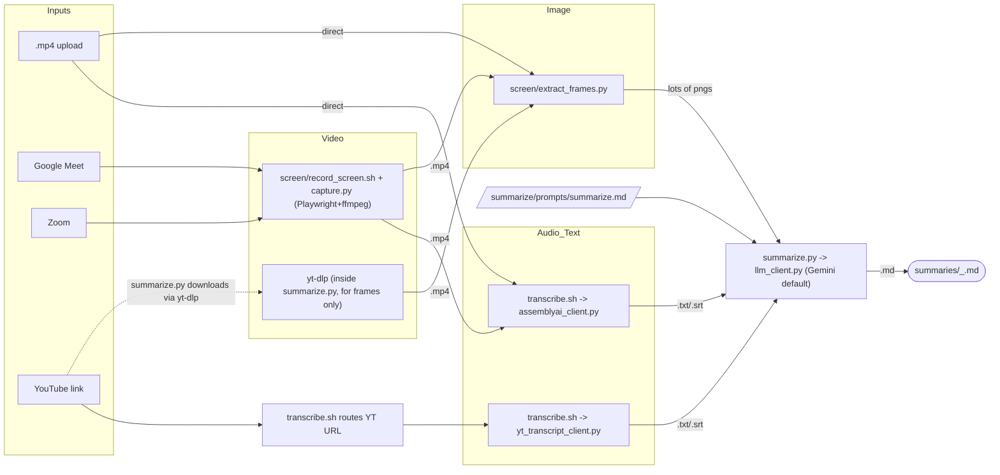

# Meeting Transcriber — Architecture

This documents the pipeline as it actually exists in the repo today (verified
against source, not the README). It matches the flow sketched in
`pipeline.md`.

## Flow



## Key facts (verified against source, not assumed)

- **No separate `mp4_to_wav` stage exists, and none is needed.** AssemblyAI's
  API accepts `.mp4` / `.m4a` / `.wav` / `.mp3` directly
  (`transcribe/assemblyai_client.py`), so `transcribe.sh` hands the MP4
  straight to AssemblyAI. `.webm`/`.ogg` are demuxed to `.mp3` with ffmpeg
  first (AssemblyAI's upload path is flakier on those containers) — that's
  the only audio-extraction step that exists, and it's conditional, not a
  fixed pipeline stage.
- **A direct `.mp4` upload already forks two ways**, matching the diagram:
  `pipeline.sh` isn't actually the code path for this today (it only accepts
  meeting/YouTube URLs) — but `transcribe.sh` and `summarize.py` can each be
  pointed at the same local MP4 independently, which is the same fork.
- **YouTube has two independent paths**, not one "Recorder/yt-dlp" box:
  - `transcribe.sh` → `yt_transcript_client.py` → `youtube-transcript.io` API
    (captions, no audio download, fast).
  - `summarize.py` → its own internal `yt-dlp` call (`download_youtube_video`)
    → downloads video *only* for frame extraction.
  These are separate downloads for a YouTube URL passed to the full
  pipeline — captions come from the API, frames come from a real download.
  This is intentional (captions are near-instant and don't need the video),
  not an oversight.
- **Summarizer**: `summarize/llm_client.py` supports Gemini, Anthropic/FCC,
  NVIDIA NIM, and Ollama, plus an auto-fallback chain. **Gemini is now the
  default** (`SUMMARY_BACKEND=gemini`) — was `fallback` with chain
  `fcc,nvidia_nim,gemini`.

## What changed in this pass

| File | Change |
|---|---|
| `summarize/llm_client.py` | Default backend `anthropic` → `gemini`. Docstring reordered so Gemini is described first. |
| `summarize/summarize.py` | Docstring env-var list updated to match (was stale, still said `anthropic` default). |
| `.env.example` | `SUMMARY_BACKEND=fallback` → `SUMMARY_BACKEND=gemini`. `SUMMARY_FALLBACK_CHAIN` reordered to `gemini,fcc,nvidia_nim` (only takes effect if you explicitly set `SUMMARY_BACKEND=fallback`). Section headers updated to stop calling FCC the "preferred primary". |
| `pipeline.sh` | Stale `whisper.cpp` references from before the AssemblyAI switch cleaned up: usage text, `WHISPER_LANGUAGE` → `ASSEMBLYAI_LANGUAGE` fallback, and the `Stage 2/3` log label. |

## Known remaining staleness (not touched — out of scope for this pass)

`README.md` and parts of `CLAUDE.md` still describe the *old* whisper.cpp-based
flow in several places (VM sizing rationale, "Thai language support",
`Architecture` section, `Files` table, `Known fragility` section — see the
`grep` below). `CLAUDE.md` itself is actually already up to date and
explicitly documents that whisper.cpp was retired; it's `README.md` that
lags. Say the word if you want that pass done too — it's a bigger, more
narrative rewrite than the surgical fixes above, which is why it wasn't
bundled into this change automatically.

```
$ grep -rn "whisper\|WHISPER" README.md
# (14 matches, mostly in Architecture/Thai-language/Files sections)
```
