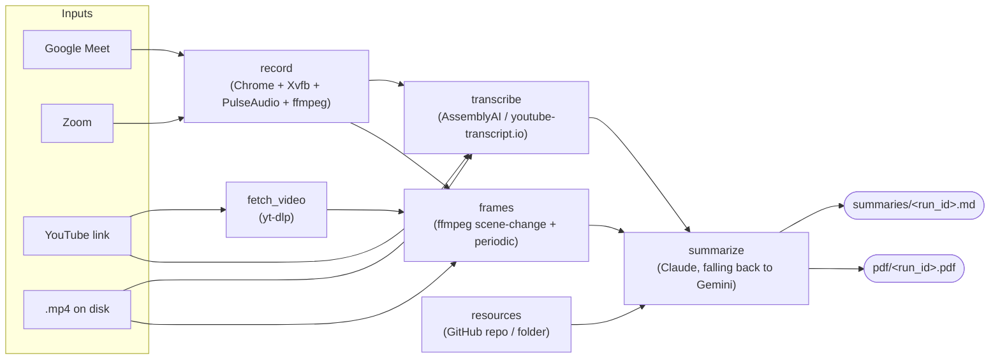

# meeting-transcriber

A meeting/lecture bot for a Proxmox box running **Debian 13 (trixie)**. It joins
a Google Meet or Zoom call in a real signed-in Chrome, records the screen and
audio to MP4, transcribes it, and writes an AI summary — as Markdown **and as a
PDF with the slides from the video inlined** — combining the transcript with
keyframes pulled from the recording. It also works on YouTube links and on video
files you already have, and it can read the lecturer's own slides from a GitHub
repo or a folder and use them as reference material.

The three stages are independent — each has its own entry script and runs
without the others — and `pipeline.sh` chains them.

- **Everything you run day to day is in [Commands](#commands).**
- Architectural decisions and the reasons behind them live in `CLAUDE.md`.

> **Coming from the Alpine version?** That tree is preserved on the
> `alpinelinux` branch. This branch runs everything natively on Debian: no
> Docker, no container image, no bind mounts. See
> [What changed on Debian 13](#what-changed-on-debian-13).

---

## Table of contents

- [How it works](#how-it-works)
- [What changed on Debian 13](#what-changed-on-debian-13)
- [Install](#install)
- [First-time login (you can't see a window)](#first-time-login-you-cant-see-a-window)
- [Commands](#commands)
- [Slides and reference material](#slides-and-reference-material)
- [Resuming a failed run](#resuming-a-failed-run)
- [Parallelism](#parallelism)
- [Output format](#output-format)
- [Configuration](#configuration)
- [Tests](#tests)
- [Troubleshooting](#troubleshooting)

---

## How it works



Each input becomes a **run**, with its own directory under
`$MEETING_BOT_ROOT/runs/<run_id>/` holding its state, logs, and sentinels.
Within a run, `transcribe` and `fetch_video → frames` are independent once a
video exists, so they execute concurrently and `summarize` joins them.

| Stage | Does | Needs |
|---|---|---|
| `record` | Joins the call, records screen + audio to MP4 | Chrome, Xvfb, PulseAudio, a signed-in profile |
| `fetch_video` | Downloads a YouTube video (for frames only) | yt-dlp |
| `transcribe` | Local file → AssemblyAI; YouTube → youtube-transcript.io captions | `ASSEMBLYAI_API_KEY_1..3` / `YT_TRANSCRIPT_KEY_1..10` |
| `frames` | Scene-change + periodic keyframes → `manifest.json` | ffmpeg |
| `summarize` | Transcript + frames (+ slides) → Markdown + PDF | `ANTHROPIC_API_KEY` / `GEMINI_API_KEY_1..3` |

Where the outputs go is **configured, not assumed** — the five directories are
independent variables, so summaries can sit on a NAS while recordings stay on
the big local disk:

```
$RECORDINGS_DIR/<run_id>.mp4            screen + audio
$TRANSCRIPTS_DIR/<run_id>.{txt,srt}
$FRAMES_DIR/<run_id>/                   keyframes + manifest.json
$SUMMARIES_DIR/<run_id>.md              the deliverable
$PDF_DIR/<run_id>.pdf                   the readable deliverable

$MEETING_BOT_ROOT/                      the pipeline's own bookkeeping
├── runs/<run_id>/                       state.json, logs/, kill, admitted, record.pid
├── state/keycursor.json                 API-key rotation cursor
├── tmp/                                 YouTube downloads, audio demuxes
├── resources/                           cached slide repos + rendered slides
└── chrome-profile/                      persistent Google/Zoom login
```

---

## What changed on Debian 13

The Alpine build could not run Chrome: Alpine is musl, Google ships no musl
build, and Playwright doesn't support Alpine for its bundled browsers. So the
browser half lived in a Debian container on an Alpine host. Debian 13 is glibc,
so **that split is gone** and everything runs natively.

| | `alpinelinux` branch | this branch |
|---|---|---|
| Host | Alpine (musl) | Debian 13 (glibc) |
| Browser stages | Debian container via Docker | Native |
| Docker | Required | Not used at all |
| Per-run isolation | Container namespaces (`:99`, `meeting_sink` hardcoded) | Display + PulseAudio sink allocated per run (`lib/xsession.sh`) |
| Init system | OpenRC (no systemd) | systemd — `setup.sh --with-trigger` installs the trigger unit |
| Summarizer | Gemini first | **Claude (Opus 5) first**, Gemini as fallback |
| Keys | One each; YouTube tokens in a JSON file | **Numbered slots in `.env`**, round-robin (3 Gemini, 3 AssemblyAI, 10 YouTube) |
| Output | Markdown, fixed layout under `/opt/meeting-bot` | Markdown **+ PDF**, five independently configured directories |
| Slides | — | `--resources` pulls a GitHub repo or folder into the prompt and the PDF |

Two consequences worth knowing:

- **Per-run isolation is now explicit.** `lib/xsession.sh` claims a free
  display number by creating `/tmp/.X<n>-lock` with `O_EXCL` (so two runs
  starting in the same second can't pick the same one) and loads a null sink
  named after the run. Chrome is pointed at that sink with `PULSE_SINK` — the
  default sink is *never* changed, because that is global state and flipping it
  would move another meeting's audio into this recording.
- **Recording is no longer isolated by a container.** Two concurrent recordings
  are still fine, but they share one PulseAudio daemon and one X server.

---

## Install

Target: Debian 13 (trixie) on Proxmox (LXC container or KVM VM), 4 vCPU / 8 GB.

```bash
sudo -H ./setup.sh
```

That installs the system packages (ffmpeg, Xvfb, PulseAudio, x11vnc/noVNC,
poppler, Pango for the PDF renderer, Thai fonts), real `google-chrome-stable`
from Google's repository, the Python venv at `/opt/meeting-bot-venv`, yt-dlp,
and the working directories.

Useful flags:

```bash
sudo -H ./setup.sh --no-chrome          # transcribe/summarize box only
sudo -H ./setup.sh --with-libreoffice   # so .pptx slides can be rendered into the PDF (~700MB)
sudo -H ./setup.sh --with-trigger       # install + enable the systemd trigger service
```

Then configure:

```bash
cp .env.example .env && chmod 600 .env
$EDITOR .env
```

Fill in the API keys and the five output directories. Check both with:

```bash
/opt/meeting-bot-venv/bin/python3 lib/paths.py show
/opt/meeting-bot-venv/bin/python3 lib/keyring.py status    # counts keys, never prints them
./verify_e2e.sh --preflight                                # everything, including a real 2s capture
```

> **Running in an LXC container?** No nesting flag is needed any more (that was
> for Docker). The container does need `/dev/shm` of a sane size for Chrome —
> the default 64MB is enough here because Chrome runs with
> `--disable-dev-shm-usage`.

---

## First-time login (you can't see a window)

Run this once, and again whenever your Google or Zoom session expires. It opens
a real Chrome on a headless display using the same persistent profile the
recorder reuses, and exposes it to **you** over noVNC.

```bash
./first_time_login.sh
```

It prints an `ssh -L ...` command to run on your own machine, then you open
`http://localhost:6080/vnc.html` and sign in. Nothing is exposed to the network.

Other ways in:

```bash
./first_time_login.sh --tailscale      # bind to this host's tailnet IP instead
./first_time_login.sh --bind 0.0.0.0   # every interface (see the warning it prints)
./first_time_login.sh --screenshot     # also dump the display to a PNG every 10s
./first_time_login.sh --url https://zoom.us/signin
```

`--screenshot` is the fallback for when noVNC can't reach at all: it writes
`$MEETING_BOT_ROOT/login-screenshots/latest.png`, which you can `scp` down to
see what's actually on screen.

Sign into Google, then open `zoom.us` in the same window and sign in there too.
Both land in the shared profile at `$CHROME_PROFILE_DIR`. Press `Ctrl+C` when
done.

> The VNC session has no password and fronts a browser holding your Google
> session. The default localhost binding is the safe one; only use `--bind` on a
> network you trust, and stop the script as soon as you're signed in.

Chrome is launched **directly** here, not through Playwright: even with
`channel="chrome"`, Playwright sets automation flags that Google's sign-in flow
rejects with "This browser or app may not be secure".

---

## Commands

### The whole pipeline

```bash
./pipeline.sh "https://meet.google.com/abc-defg-hij" --name "Weekly Standup"
./pipeline.sh "https://zoom.us/j/1234567890" --name "Client Call"
./pipeline.sh "https://www.youtube.com/watch?v=5GAfjAjLKYk"
./pipeline.sh /srv/recordings/existing.mp4
```

Each of those writes both `$SUMMARIES_DIR/<run_id>.md` and
`$PDF_DIR/<run_id>.pdf`.

### Several inputs at once

Any mix of types, processed concurrently:

```bash
./pipeline.sh "https://youtu.be/aaa" "https://youtu.be/bbb" "https://youtu.be/ccc" --jobs 3
```

From a file (blank lines and `#` comments are skipped):

```bash
./pipeline.sh --from-file links.txt --jobs 4
```

Expand a playlist — opt-in, because a normal watch URL often carries a stray
`&list=` and silently transcribing 200 videos would be rude:

```bash
./pipeline.sh "https://www.youtube.com/playlist?list=PL..." --playlist
```

Write one combined chapter-shaped file as well as the per-run summaries:

```bash
./pipeline.sh --from-file chapter3_links.txt --prompt lecture-claude \
  --combine ~/courses/2_Transcripts/chapter3.md
```

### Options

| Flag | Meaning |
|---|---|
| `--name N` | Meeting name (single input only; otherwise derived) |
| `--display-name D` | Name the bot shows in the meeting (default `Meeting Bot`) |
| `--language L` | `th` (default), `en`, `auto`, or any AssemblyAI code |
| `--prompt P` | A file in `summarize/prompts/`, e.g. `--prompt lecture-claude` |
| `--resources SPEC` | Slides / notes for this session; repeatable (see below) |
| `--jobs N` | Inputs processed at once (default 2) |
| `--from-file F` | Read inputs from a file, one per line |
| `--playlist` | Expand YouTube playlist URLs |
| `--combine F` | Also write every summary into one file, in input order |
| `--force` | Ignore prior state, start clean |
| `--run-id ID` / `--resume-last` / `--resume-all` | Resume (see below) |
| `--list` / `--status ID` | Inspect runs |

The legacy positional form still works when unambiguous:
`./pipeline.sh <input> [name] [display_name] [language] [prompt]`.

### Individual stages

```bash
# 1 — record only
./screen/record_screen.sh "<meeting_url>" "Meeting Name" ["Display Name"] [out.mp4]

# 2 — transcribe only  (local file → AssemblyAI, YouTube URL → captions)
./transcribe/transcribe.sh <file_or_youtube_url> "<name>" [language] [--out-base PATH]

# 3 — summarize only
/opt/meeting-bot-venv/bin/python3 ./summarize/summarize.py \
    <video_or_youtube_url> <transcript.txt> [out.md] \
    [--prompt NAME] [--frames-manifest PATH] [--resources SPEC] \
    [--pdf-out PATH] [--no-pdf] [--no-markdown] [--source-url URL] [--title TEXT]

# frames only (normally called by the pipeline)
python3 screen/extract_frames.py <video> <out_dir> ["name"]

# PDF only, from a summary you already have
/opt/meeting-bot-venv/bin/python3 summarize/pdf.py summary.md out.pdf \
    --frames-manifest "$FRAMES_DIR/<run_id>/manifest.json"
```

### Stopping a recording

```bash
./kill_meeting.sh                  # every active run
./kill_meeting.sh --run-id <id>    # just that one
./kill_meeting.sh --list           # show what's running, kill nothing
```

`Ctrl+\` in the recording terminal does the same thing. Either way the bot
clicks **Leave** in the meeting UI so other participants see it go, rather than
having the browser killed under it. Only if a recorder is still alive after the
grace period (25s) does `kill_meeting.sh` escalate to signals, and even then
ffmpeg gets `SIGINT` first so the MP4 is finalised and playable.

### Remote trigger (start a run from your phone over Tailscale)

Debian has systemd, so the bundled unit is usable directly:

```bash
sudo -H ./setup.sh --with-trigger
echo "MEETING_BOT_TOKEN=$(openssl rand -hex 24)" | sudo tee -a /etc/meeting-bot.env
sudo systemctl restart meeting-bot-trigger
```

```bash
curl -X POST http://<tailscale-host>:8765/trigger \
  -H "Authorization: Bearer <token>" -H "Content-Type: application/json" \
  -d '{"url": "https://meet.google.com/abc-defg-hij", "name": "Client Call",
       "resources": "https://github.com/me/course@week4"}'
```

Returns `202` immediately and runs `pipeline.sh` in the background, logging to
`$MEETING_BOT_ROOT/logs/trigger_<timestamp>.log`.

---

## Slides and reference material

A recording plus a transcript is what the class *said*. The slides are what it
*meant* — the correct spelling of every technical term, the notation actually
used, the section numbering. Feeding them in alongside the transcript is the
cheapest available fix for speech recognition mangling domain vocabulary.

```bash
# a GitHub repo (default branch)
./pipeline.sh "<url>" --resources https://github.com/me/course

# a branch
./pipeline.sh "<url>" --resources https://github.com/me/course@week4

# a branch and a subdirectory — paste a /tree/ URL straight from GitHub
./pipeline.sh "<url>" --resources https://github.com/me/course/tree/main/lectures/wk4

# a local folder or a single file
./pipeline.sh "<url>" --resources "/srv/course/Week 4" --resources ~/notes/handout.pdf
```

What happens to it:

- **Text** is extracted from `.md`, `.txt`, `.pdf` (via `pdftotext`), `.pptx`
  and `.docx` and appended to the prompt as reference material, capped at
  `RESOURCE_MAX_CHARS` (40,000) in total so a whole textbook can't push the
  transcript out of the model's context. It is framed as *data*, never as
  instructions — the same treatment the transcript gets.
- **Slide images** are rendered (PDF pages via `pdftoppm`; `.pptx` via
  LibreOffice when installed) and embedded in the PDF's Appendix B.
- GitHub sources are shallow-cloned into `$RESOURCE_CACHE_DIR` and refreshed on
  re-runs. Private repos work when `GITHUB_TOKEN` is set; the token is injected
  into the remote URL only for the clone, never written to disk or logged.
- The specs are stored in the run's `state.json`, so a **resume** summarizes
  against the same material the first attempt used.

A GitHub source that can't be fetched degrades the summary and is reported —
it doesn't fail the run. A *local* path that doesn't exist fails immediately,
because that is always a typo, and finding out after paying for a summary is
worse.

---

## Resuming a failed run

Every run records what it finished and where the output went, so nothing
successful is ever redone. **Just run the same command again** — it finds the
unfinished run for that input and restarts at the first stage that isn't done:

```bash
./pipeline.sh "https://youtu.be/abc"     # died at summarize (API was down)
./pipeline.sh "https://youtu.be/abc"     # resumes; reuses transcript + frames
```

Explicit forms:

```bash
./pipeline.sh --list                 # what runs exist and how far each got
./pipeline.sh --status <run_id>      # per-stage detail, artifacts, last error
./pipeline.sh --run-id <run_id>      # resume that one
./pipeline.sh --resume-last          # resume the most recent
./pipeline.sh --resume-all           # resume everything unfinished
./pipeline.sh <input> --force        # ignore prior state, start over
```

Two details worth knowing:

- **A stage counts as done only if its output is still on disk.** Delete a
  transcript and re-run, and it regenerates rather than being skipped.
- **A run is locked while it's being processed**, so two invocations can't work
  the same run. If the owning process died, the lock is taken over instead of
  blocking forever — a killed run has to stay resumable.

Old run directories (which hold YouTube downloads) can be swept:

```bash
python3 lib/runstate.py sweep --days 30
```

---

## Parallelism

Four independent levels, all tunable:

| Level | Control | Default |
|---|---|---|
| Inputs processed at once, **within one invocation** | `--jobs N` / `PIPELINE_JOBS` | 2 |
| Within a run: `transcribe` ∥ `fetch_video`→`frames` | always on | — |
| Chunks of a long transcript summarized at once | `SUMMARY_MAX_PARALLEL` | 3 |
| A component running at once, **across all invocations** | `QUEUE_SLOTS_<COMPONENT>` | unlimited |

On a 4-vCPU box, `--jobs 2` or `3` is sensible; frame extraction is the
CPU-hungry part. Chunk concurrency is kept low on purpose — every chunk carries
images, and firing a dozen multi-megabyte requests is a good way to earn the
429s you then have to sit out.

### Queueing across separate sessions

`--jobs` only limits concurrency *inside one* `./pipeline.sh` invocation. Run
the script in three terminals — or trigger it three times from your phone — and
you get three independent sets of stages competing for the same CPUs and the
same rate-limited APIs.

The queue is the machine-wide throttle those sessions coordinate through. Set a
slot count and they take turns, first-come-first-served:

```bash
# in .env
QUEUE_SLOTS_TRANSCRIBE=1     # one transcription at a time, box-wide
QUEUE_SLOTS_FRAMES=1         # one ffmpeg frame extraction at a time
QUEUE_SLOTS_SUMMARIZE=2      # two summaries in flight
QUEUE_SLOTS_DEFAULT=1        # fallback for anything not named above
```

A session that can't get a slot waits and says where it stands, so a blocked
run never looks hung:

```
  queue: waiting for a 'transcribe' slot (1 ahead, 1/1 in use)
```

**Everything is unlimited unless you set its variable** — with nothing
configured, no queue files are created and behaviour is exactly as before.

> **Think twice about `QUEUE_SLOTS_RECORD`.** Recording is the one
> time-sensitive stage. If two meetings overlap and there's a single record
> slot, the second meeting isn't delayed — it's *missed*, and you can't go back
> and record it. Leave it unset unless your meetings never overlap.

Inspect and unstick:

```bash
python3 lib/slotqueue.py status
python3 lib/slotqueue.py reset --component transcribe
```

A slot is held by the shell running the stage. If that process dies — a kill, a
reboot — the next caller notices the PID is gone and reclaims the slot, so the
queue can't wedge permanently and needs no cleanup daemon.

---

## Output format

### Markdown

Summaries from `lecture-*` and `tutorial-*` prompts are wrapped in a
course-note document, shaped to drop straight into a chapter file:

```markdown
<!-- meeting-transcriber
     source: https://www.youtube.com/watch?v=5GAfjAjLKYk
     source_type: youtube
     model: anthropic/claude-opus-5
     prompt: lecture-claude.md
     run_id: yt_5GAfjAjLKYk_20260904_120000
     generated: 2026-09-04
-->

Chapter N — <topic> (<date>)

# 2110203 L01 : Signals and Transformations

Youtube Link: `https://www.youtube.com/watch?v=5GAfjAjLKYk`

<details>
    <summary> View Transcript </summary>

    ...the full transcript, indented four spaces...
</details>
<br>

...the model's structured summary...

<br><br>
```

- The provenance header is an HTML comment: invisible when rendered, greppable
  in the raw file, and harmless when pasted into a larger document. On a
  fallback chain it is the only record of which provider actually answered.
- `Chapter N — <topic> (<date>)` is a literal placeholder for you to fill in.
  The chapter number isn't derivable from the video, and a plausible-looking
  guess would be worse than an obvious blank.
- The title comes from yt-dlp, the link and transcript are inserted by the code
  — the model never writes them, so they can't be hallucinated or truncated.
- `--combine` concatenates several of these with one Chapter line at the top,
  in **input order** (runs finish out of order when several go at once). It
  works on the `.md` files, so it has nothing to do if `--no-markdown` is set.

`meeting-*` prompts keep the plain executive-summary format — no wrapper.

Available prompts: `ls summarize/prompts/`. Pick one with `--prompt <name>`
(no `.md` needed). `_merge.md` is internal and not selectable.

### PDF

The same summary is rendered to `$PDF_DIR/<run_id>.pdf` by WeasyPrint:

- **Cited frames become pictures.** The model cites keyframes inline as
  *(Frame 12 @ 410.0s)*; in the PDF the first citation of each frame is
  replaced by the image itself, captioned with its timestamp. Later citations
  of the same frame stay as text, so a lecture that keeps referring back to one
  diagram doesn't print it eight times.
- **Frames are cropped to the slide.** A raw 1920×1080 Meet frame is mostly
  dark UI chrome and participant tiles. `summarize/framecrop.py` finds the
  largest bright rectangle — slides are overwhelmingly light on dark UI — and
  crops to it, but only when the candidate passes size, area, aspect-ratio and
  brightness checks. Otherwise it falls back to a plain border trim, and then
  to the untouched frame: a confidently wrong crop (half a slide, one
  participant's face) is worse than no crop. Tune with `PDF_FRAME_CROP`
  (`slide` | `border` | `none`).
- **The transcript moves to Appendix A**, on its own page in a smaller face —
  a PDF has no collapsed `<details>`, and 80KB of ASR output at the top would
  bury the summary. Reference slides get Appendix B.
- Thai renders correctly (`fonts-thai-tlwg` plus Noto, requested by
  `PDF_FONT_FAMILY`).

A PDF that fails to render logs a warning and leaves the run successful — the
Markdown is the artifact everything downstream depends on. Turn either output
off with `--no-pdf` / `--no-markdown` (or `SUMMARY_WRITE_PDF=0` /
`SUMMARY_WRITE_MARKDOWN=0`); turning off both is an error rather than a run
that writes nothing.

---

## Configuration

All settings live in `.env` at the repo root (`cp .env.example .env`,
`chmod 600 .env`). `.env.example` is a bare list of names and defaults — the
explanations are here. Already-exported variables always win, so one-off
overrides work: `SUMMARY_EFFORT=max ./pipeline.sh ...`.

### Output directories — all five are required

| Variable | Holds |
|---|---|
| `RECORDINGS_DIR` | `<run_id>.mp4` and its ffmpeg log |
| `TRANSCRIPTS_DIR` | `<run_id>.txt` and `<run_id>.srt` |
| `FRAMES_DIR` | `<run_id>/` — keyframes and `manifest.json` |
| `SUMMARIES_DIR` | `<run_id>.md` |
| `PDF_DIR` | `<run_id>.pdf` |
| `MEETING_BOT_ROOT` | The pipeline's own bookkeeping only: `runs/`, `state/`, `tmp/`, `resources/`, `chrome-profile/` |

They are independent of each other and of `MEETING_BOT_ROOT` — point any of
them anywhere, including a mount with spaces in the path. An unset one is a
hard error naming the variable, rather than a silent default: with independent
paths, a wrong default doesn't fail, it just puts your lecture summaries
somewhere you'll never look.

`CHROME_PROFILE_DIR` (default `$MEETING_BOT_ROOT/chrome-profile`) and
`RESOURCE_CACHE_DIR` (default `$MEETING_BOT_ROOT/resources`) can also be moved.

### API keys — numbered slots, rotated round-robin

Every provider that allows several accounts reads numbered variables, and the
unnumbered name is accepted as slot 1:

| Variable | Slots | Used by |
|---|---|---|
| `ANTHROPIC_API_KEY` | 1 | The default summarizer |
| `GEMINI_API_KEY_1..3` (or `GOOGLE_API_KEY`) | 3 | The fallback summarizer |
| `ASSEMBLYAI_API_KEY_1..3` | 3 | Transcribing local recordings |
| `YT_TRANSCRIPT_KEY_1..10` | 10 | YouTube captions |

`lib/keyring.py` rotates them. The cursor is **persisted** to
`$MEETING_BOT_ROOT/state/keycursor.json` and advances past the key that just
worked, so consecutive runs start on different accounts — a per-process cursor
would send every run at key #1 and exhaust that account first. Blank slots and
duplicates are skipped; a gap (`_1` and `_3` set, `_2` commented out) doesn't
end the scan.

```bash
/opt/meeting-bot-venv/bin/python3 lib/keyring.py status   # counts and the next slot
```

> **Moved from the Alpine version:** youtube-transcript.io tokens used to live
> in `/opt/meeting-bot/secrets/youtube_transcript_keys.json`. That file is gone;
> the tokens are `YT_TRANSCRIPT_KEY_1..10` in `.env` now.

### Summarization

| Variable | Default | Meaning |
|---|---|---|
| `SUMMARY_BACKEND` | `fallback` | `fallback`, `anthropic`, `gemini` |
| `SUMMARY_FALLBACK_CHAIN` | `anthropic,gemini` | Tried in order; first success wins. `disabled` short-circuits a slot |
| `ANTHROPIC_API_KEY` | — | Required for the default backend |
| `ANTHROPIC_MODEL` | `claude-opus-5` | Any current Claude model |
| `ANTHROPIC_BASE_URL` | `https://api.anthropic.com` | Point at a Messages-API-compatible proxy if you use one |
| `SUMMARY_EFFORT` | `high` | `low`, `medium`, `high`, `xhigh`, `max` |
| `GEMINI_API_KEY_1..3` | — | For the `gemini` fallback |
| `GEMINI_MODEL` | `gemini-3.6-flash` | Google retires model names; pin a real version, not a `-latest` alias |
| `SUMMARY_PROMPT` | `summarize.md` | Prompt file; `--prompt` overrides |
| `SUMMARY_MAX_TOKENS` | 16000 | |
| `SUMMARY_DOC_FORMAT` | `auto` | `auto` wraps `lecture-*`/`tutorial-*` output; `always`/`never` override |

**About `SUMMARY_EFFORT`.** It maps directly onto the Messages API's
`output_config.effort`, which is how current Claude models are told how hard to
think; thinking itself is adaptive, so the model decides when to use it. There
is deliberately no "thinking budget" setting: the older `budget_tokens`
parameter is rejected outright by Opus 5. `high` is the sweet spot for lecture
notes; `max` costs meaningfully more for a marginal gain on this kind of task,
and `low` is fine for short standups.

Missing credentials for one backend are not fatal — the chain skips it and
moves on. Which backend answered is recorded in the document's provenance
header.

### PDF export

| Variable | Default | Meaning |
|---|---|---|
| `SUMMARY_WRITE_PDF` | 1 | `0` = markdown only (same as `--no-pdf`) |
| `SUMMARY_WRITE_MARKDOWN` | 1 | `0` = PDF only (same as `--no-markdown`) |
| `PDF_FRAME_CROP` | `slide` | `slide`, `border`, or `none` |
| `PDF_FRAME_MAX_WIDTH` | 1280 | Frames are downscaled to this before embedding |
| `PDF_PAGE_SIZE` | `A4` | Any WeasyPrint page size |
| `PDF_FONT_FAMILY` | `Noto Sans Thai, Noto Sans, DejaVu Sans, sans-serif` | |

### Reference material

| Variable | Default | Meaning |
|---|---|---|
| `RESOURCES` | — | Default `--resources` specs for every run, comma- or newline-separated |
| `RESOURCE_MAX_CHARS` | 40000 | Total extracted text given to the model |
| `RESOURCE_MAX_FILE_MB` | 25 | Per-file size cap |
| `RESOURCE_SLIDE_IMAGES` | 1 | `0` skips rendering slide images |
| `RESOURCE_CACHE_DIR` | `$MEETING_BOT_ROOT/resources` | Clones and rendered slides |
| `GITHUB_TOKEN` | — | For private repositories |

### Transient failures (503 "server is busy", 429, 5xx)

| Variable | Default |
|---|---|
| `SUMMARY_MAX_RETRIES` | 5 |
| `SUMMARY_RETRY_BASE_SECONDS` | 2.0 |
| `SUMMARY_RETRY_MAX_SECONDS` | 60.0 |

Retries use exponential backoff with full jitter and honor `Retry-After`. A
backend is only abandoned once its own retries are exhausted; then the chain
advances. `400/401/403/404/422` never retry — a bad key fails the same way
forever, and retrying just delays the fallback. Gemini key rotation happens
*outside* the retry loop: an exhausted key hands over to the next one
immediately rather than burning the full retry schedule first.

### Long transcripts

| Variable | Default | Meaning |
|---|---|---|
| `SUMMARY_CHUNK_CHARS` | 24000 | Above this, chunk + merge. `0` disables |
| `SUMMARY_CHUNK_OVERLAP` | 800 | Context repeated across a boundary |
| `SUMMARY_MAX_PARALLEL` | 3 | Concurrent chunk requests |

### Transcription

| Variable | Default | Meaning |
|---|---|---|
| `ASSEMBLYAI_API_KEY_1..3` | — | Required for local files |
| `ASSEMBLYAI_LANGUAGE` | `th` | `en`, `auto`, or any AssemblyAI code |
| `ASSEMBLYAI_MODEL` | SDK chain `universal-3-5-pro`, `universal-2` | Overrides the leading entry |
| `YT_TRANSCRIPT_KEY_1..10` | — | Required for YouTube inputs |
| `TRANSCRIBE_BACKEND` | `assemblyai` | YouTube URLs always use captions regardless |

A key rejected for auth or quota reasons hands over to the next key; a failure
that is about the *audio* (silent file, unsupported language) does not, because
another key would fail identically.

### Frames

| Variable | Default | Meaning |
|---|---|---|
| `SCENE_THRESHOLD` | 0.3 | ffmpeg scene-change score cutoff |
| `FRAME_PERIOD_SECONDS` | 30 | Periodic safety-net sample; `0` disables |

Aggressive: `FRAME_PERIOD_SECONDS=10 SCENE_THRESHOLD=0.2`.
Slides only: `FRAME_PERIOD_SECONDS=300 SCENE_THRESHOLD=0.6`.

### Meeting behaviour

| Variable | Default | Meaning |
|---|---|---|
| `MAX_MEETING_MINUTES` | 240 | Hard wall-clock cap |
| `IDLE_LEAVE_MINUTES` | 5 | Leave after this long alone (or with one other); `0` disables |
| `RECORD_GEOMETRY` | `1920x1080` | Xvfb head, Chrome window and ffmpeg capture size — they must agree or the recording gets black edges |
| `RECORD_FRAMERATE` | 15 | |
| `MEETING_BOT_DISPLAY_NAME` | `Meeting Bot` | Same as `--display-name` |
| `PIPELINE_JOBS` | 2 | Same as `--jobs` |

The bot also leaves on the kill sentinel, when the page says the meeting ended,
or when participants drop below 30% of their peak for two consecutive polls.

---

## Tests

Everything except `verify_e2e.sh` runs with no API keys, no network access and
no `/opt` — against temporary directories, including one with a space in its
path so quoting mistakes surface.

```bash
python3 lib/test_runstate.py                 # run state, resume, concurrency (13)
python3 lib/test_slotqueue.py                # cross-session component queue (23)
python3 lib/test_keyring.py                  # numbered keys + rotation cursor (22)
python3 lib/test_resources.py                # resource specs, extraction, GitHub (27)
python3 summarize/test_summarize_units.py    # retry, chunking, map-reduce, document (31)
python3 summarize/test_pdf_units.py          # frame cropping, citations, PDF render (23)
python3 transcribe/test_yt_transcript_client.py   # key rotation, retry, tracks[] (16)
bash lib/test_pipeline_e2e.sh                # full orchestration, stages stubbed (106)
bash lib/test_media_e2e.sh                   # real media, APIs stubbed at the socket (49)
```

Two of those are worth understanding:

- **`test_pipeline_e2e.sh`** runs `pipeline.sh` and `run_one.sh` for real —
  routing, the DAG, parallel branches, state transitions, resume, `--force`,
  `--combine`, locking, the output-directory requirements, `--resources`
  threading — with the four expensive stages replaced by stubs honoring the
  same contract.
- **`test_media_e2e.sh`** does the opposite: it builds a real MP4 with ffmpeg
  and runs the *actual* stages against local stub servers
  (`lib/fake_api_server.py`) that speak the providers' HTTP protocols. The real
  AssemblyAI and Anthropic SDKs make real requests, so it verifies things a
  mock never could — that `output_config.effort` and adaptive thinking are on
  the wire, that `budget_tokens` is not, that frames are attached as image
  blocks, that the key cursor advances, that the PDF comes out with cropped
  frames in it.

Neither proves Chrome can join a live Meet call, or that your real keys work.
That is what `verify_e2e.sh` is for:

```bash
./verify_e2e.sh --preflight                    # tools, packages, keys, profile,
                                               # and a real 2-second Xvfb+Pulse+ffmpeg capture
./verify_e2e.sh --mp4 /path/to/recording.mp4   # real AssemblyAI + real summarizer
./verify_e2e.sh --youtube "<url>"              # real captions + real summarizer
./verify_e2e.sh --meet "<url>" --minutes 3     # real Chrome joins, records, leaves
./verify_e2e.sh --zoom "<url>" --minutes 3
```

The meeting checks record for `--minutes`, then stop through the normal
`kill_meeting.sh` path, so they exercise the kill switch too. They check the
recording actually has an audio stream — a missing sink produces perfect video,
a silent MP4 and an empty transcript, which is otherwise only noticed at the
summary.

---

## Troubleshooting

**`missing required program(s): ...`**
`sudo -H ./setup.sh`. The browser stages run natively now, so Xvfb, PulseAudio,
x11vnc and Chrome all have to be present on the host itself.

**`no free X display between :90 and :119`**
Stale locks from a crashed run: `ls -l /tmp/.X*-lock`, and remove the ones with
no matching process.

**`PulseAudio did not start (pactl info fails)`**
The daemon runs per-user and this runs as root. `pulseaudio -D
--exit-idle-time=-1` by hand will show the real error; in a locked-down LXC it
usually needs `/dev/shm` and a writable `$HOME`.

**Google says "This browser or app may not be secure"**
The login must go through `first_time_login.sh`, which launches Chrome directly.
Playwright sets automation flags Google detects, even with `channel="chrome"`.

**The bot never gets admitted**
Check `runs/<run_id>/join_failed.png` or `not_admitted.png`, and
`runs/<run_id>/logs/record.log`.

**The MP4 has video but no sound**
The sink wasn't wired to the browser. Check that `PULSE_SINK` reached Chrome
(`runs/<run_id>/record.pid` records the sink name) and that
`pactl list short sinks` shows it. `./verify_e2e.sh --preflight` reproduces the
whole chain in two seconds.

**The MP4 is empty**
See `<recording>_ffmpeg.log` next to the MP4. Usually the display or the sink
didn't come up.

**No PDF, but the markdown is there**
The renderer is optional at runtime by design. The warning names what's
missing — usually `weasyprint` or its Pango libraries:
`sudo apt-get install libpango-1.0-0 libpangoft2-1.0-0` and
`/opt/meeting-bot-venv/bin/pip install weasyprint markdown pillow`.

**Frames in the PDF are uncropped**
Pillow isn't installed, or the slide detector declined on every frame (a
full-screen camera shot has no slide to find). `PDF_FRAME_CROP=border` gives
you the plain border trim instead.

**A YouTube transcript comes back as `[เสียงพากย์ไทย]`**
That's a re-voiced video whose only captions are a placeholder. Every API key
hits the same upstream captions, so retrying won't help — the placeholder is
written through deliberately so you can see it in the `.txt`.

**A run half-finished**
`./pipeline.sh --status <run_id>` shows which stage failed and the error;
`./pipeline.sh --run-id <run_id>` picks up from there.

**Everything is slow on a long video**
Frame extraction is CPU-bound. Raise `FRAME_PERIOD_SECONDS`, or lower `--jobs`
so runs aren't competing for the same cores.
