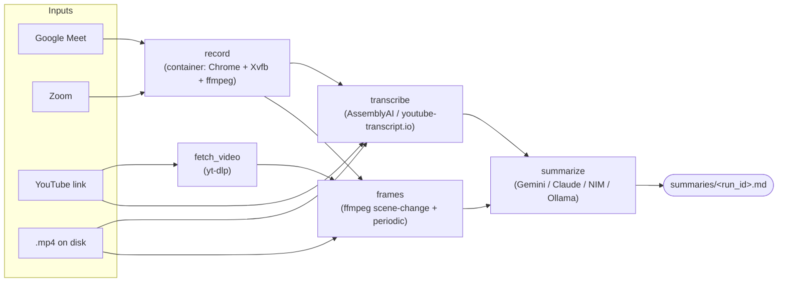

# meeting-transcriber

A meeting/lecture bot for a Proxmox box running **Alpine Linux**. It joins a
Google Meet or Zoom call in a real signed-in Chrome, records the screen and
audio to MP4, transcribes it, and writes an AI summary that combines the
transcript with keyframes pulled from the video. It also works on YouTube links
and on video files you already have.

The three stages are independent — each has its own entry script and runs
without the others — and `pipeline.sh` chains them.

- **Everything you run day to day is in [Commands](#commands).**
- Architectural decisions and the reasons behind them live in `CLAUDE.md`.

---

## Table of contents

- [How it works](#how-it-works)
- [Why there's a container](#why-theres-a-container)
- [Install](#install)
- [First-time login (you can't see a window)](#first-time-login-you-cant-see-a-window)
- [Commands](#commands)
- [Resuming a failed run](#resuming-a-failed-run)
- [Parallelism](#parallelism)
- [Output format](#output-format)
- [Configuration](#configuration)
- [Tests](#tests)
- [Troubleshooting](#troubleshooting)

---

## How it works



Each input becomes a **run**, with its own directory under
`/opt/meeting-bot/runs/<run_id>/` holding its state, logs, and sentinels.
Within a run, `transcribe` and `fetch_video → frames` are independent once a
video exists, so they execute concurrently and `summarize` joins them.

| Stage | Does | Needs |
|---|---|---|
| `record` | Joins the call, records screen + audio to MP4 | Docker, a signed-in Chrome profile |
| `fetch_video` | Downloads a YouTube video (for frames only) | yt-dlp |
| `transcribe` | Local file → AssemblyAI; YouTube → youtube-transcript.io captions | `ASSEMBLYAI_API_KEY` / yt-transcript tokens |
| `frames` | Scene-change + periodic keyframes → `manifest.json` | ffmpeg |
| `summarize` | Transcript + frames → Markdown | `GOOGLE_API_KEY` / `ANTHROPIC_API_KEY` / `NVIDIA_NIM_API_KEY` |

Outputs all land under `/opt/meeting-bot/`:

```
/opt/meeting-bot/
├── recordings/<run_id>.mp4          screen + audio
├── transcripts/<run_id>.{txt,srt}
├── frames/<run_id>/                 keyframes + manifest.json
├── summaries/<run_id>.md            the deliverable
├── runs/<run_id>/                   state.json, logs/, kill, admitted
├── chrome-profile/                  persistent Google/Zoom login
└── secrets/                         youtube_transcript_keys.json
```

---

## Why there's a container

Alpine uses **musl libc**. Google ships no musl build of Chrome, and Playwright
doesn't support Alpine for its bundled browsers. Meanwhile the bot *needs* real
Google Chrome — Google's sign-in flow blocks unbranded Chromium with "This
browser or app may not be secure".

So the system is split:

- **Alpine host** — Python, ffmpeg, yt-dlp, the transcribe and summarize
  stages, and the Docker daemon. All musl-clean.
- **Debian container** (`docker/Dockerfile.recorder`) — Xvfb, PulseAudio, real
  `google-chrome-stable`, Playwright, ffmpeg. Everything the browser touches.

A useful side effect: each recording gets its own container, hence its own
PID/IPC/network namespace, so several meetings can record at once without
fighting over display `:99` or the `meeting_sink` audio sink.

The repo is bind-mounted into the container, so editing a `.py` or `.sh` file
takes effect on the next run — no rebuild.

---

## Install

Target: Alpine Linux on Proxmox (LXC container or KVM VM), 4 vCPU / 8 GB.

```bash
sudo -H ./setup.sh
```

That installs the host packages, the Python venv at `/opt/meeting-bot-venv`,
yt-dlp, Docker, creates the directories under `/opt/meeting-bot`, and builds
the recorder image.

Useful flags:

```bash
sudo -H ./setup.sh --build-recorder   # only rebuild the container image
sudo -H ./setup.sh --no-recorder      # host side only, skip the image
sudo -H ./setup.sh --no-docker        # transcribe/summarize box only
```

Then configure:

```bash
cp .env.example .env && chmod 600 .env
```

Fill in your API keys. For YouTube inputs, also add at least one
youtube-transcript.io token to
`/opt/meeting-bot/secrets/youtube_transcript_keys.json`.

> **Running in an LXC container?** Docker needs `nesting=1` on the CT
> (Proxmox → the container → Options → Features → Nesting) and a usable
> storage driver. Without it the daemon won't start and Stage 1 can't run;
> stages 2 and 3 work regardless.

---

## First-time login (you can't see a window)

Run this once, and again whenever your Google or Zoom session expires. It opens
a real Chrome on a headless display inside the container, using the same
persistent profile the recorder reuses, and exposes it to **you** over noVNC.

```bash
./first_time_login.sh
```

It prints an `ssh -L ...` command to run on your own machine, then you open
`http://localhost:6080/vnc.html` and sign in. Nothing is exposed to the network.

Other ways in:

```bash
./first_time_login.sh --tailscale      # bind to this host's tailnet IP instead
./first_time_login.sh --bind 0.0.0.0   # every interface (see the warning it prints)
./first_time_login.sh --screenshot     # also dump the display to a PNG every 10s
./first_time_login.sh --url https://zoom.us/signin
```

`--screenshot` is the fallback for when noVNC can't reach at all: it writes
`/opt/meeting-bot/login-screenshots/latest.png`, which you can `scp` down to see
what's actually on screen.

Sign into Google, then open `zoom.us` in the same window and sign in there too.
Both land in the shared profile at `/opt/meeting-bot/chrome-profile`. Press
`Ctrl+C` when done.

> The VNC session has no password and fronts a browser holding your Google
> session. The default localhost binding is the safe one; only use `--bind` on a
> network you trust, and stop the script as soon as you're signed in.

---

## Commands

### The whole pipeline

```bash
./pipeline.sh "https://meet.google.com/abc-defg-hij" --name "Weekly Standup"
./pipeline.sh "https://zoom.us/j/1234567890" --name "Client Call"
./pipeline.sh "https://www.youtube.com/watch?v=5GAfjAjLKYk"
./pipeline.sh /opt/meeting-bot/recordings/existing.mp4
```

### Several inputs at once

Any mix of types, processed concurrently:

```bash
./pipeline.sh "https://youtu.be/aaa" "https://youtu.be/bbb" "https://youtu.be/ccc" --jobs 3
```

From a file (blank lines and `#` comments are skipped):

```bash
./pipeline.sh --from-file links.txt --jobs 4
```

Expand a playlist — opt-in, because a normal watch URL often carries a stray
`&list=` and silently transcribing 200 videos would be rude:

```bash
./pipeline.sh "https://www.youtube.com/playlist?list=PL..." --playlist
```

Write one combined chapter-shaped file as well as the per-run summaries:

```bash
./pipeline.sh --from-file chapter3_links.txt --prompt lecture-gemini \
  --combine ~/courses/2_Transcripts/chapter3.md
```

### Options

| Flag | Meaning |
|---|---|
| `--name N` | Meeting name (single input only; otherwise derived) |
| `--display-name D` | Name the bot shows in the meeting (default `Meeting Bot`) |
| `--language L` | `th` (default), `en`, `auto`, or any AssemblyAI code |
| `--prompt P` | A file in `summarize/prompts/`, e.g. `--prompt lecture-gemini` |
| `--jobs N` | Inputs processed at once (default 2) |
| `--from-file F` | Read inputs from a file, one per line |
| `--playlist` | Expand YouTube playlist URLs |
| `--combine F` | Also write every summary into one file, in input order |
| `--force` | Ignore prior state, start clean |
| `--run-id ID` / `--resume-last` / `--resume-all` | Resume (see below) |
| `--list` / `--status ID` | Inspect runs |

The legacy positional form still works when unambiguous:
`./pipeline.sh <input> [name] [display_name] [language] [prompt]`.

### Individual stages

```bash
# 1 — record only
./screen/record_screen.sh "<meeting_url>" "Meeting Name" ["Display Name"] [out.mp4]

# 2 — transcribe only  (local file → AssemblyAI, YouTube URL → captions)
./transcribe/transcribe.sh <file_or_youtube_url> "<name>" [language] [--out-base PATH]

# 3 — summarize only
/opt/meeting-bot-venv/bin/python3 ./summarize/summarize.py \
    <video_or_youtube_url> <transcript.txt> [out.md] \
    [--prompt NAME] [--frames-manifest PATH] [--source-url URL] [--title TEXT]

# frames only (normally called by the pipeline)
python3 screen/extract_frames.py <video> <out_dir> ["name"]
```

### Stopping a recording

```bash
./kill_meeting.sh                  # every active run
./kill_meeting.sh --run-id <id>    # just that one
./kill_meeting.sh --list           # show what's running, kill nothing
```

`Ctrl+\` in the recording terminal does the same thing. Either way the bot
clicks **Leave** in the meeting UI so other participants see it go, rather than
having the browser killed under it.

### Remote trigger (start a run from your phone over Tailscale)

```bash
sudo cp meeting-bot-trigger.service /etc/systemd/system/
sudo cp trigger_server.py /opt/meeting-bot/trigger_server.py
echo "MEETING_BOT_TOKEN=$(openssl rand -hex 24)" | sudo tee /etc/meeting-bot.env
sudo systemctl enable --now meeting-bot-trigger
```

```bash
curl -X POST http://<tailscale-host>:8765/trigger \
  -H "Authorization: Bearer <token>" -H "Content-Type: application/json" \
  -d '{"url": "https://meet.google.com/abc-defg-hij", "name": "Client Call"}'
```

Returns `202` immediately and runs `pipeline.sh` in the background.

> Alpine uses OpenRC, not systemd. On an Alpine host, write an
> `/etc/init.d/meeting-bot-trigger` OpenRC script instead of using the bundled
> `.service` file — the unit is kept for systemd hosts.

---

## Resuming a failed run

Every run records what it finished and where the output went, so nothing
successful is ever redone. **Just run the same command again** — it finds the
unfinished run for that input and restarts at the first stage that isn't done:

```bash
./pipeline.sh "https://youtu.be/abc"     # died at summarize (API was down)
./pipeline.sh "https://youtu.be/abc"     # resumes; reuses transcript + frames
```

Explicit forms:

```bash
./pipeline.sh --list                 # what runs exist and how far each got
./pipeline.sh --status <run_id>      # per-stage detail, artifacts, last error
./pipeline.sh --run-id <run_id>      # resume that one
./pipeline.sh --resume-last          # resume the most recent
./pipeline.sh --resume-all           # resume everything unfinished
./pipeline.sh <input> --force        # ignore prior state, start over
```

Two details worth knowing:

- **A stage counts as done only if its output is still on disk.** Delete a
  transcript and re-run, and it regenerates rather than being skipped.
- **A run is locked while it's being processed**, so two invocations can't work
  the same run. If the owning process died, the lock is taken over instead of
  blocking forever — a killed run has to stay resumable.

Old run directories (which hold YouTube downloads) can be swept:

```bash
python3 lib/runstate.py sweep --days 30
```

---

## Parallelism

Three independent levels, all tunable:

| Level | Control | Default |
|---|---|---|
| Inputs processed at once | `--jobs N` / `PIPELINE_JOBS` | 2 |
| Within a run: `transcribe` ∥ `fetch_video`→`frames` | always on | — |
| Chunks of a long transcript summarized at once | `SUMMARY_MAX_PARALLEL` | 3 |

On a 4-vCPU box, `--jobs 2` or `3` is sensible; frame extraction is the
CPU-hungry part. Chunk concurrency is kept low on purpose — every chunk carries
images, and firing a dozen multi-megabyte requests is a good way to earn the
429s you then have to sit out.

---

## Output format

Summaries from `lecture-*` and `tutorial-*` prompts are wrapped in a
course-note document, shaped to drop straight into a chapter file:

```markdown
<!-- meeting-transcriber
     source: https://www.youtube.com/watch?v=5GAfjAjLKYk
     source_type: youtube
     model: gemini/gemini-2.5-flash
     prompt: lecture-gemini.md
     run_id: yt_5GAfjAjLKYk_20260809_120000
     generated: 2026-08-09
-->

Chapter N — <topic> (<date>)

# 2110203 L01 : Signals and Transformations

Youtube Link: `https://www.youtube.com/watch?v=5GAfjAjLKYk`

<details>
    <summary> View Transcript </summary>

    ...the full transcript, indented four spaces...
</details>
<br>

...the model's structured summary...

<br><br>
```

- The provenance header is an HTML comment: invisible when rendered, greppable
  in the raw file, and harmless when pasted into a larger document.
- `Chapter N — <topic> (<date>)` is a literal placeholder for you to fill in.
  The chapter number isn't derivable from the video, and a plausible-looking
  guess would be worse than an obvious blank.
- The title comes from yt-dlp, the link and transcript are inserted by the code
  — the model never writes them, so they can't be hallucinated or truncated.
- `--combine` concatenates several of these with one Chapter line at the top,
  in **input order** (runs finish out of order when several go at once).

`meeting-*` prompts keep the plain executive-summary format — no wrapper.

Available prompts: `ls summarize/prompts/`. Pick one with `--prompt <name>`
(no `.md` needed). `_merge.md` is internal and not selectable.

---

## Configuration

All non-secret settings live in `.env` at the repo root (`cp .env.example .env`,
`chmod 600 .env`). Already-exported variables always win, so one-off overrides
work: `SUMMARY_BACKEND=gemini ./pipeline.sh ...`.

### Summarization

| Variable | Default | Meaning |
|---|---|---|
| `SUMMARY_BACKEND` | `fallback` | `fallback`, `gemini`, `anthropic`, `nvidia_nim`, `ollama` |
| `SUMMARY_FALLBACK_CHAIN` | `gemini,fcc,nvidia_nim` | Tried in order; first success wins |
| `GOOGLE_API_KEY` / `GEMINI_API_KEY` | — | For `gemini` |
| `GEMINI_MODEL` | `gemini-2.5-flash` | |
| `ANTHROPIC_API_KEY`, `ANTHROPIC_BASE_URL` | — | For `anthropic`/`fcc` (FCC proxy works via the base URL) |
| `SUMMARY_MODEL` | `claude-sonnet-4-5` | Anthropic model |
| `NVIDIA_NIM_API_KEY`, `NVIDIA_NIM_MODEL` | — | For `nvidia_nim` |
| `SUMMARY_PROMPT` | `summarize.md` | Prompt file; `--prompt` overrides |
| `SUMMARY_MAX_TOKENS` | 4096 | |

### Transient failures (503 "server is busy", 429, 5xx)

| Variable | Default |
|---|---|
| `SUMMARY_MAX_RETRIES` | 5 |
| `SUMMARY_RETRY_BASE_SECONDS` | 2.0 |
| `SUMMARY_RETRY_MAX_SECONDS` | 60.0 |

Retries use exponential backoff with full jitter and honor `Retry-After`. A
backend is only abandoned once its own retries are exhausted; then the chain
advances. `400/401/403/404/422` never retry — a bad key fails the same way
forever, and retrying just delays the fallback.

### Long transcripts

| Variable | Default | Meaning |
|---|---|---|
| `SUMMARY_CHUNK_CHARS` | 24000 | Above this, chunk + merge. `0` disables |
| `SUMMARY_CHUNK_OVERLAP` | 800 | Context repeated across a boundary |
| `SUMMARY_MAX_PARALLEL` | 3 | Concurrent chunk requests |

### Transcription

| Variable | Default |
|---|---|
| `ASSEMBLYAI_API_KEY` | — (required for local files) |
| `ASSEMBLYAI_LANGUAGE` | `th` |
| `ASSEMBLYAI_MODEL` | SDK chain `universal-3-5-pro`, `universal-2` |
| `YT_TRANSCRIPT_KEYS_FILE` | `/opt/meeting-bot/secrets/youtube_transcript_keys.json` |

Multiple youtube-transcript.io accounts rotate round-robin to spread quota:

```json
{ "keys": ["acct1-token", "acct2-token"], "next_index": 0 }
```

### Frames

| Variable | Default | Meaning |
|---|---|---|
| `SCENE_THRESHOLD` | 0.3 | ffmpeg scene-change score cutoff |
| `FRAME_PERIOD_SECONDS` | 30 | Periodic safety-net sample; `0` disables |

Aggressive: `FRAME_PERIOD_SECONDS=10 SCENE_THRESHOLD=0.2`.
Slides only: `FRAME_PERIOD_SECONDS=300 SCENE_THRESHOLD=0.6`.

### Meeting behaviour

| Variable | Default | Meaning |
|---|---|---|
| `MAX_MEETING_MINUTES` | 240 | Hard wall-clock cap |
| `IDLE_LEAVE_MINUTES` | 5 | Leave after this long alone (or with one other); `0` disables |
| `PIPELINE_JOBS` | 2 | Same as `--jobs` |

The bot also leaves on the kill sentinel, when the page says the meeting ended,
or when participants drop below 30% of their peak for two consecutive polls.

---

## Tests

None of these need API keys, a network, or `/opt` — they all run against
temporary directories.

```bash
python3 lib/test_runstate.py            # run state, resume, concurrency (13)
python3 summarize/test_summarize_units.py  # retry, chunking, map-reduce, document (31)
bash lib/test_pipeline_e2e.sh           # full orchestration, stages stubbed (72)
python3 transcribe/test_yt_transcript_client.py
```

`test_pipeline_e2e.sh` runs `pipeline.sh` and `run_one.sh` for real — routing,
the DAG, parallel branches, state transitions, resume, `--force`, `--combine`,
locking — with the four expensive stages replaced by stubs honoring the same
contract. It proves the machinery is correct; it does **not** prove Chrome can
join a Meet call or that your keys work. For those, do one real low-stakes run
per input type.

---

## Troubleshooting

**`docker is installed but the daemon isn't reachable`**
`service docker start`. In an LXC container it also needs `nesting=1` and a
usable storage driver.

**`recorder image is not built`**
`sudo -H ./setup.sh --build-recorder`.

**Google says "This browser or app may not be secure"**
The login must go through `first_time_login.sh`, which launches Chrome directly.
Playwright sets automation flags Google detects, even with `channel="chrome"`.

**The bot never gets admitted**
Check `runs/<run_id>/join_failed.png` or `not_admitted.png`, and
`runs/<run_id>/logs/record.log`.

**The MP4 is empty**
See `recordings/<run_id>_ffmpeg.log`. Usually the audio sink or the display
didn't come up inside the container.

**A YouTube transcript comes back as `[เสียงพากย์ไทย]`**
That's a re-voiced video whose only captions are a placeholder. Every API key
hits the same upstream captions, so retrying won't help — the placeholder is
written through deliberately so you can see it in the `.txt`.

**A run half-finished**
`./pipeline.sh --status <run_id>` shows which stage failed and the error;
`./pipeline.sh --run-id <run_id>` picks up from there.

**Everything is slow on a long video**
Frame extraction is CPU-bound. Raise `FRAME_PERIOD_SECONDS`, or lower `--jobs`
so runs aren't competing for the same cores.
