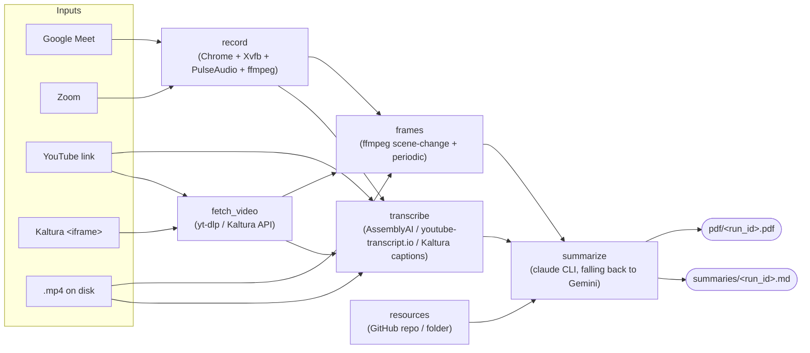

# meeting-transcriber

A meeting/lecture bot for a Proxmox box running **Debian 13 (trixie)**. It joins
a Google Meet or Zoom call in a real signed-in Chrome, records the screen and
audio to MP4, transcribes it, and writes an AI summary — as Markdown **and as a
PDF with the slides from the video inlined** — combining the transcript with
keyframes pulled from the recording. It also works on YouTube links, on Kaltura
lecture-capture embeds (paste the `<iframe>` from your LMS), and on video
files you already have, and it can read the lecturer's own slides from a GitHub
repo or a folder and use them as reference material.

The three stages are independent — each has its own entry script and runs
without the others — and `pipeline.sh` chains them.

- **Everything you run day to day is in [Commands](#commands).**
- Architectural decisions and the reasons behind them live in `CLAUDE.md`.

> **Coming from the Alpine version?** That tree is preserved on the
> `alpinelinux` branch. This branch runs everything natively on Debian: no
> Docker, no container image, no bind mounts. See
> [What changed on Debian 13](#what-changed-on-debian-13).

---

## Table of contents

- [How it works](#how-it-works)
- [What changed on Debian 13](#what-changed-on-debian-13)
- [Install](#install)
- [First-time login (you can't see a window)](#first-time-login-you-cant-see-a-window)
- [Commands](#commands)
- [Slides and reference material](#slides-and-reference-material)
- [Resuming a failed run](#resuming-a-failed-run)
- [Parallelism](#parallelism)
- [Output format](#output-format)
- [Configuration](#configuration)
- [Tests](#tests)
- [Troubleshooting](#troubleshooting)

---

## How it works



Each input becomes a **run**, with its own directory under
`$MEETING_BOT_ROOT/runs/<run_id>/` holding its state, logs, and sentinels.
Within a run, `transcribe` and `fetch_video → frames` are independent once a
video exists, so they execute concurrently and `summarize` joins them. Kaltura
is the exception: its entries rarely carry captions, so `transcribe` needs the
downloaded file and `fetch_video` runs first, ahead of both branches.

| Stage | Does | Needs |
|---|---|---|
| `record` | Joins the call, records screen + audio to MP4 | Chrome, Xvfb, PulseAudio, a signed-in profile |
| `fetch_video` | Downloads a YouTube video (for frames only) or a Kaltura entry (for frames *and* audio) | yt-dlp / nothing (Kaltura needs no key) |
| `transcribe` | Local file → AssemblyAI; YouTube → youtube-transcript.io captions; Kaltura → its own captions if it has any, else AssemblyAI | `ASSEMBLYAI_API_KEY_1..3` / `YT_TRANSCRIPT_KEY_1..10` |
| `frames` | Scene-change + periodic keyframes → `manifest.json` | ffmpeg |
| `summarize` | Transcript + frames (+ slides) → Markdown + PDF | the `claude` CLI signed into your Claude subscription / `GEMINI_API_KEY_1..3` |

Where the outputs go is **configured, not assumed** — the five directories are
independent variables, so summaries can sit on a NAS while recordings stay on
the big local disk:

```
$RECORDINGS_DIR/<run_id>.mp4            screen + audio
$TRANSCRIPTS_DIR/<run_id>.{txt,srt}
$FRAMES_DIR/<run_id>/                   keyframes + manifest.json
$SUMMARIES_DIR/<run_id>.md              the deliverable
$PDF_DIR/<run_id>.pdf                   the readable deliverable

$MEETING_BOT_ROOT/                      the pipeline's own bookkeeping
├── runs/<run_id>/                       state.json, logs/, kill, admitted, record.pid
├── state/keycursor.json                 API-key rotation cursor
├── tmp/                                 YouTube downloads, audio demuxes
├── resources/                           cached slide repos + rendered slides
└── chrome-profile/                      persistent Google/Zoom login
```

---

## What changed on Debian 13

The Alpine build could not run Chrome: Alpine is musl, Google ships no musl
build, and Playwright doesn't support Alpine for its bundled browsers. So the
browser half lived in a Debian container on an Alpine host. Debian 13 is glibc,
so **that split is gone** and everything runs natively.

| | `alpinelinux` branch | this branch |
|---|---|---|
| Host | Alpine (musl) | Debian 13 (glibc) |
| Browser stages | Debian container via Docker | Native |
| Docker | Required | Not used at all |
| Per-run isolation | Container namespaces (`:99`, `meeting_sink` hardcoded) | Display + PulseAudio sink allocated per run (`lib/xsession.sh`) |
| Init system | OpenRC (no systemd) | systemd — `setup.sh --with-trigger` installs the trigger unit |
| Summarizer | Gemini first, API key | **Claude first, on your subscription** via the `claude` CLI; Gemini as fallback |
| Keys | One each; YouTube tokens in a JSON file | **Numbered slots in `.env`**, round-robin (3 Gemini, 3 AssemblyAI, 10 YouTube) |
| Output | Markdown, fixed layout under `/opt/meeting-bot` | Markdown **+ PDF**, five independently configured directories |
| Slides | — | `--resources` pulls a GitHub repo or folder into the prompt and the PDF |

Two consequences worth knowing:

- **Per-run isolation is now explicit.** `lib/xsession.sh` claims a free
  display number by creating `/tmp/.X<n>-lock` with `O_EXCL` (so two runs
  starting in the same second can't pick the same one) and loads a null sink
  named after the run. Chrome is pointed at that sink with `PULSE_SINK` — the
  default sink is *never* changed, because that is global state and flipping it
  would move another meeting's audio into this recording.
- **Recording is no longer isolated by a container.** Two concurrent recordings
  are still fine, but they share one PulseAudio daemon and one X server.

---

## Install

Target: Debian 13 (trixie) on Proxmox (LXC container or KVM VM), 4 vCPU / 8 GB.

```bash
sudo -H ./setup.sh
```

That installs the system packages (ffmpeg, Xvfb, PulseAudio, x11vnc/noVNC,
poppler, Pango for the PDF renderer, Thai fonts), real `google-chrome-stable`
from Google's repository, the Python venv at `/opt/meeting-bot-venv`, yt-dlp,
and the working directories.

**Python dependencies are pinned.** `requirements.txt` (and
`requirements-browser.txt`, which is skipped by `--no-chrome`) hold every
package and transitive dependency at an exact version with a SHA-256 hash. Both
are generated from the `requirements.in` files beside them. This is what stops
two boxes built months apart from getting different SDK versions — the failure
mode there is an SDK that quietly changes its request surface and turns a
working install into a 400 on every summary.

**uv is optional but worth installing** — same pinned result, ~40x faster
(measured on this target: 4s versus 2m43s):

```bash
curl -LsSf https://astral.sh/uv/install.sh | sh
```

`setup.sh` uses it automatically when it's on `PATH` and falls back to pip
otherwise; both verify the lockfile's hashes, so the venv is identical either
way. uv is not in Debian's archive, which is why it stays optional.

To change a dependency, edit `requirements.in`, then regenerate (needs uv):

```bash
uv pip compile --generate-hashes requirements.in -o requirements.txt
```

```bash
uv pip compile --generate-hashes -c requirements.txt requirements-browser.in -o requirements-browser.txt
```

Useful flags:

```bash
sudo -H ./setup.sh --no-chrome          # transcribe/summarize box only
sudo -H ./setup.sh --with-libreoffice   # so .pptx slides can be rendered into the PDF (~700MB)
sudo -H ./setup.sh --with-trigger       # install + enable the systemd trigger service
```

### Sign the summarizer in

The summarizer spends **your Claude subscription**, not a metered API key —
there is no `ANTHROPIC_API_KEY` anywhere in this project. It does that by
running the `claude` CLI, so the CLI has to be installed and signed in once:

```bash
curl -fsSL https://claude.ai/install.sh | bash
```

```bash
claude auth login
```

`claude auth login` opens a browser flow. On this box there is no browser you
can see, so either run it through the same noVNC session
[`first_time_login.sh`](#first-time-login-you-cant-see-a-window) sets up, or
generate a long-lived token on a machine you *can* see and paste it in:

```bash
claude setup-token
```

`setup.sh` does not install the CLI: it comes from Anthropic's own installer
rather than apt, and it is per-user state (the login lives in `~/.claude`),
so it is not part of a root system bootstrap. Check it any time with:

```bash
claude auth status
```

If the CLI is missing or signed out, the summarize stage says so and falls
through to Gemini rather than failing the run — but the summaries you get are
Gemini's, so it is worth checking. `./verify_e2e.sh --preflight` reports it.

Then configure:

```bash
cp .env.example .env && chmod 600 .env
$EDITOR .env
```

Fill in the API keys (Gemini, AssemblyAI, youtube-transcript.io — Claude
needs none) and the five output directories. Check them with:

```bash
/opt/meeting-bot-venv/bin/python3 lib/paths.py show
/opt/meeting-bot-venv/bin/python3 lib/keyring.py status    # counts keys, never prints them
./verify_e2e.sh --preflight                                # everything, including a real 2s capture
```

> **Running in an LXC container?** No nesting flag is needed any more (that was
> for Docker). The container does need `/dev/shm` of a sane size for Chrome —
> the default 64MB is enough here because Chrome runs with
> `--disable-dev-shm-usage`.

---

## First-time login (you can't see a window)

Run this once, and again whenever your Google or Zoom session expires. It opens
a real Chrome on a headless display using the same persistent profile the
recorder reuses, and exposes it to **you** over noVNC.

```bash
./first_time_login.sh
```

It prints an `ssh -L ...` command to run on your own machine, then you open
`http://localhost:6080/vnc.html` and sign in. Nothing is exposed to the network.

Other ways in:

```bash
./first_time_login.sh --tailscale      # bind to this host's tailnet IP instead
./first_time_login.sh --bind 0.0.0.0   # every interface (see the warning it prints)
./first_time_login.sh --screenshot     # also dump the display to a PNG every 10s
./first_time_login.sh --url https://zoom.us/signin
```

`--screenshot` is the fallback for when noVNC can't reach at all: it writes
`$MEETING_BOT_ROOT/login-screenshots/latest.png`, which you can `scp` down to
see what's actually on screen.

Sign into Google, then open `zoom.us` in the same window and sign in there too.
Both land in the shared profile at `$CHROME_PROFILE_DIR`. Press `Ctrl+C` when
done.

> The VNC session has no password and fronts a browser holding your Google
> session. The default localhost binding is the safe one; only use `--bind` on a
> network you trust, and stop the script as soon as you're signed in.

Chrome is launched **directly** here, not through Playwright: even with
`channel="chrome"`, Playwright sets automation flags that Google's sign-in flow
rejects with "This browser or app may not be secure".

---

## Commands

### The whole pipeline

```bash
./pipeline.sh "https://meet.google.com/abc-defg-hij" --name "Weekly Standup"
./pipeline.sh "https://zoom.us/j/1234567890" --name "Client Call"
./pipeline.sh "https://www.youtube.com/watch?v=5GAfjAjLKYk"
./pipeline.sh /srv/recordings/existing.mp4
```

A Kaltura lecture can be given either way — paste the whole `<iframe>` your LMS
shows you, or just its `src`. Quote it: the tag contains spaces.

```bash
./pipeline.sh '<iframe id="kaltura_player" src="https://cdnapisec.kaltura.com/p/2910381/embedPlaykitJs/uiconf_id/52668182?iframeembed=true&entry_id=1_y9jay9sw"></iframe>'
./pipeline.sh "https://cdnapisec.kaltura.com/p/2910381/embedPlaykitJs/uiconf_id/52668182?iframeembed=true&entry_id=1_y9jay9sw"
```

Both produce the same run (`kal_1_y9jay9sw_<timestamp>`), so pasting the tag
once and the URL later resumes rather than duplicates. No key and no login are
involved — the entry is reached with an anonymous Kaltura widget session, the
same one the embedded player uses. An entry that *does* need a logged-in LMS
session fails immediately and says so; recording one through the browser is not
implemented.

Each of those writes both `$SUMMARIES_DIR/<run_id>.md` and
`$PDF_DIR/<run_id>.pdf`.

### Several inputs at once

Any mix of types, processed concurrently:

```bash
./pipeline.sh "https://youtu.be/aaa" "https://youtu.be/bbb" "https://youtu.be/ccc" --jobs 3
```

From a file (blank lines and `#` comments are skipped):

```bash
./pipeline.sh --from-file links.txt --jobs 4
```

Expand a playlist — opt-in, because a normal watch URL often carries a stray
`&list=` and silently transcribing 200 videos would be rude:

```bash
./pipeline.sh "https://www.youtube.com/playlist?list=PL..." --playlist
```

Write one combined chapter-shaped file as well as the per-run summaries:

```bash
./pipeline.sh --from-file chapter3_links.txt --prompt lecture-claude \
  --combine ~/courses/2_Transcripts/chapter3.md
```

That writes `chapter3.md` **and** `chapter3.pdf` — one PDF holding every
lecture, with a single keyframe appendix and every source transcript in the
hidden text layer. Name the PDF somewhere else with `--combine-pdf`, or skip it
with `--no-combine-pdf`:

```bash
./pipeline.sh --from-file chapter3_links.txt \
  --combine ~/courses/2_Transcripts/chapter3.md \
  --combine-pdf ~/courses/pdf/chapter3.pdf
```

Frame numbers are unique only within one recording, so the combined document
renumbers each section's citations — lecture B's "Frame 2" becomes "Frame 5"
if lecture A contributed three frames. That means **the combined `.md` and the
per-run `.md` cite different numbers for the same picture**, which is the point:
in the combined PDF each number resolves to the right lecture's frame. With
`--no-combine-pdf` nothing is renumbered, because there is no combined
appendix to resolve against.

Because the combined PDF is rendered after every run has finished, `pipeline.sh`
tells the runs to keep their frames and sweeps them itself once the render is
done. `KEEP_FRAMES=1` still keeps them.

### Options

| Flag | Meaning |
|---|---|
| `--name N` | Meeting name (single input only; otherwise derived) |
| `--display-name D` | Name the bot shows in the meeting (default `Meeting Bot`) |
| `--language L` | `th` (default), `en`, `auto`, or any AssemblyAI code |
| `--prompt P` | A file in `summarize/prompts/`, e.g. `--prompt lecture-claude` |
| `--resources SPEC` | Slides / notes for this session; repeatable (see below) |
| `--jobs N` | Inputs processed at once (default 2) |
| `--from-file F` | Read inputs from a file, one per line |
| `--playlist` | Expand YouTube playlist URLs |
| `--combine F` | Also write every summary into one file, in input order |
| `--combine-pdf F` | Where the combined PDF goes (default: `--combine`'s path with `.pdf`) |
| `--no-combine-pdf` | Write only the combined markdown |
| `--force` | Ignore prior state, start clean |
| `--run-id ID` / `--resume-last` / `--resume-all` | Resume (see below) |
| `--list` / `--status ID` | Inspect runs |

The legacy positional form still works when unambiguous:
`./pipeline.sh <input> [name] [display_name] [language] [prompt]`.

### Individual stages

```bash
# 1 — record only
./screen/record_screen.sh "<meeting_url>" "Meeting Name" ["Display Name"] [out.mp4]

# 2 — transcribe only  (local file → AssemblyAI, YouTube URL → captions,
#     Kaltura embed → its captions, else AssemblyAI on the file behind --media)
./transcribe/transcribe.sh <file_or_url> "<name>" [language] [--out-base PATH] [--media PATH]

# Kaltura on its own: inspect an entry, or pull the MP4 down by hand
python3 lib/kaltura.py info "<iframe or src url>"
python3 lib/kaltura.py download "<iframe or src url>" /tmp/lecture.mp4

# 3 — summarize only
/opt/meeting-bot-venv/bin/python3 ./summarize/summarize.py \
    <video_or_youtube_url> <transcript.txt> [out.md] \
    [--prompt NAME] [--frames-manifest PATH] [--resources SPEC] \
    [--pdf-out PATH] [--no-pdf] [--no-markdown] [--source-url URL] [--title TEXT]

# frames only (normally called by the pipeline)
python3 screen/extract_frames.py <video> <out_dir> ["name"]

# PDF only, from a summary you already have
/opt/meeting-bot-venv/bin/python3 summarize/pdf.py summary.md out.pdf \
    --frames-manifest "$FRAMES_DIR/<run_id>/manifest.json"
```

### Stopping a recording

```bash
./kill_meeting.sh                  # every active run
./kill_meeting.sh --run-id <id>    # just that one
./kill_meeting.sh --list           # show what's running, kill nothing
```

`Ctrl+\` in the recording terminal does the same thing. Either way the bot
clicks **Leave** in the meeting UI so other participants see it go, rather than
having the browser killed under it. Only if a recorder is still alive after the
grace period (25s) does `kill_meeting.sh` escalate to signals, and even then
ffmpeg gets `SIGINT` first so the MP4 is finalised and playable.

### Remote trigger (start a run from your phone over Tailscale)

Debian has systemd, so the bundled unit is usable directly:

```bash
sudo -H ./setup.sh --with-trigger
echo "MEETING_BOT_TOKEN=$(openssl rand -hex 24)" | sudo tee -a /etc/meeting-bot.env
sudo systemctl restart meeting-bot-trigger
```

```bash
curl -X POST http://<tailscale-host>:8765/trigger \
  -H "Authorization: Bearer <token>" -H "Content-Type: application/json" \
  -d '{"url": "https://meet.google.com/abc-defg-hij", "name": "Client Call",
       "resources": "https://github.com/me/course@week4"}'
```

Returns `202` immediately and runs `pipeline.sh` in the background, logging to
`$MEETING_BOT_ROOT/logs/trigger_<timestamp>.log`.

---

## Slides and reference material

A recording plus a transcript is what the class *said*. The slides are what it
*meant* — the correct spelling of every technical term, the notation actually
used, the section numbering. Feeding them in alongside the transcript is the
cheapest available fix for speech recognition mangling domain vocabulary.

```bash
# a GitHub repo (default branch)
./pipeline.sh "<url>" --resources https://github.com/me/course

# a branch
./pipeline.sh "<url>" --resources https://github.com/me/course@week4

# a branch and a subdirectory — paste a /tree/ URL straight from GitHub
./pipeline.sh "<url>" --resources https://github.com/me/course/tree/main/lectures/wk4

# a local folder or a single file
./pipeline.sh "<url>" --resources "/srv/course/Week 4" --resources ~/notes/handout.pdf
```

What happens to it:

- **Text** is extracted from `.md`, `.txt`, `.pdf` (via `pdftotext`), `.pptx`
  and `.docx` and appended to the prompt as reference material, capped at
  `RESOURCE_MAX_CHARS` (40,000) in total so a whole textbook can't push the
  transcript out of the model's context. It is framed as *data*, never as
  instructions — the same treatment the transcript gets.
- **Slide images** are rendered (PDF pages via `pdftoppm`; `.pptx` via
  LibreOffice when installed) and embedded in the PDF's Appendix B.
- GitHub sources are shallow-cloned into `$RESOURCE_CACHE_DIR` and refreshed on
  re-runs. Private repos work when `GITHUB_TOKEN` is set; the token is injected
  into the remote URL only for the clone, never written to disk or logged.
- The specs are stored in the run's `state.json`, so a **resume** summarizes
  against the same material the first attempt used.

A GitHub source that can't be fetched degrades the summary and is reported —
it doesn't fail the run. A *local* path that doesn't exist fails immediately,
because that is always a typo, and finding out after paying for a summary is
worse.

---

## Resuming a failed run

Every run records what it finished and where the output went, so nothing
successful is ever redone. **Just run the same command again** — it finds the
unfinished run for that input and restarts at the first stage that isn't done:

```bash
./pipeline.sh "https://youtu.be/abc"     # died at summarize (API was down)
./pipeline.sh "https://youtu.be/abc"     # resumes; reuses transcript + frames
```

Explicit forms:

```bash
./pipeline.sh --list                 # what runs exist and how far each got
./pipeline.sh --status <run_id>      # per-stage detail, artifacts, last error
./pipeline.sh --run-id <run_id>      # resume that one
./pipeline.sh --resume-last          # resume the most recent
./pipeline.sh --resume-all           # resume everything unfinished
./pipeline.sh <input> --force        # ignore prior state, start over
```

Two details worth knowing:

- **A stage counts as done only if its output is still on disk.** Delete a
  transcript and re-run, and it regenerates rather than being skipped.
- **A run is locked while it's being processed**, so two invocations can't work
  the same run. If the owning process died, the lock is taken over instead of
  blocking forever — a killed run has to stay resumable.

Old run directories (which hold YouTube downloads) can be swept:

```bash
python3 lib/runstate.py sweep --days 30
```

---

## Parallelism

Four independent levels, all tunable:

| Level | Control | Default |
|---|---|---|
| Inputs processed at once, **within one invocation** | `--jobs N` / `PIPELINE_JOBS` | 2 |
| Within a run: `transcribe` ∥ `fetch_video`→`frames` | always on | — |
| Chunks of a long transcript summarized at once | `SUMMARY_MAX_PARALLEL` | 3 |
| A component running at once, **across all invocations** | `QUEUE_SLOTS_<COMPONENT>` | unlimited |

On a 4-vCPU box, `--jobs 2` or `3` is sensible; frame extraction is the
CPU-hungry part. Chunk concurrency is kept low on purpose — every chunk carries
images, and firing a dozen multi-megabyte requests is a good way to earn the
429s you then have to sit out.

### Queueing across separate sessions

`--jobs` only limits concurrency *inside one* `./pipeline.sh` invocation. Run
the script in three terminals — or trigger it three times from your phone — and
you get three independent sets of stages competing for the same CPUs and the
same rate-limited APIs.

The queue is the machine-wide throttle those sessions coordinate through. Set a
slot count and they take turns, first-come-first-served:

```bash
# in .env
QUEUE_SLOTS_TRANSCRIBE=1     # one transcription at a time, box-wide
QUEUE_SLOTS_FRAMES=1         # one ffmpeg frame extraction at a time
QUEUE_SLOTS_SUMMARIZE=2      # two summaries in flight
QUEUE_SLOTS_DEFAULT=1        # fallback for anything not named above
```

A session that can't get a slot waits and says where it stands, so a blocked
run never looks hung:

```
  queue: waiting for a 'transcribe' slot (1 ahead, 1/1 in use)
```

**Everything is unlimited unless you set its variable** — with nothing
configured, no queue files are created and behaviour is exactly as before.

> **Think twice about `QUEUE_SLOTS_RECORD`.** Recording is the one
> time-sensitive stage. If two meetings overlap and there's a single record
> slot, the second meeting isn't delayed — it's *missed*, and you can't go back
> and record it. Leave it unset unless your meetings never overlap.

Inspect and unstick:

```bash
python3 lib/slotqueue.py status
python3 lib/slotqueue.py reset --component transcribe
```

A slot is held by the shell running the stage. If that process dies — a kill, a
reboot — the next caller notices the PID is gone and reclaims the slot, so the
queue can't wedge permanently and needs no cleanup daemon.

---

## Output format

### Markdown

Summaries from `lecture-*` and `tutorial-*` prompts are wrapped in a
course-note document, shaped to drop straight into a chapter file:

```markdown
<!-- meeting-transcriber
     source: https://www.youtube.com/watch?v=5GAfjAjLKYk
     source_type: youtube
     model: claude-cli/opus
     prompt: lecture-claude.md
     run_id: yt_5GAfjAjLKYk_20260904_120000
     generated: 2026-09-04
-->

Chapter N — <topic> (<date>)

# 2110203 L01 : Signals and Transformations

Youtube Link: `https://www.youtube.com/watch?v=5GAfjAjLKYk`

<details>
    <summary> View Transcript </summary>

    ...the full transcript, indented four spaces...
</details>
<br>

...the model's structured summary...

<br><br>
```

- The provenance header is an HTML comment: invisible when rendered, greppable
  in the raw file, and harmless when pasted into a larger document. On a
  fallback chain it is the only record of which provider actually answered.
- `Chapter N — <topic> (<date>)` is a literal placeholder for you to fill in.
  The chapter number isn't derivable from the video, and a plausible-looking
  guess would be worse than an obvious blank.
- The title comes from yt-dlp, the link and transcript are inserted by the code
  — the model never writes them, so they can't be hallucinated or truncated.
- `--combine` concatenates several of these with one Chapter line at the top,
  in **input order** (runs finish out of order when several go at once). It
  works on the `.md` files, so it has nothing to do if `--no-markdown` is set.
  It also renders a combined PDF from the same text — see above for the frame
  renumbering that makes its pictures line up.

`meeting-*` prompts keep the plain executive-summary format — no wrapper.

Available prompts: `ls summarize/prompts/`. Pick one with `--prompt <name>`
(no `.md` needed). `_merge.md` is internal and not selectable.

### PDF

The same summary is rendered to `$PDF_DIR/<run_id>.pdf` by WeasyPrint:

- **LaTeX is typeset, in Computer Modern.** The model writes maths as `$L/R$`
  and `$$...$$`; markdown readers render that, and a PDF renderer with no
  JavaScript engine and no MathML would print the backslashes. So
  `summarize/mathrender.py` lifts every expression out before the HTML
  conversion and hands it to matplotlib's `mathtext` — a LaTeX-subset
  typesetter that ships Computer Modern and needs no TeX installation —
  inlining the result as SVG, baseline-aligned to the text around it.
  `\begin{aligned}` blocks are split into rows first, since mathtext has no
  environments. Anything it still can't parse degrades to cleaned-up text
  rather than failing the render. `PDF_MATH=0` turns the whole pass off;
  `PDF_MATH_SCALE` sizes the maths against the body text.
- **Keyframes go to Appendix A, not into the argument.** A keyframe is a
  screenshot of a video call: mostly a participant's face, a half-drawn slide,
  or — the scene-change pass being drawn to exactly this — solid black.
  Printed full width mid-paragraph they were noise, so the citations stay as
  the model wrote them and the frames they name are collected into a thumbnail
  contact sheet at the back: each frame once, blank ones dropped, and only the
  cited ones cropped at all. `PDF_FRAMES=inline` restores the old behaviour of
  replacing the first citation of each frame with the picture; `none` drops
  frames from the PDF entirely.
- **Frames are cropped to the slide.** A raw 1920×1080 Meet frame is mostly
  dark UI chrome and participant tiles. `summarize/framecrop.py` finds the
  largest bright rectangle — slides are overwhelmingly light on dark UI — and
  crops to it, but only when the candidate passes size, area, aspect-ratio and
  brightness checks. Otherwise it falls back to a plain border trim, and then
  to the untouched frame: a confidently wrong crop (half a slide, one
  participant's face) is worse than no crop. Tune with `PDF_FRAME_CROP`
  (`slide` | `border` | `none`).
- **The transcript is present but invisible.** It goes in as white 1pt text
  between `BEGIN_TRANSCRIPT` and `END_TRANSCRIPT` markers: nobody reading the
  PDF sees it, and `pdftotext` — or any other extractor — hands an agent the
  summary followed by the labelled transcript. It is written in ~40,000-
  character pieces because poppler silently stops extracting text after about
  50,000 characters on one page, so a single block would come back truncated
  with no warning; the cost is a couple of blank-looking pages at the back of
  a long lecture. `PDF_TRANSCRIPT=appendix` prints it as Appendix C instead,
  `none` leaves it out. Reference slides get Appendix B either way.
- **Body text is Adwaita Sans at 8pt** (`PDF_FONT_FAMILY`, `PDF_FONT_SIZE`),
  with Arial and Liberation Sans behind it and Noto Sans Thai for the Thai —
  every other size in the document is relative to `PDF_FONT_SIZE`, so changing
  it rescales headings, tables and captions together. `setup.sh` installs
  `fonts-adwaita-sans`; if it isn't available the stack falls through to
  Liberation Sans. Keep a Thai face in any custom stack or a Thai lecture
  renders as tofu boxes.

A PDF that fails to render logs a warning and leaves the run successful — the
Markdown is the artifact everything downstream depends on. Turn either output
off with `--no-pdf` / `--no-markdown` (or `SUMMARY_WRITE_PDF=0` /
`SUMMARY_WRITE_MARKDOWN=0`); turning off both is an error rather than a run
that writes nothing.

---

## Configuration

All settings live in `.env` at the repo root (`cp .env.example .env`,
`chmod 600 .env`). `.env.example` is a bare list of names and defaults — the
explanations are here. Already-exported variables always win, so one-off
overrides work: `SUMMARY_EFFORT=max ./pipeline.sh ...`.

### Output directories — all five are required

| Variable | Holds |
|---|---|
| `RECORDINGS_DIR` | `<run_id>.mp4` and its ffmpeg log |
| `TRANSCRIPTS_DIR` | `<run_id>.txt` and `<run_id>.srt` |
| `FRAMES_DIR` | `<run_id>/` — keyframes and `manifest.json` |
| `SUMMARIES_DIR` | `<run_id>.md` |
| `PDF_DIR` | `<run_id>.pdf` |
| `MEETING_BOT_ROOT` | The pipeline's own bookkeeping only: `runs/`, `state/`, `tmp/`, `resources/`, `chrome-profile/` |

They are independent of each other and of `MEETING_BOT_ROOT` — point any of
them anywhere, including a mount with spaces in the path. An unset one is a
hard error naming the variable, rather than a silent default: with independent
paths, a wrong default doesn't fail, it just puts your lecture summaries
somewhere you'll never look.

`CHROME_PROFILE_DIR` (default `$MEETING_BOT_ROOT/chrome-profile`) and
`RESOURCE_CACHE_DIR` (default `$MEETING_BOT_ROOT/resources`) can also be moved.

### API keys — numbered slots, rotated round-robin

Every provider that allows several accounts reads numbered variables, and the
unnumbered name is accepted as slot 1:

| Variable | Slots | Used by |
|---|---|---|
| *(none — the `claude` CLI's own login)* | — | The default summarizer |
| `GEMINI_API_KEY_1..3` (or `GOOGLE_API_KEY`) | 3 | The fallback summarizer |
| `ASSEMBLYAI_API_KEY_1..3` | 3 | Transcribing local recordings |
| `YT_TRANSCRIPT_KEY_1..10` | 10 | YouTube captions |

`lib/keyring.py` rotates them. The cursor is **persisted** to
`$MEETING_BOT_ROOT/state/keycursor.json` and advances past the key that just
worked, so consecutive runs start on different accounts — a per-process cursor
would send every run at key #1 and exhaust that account first. Blank slots and
duplicates are skipped; a gap (`_1` and `_3` set, `_2` commented out) doesn't
end the scan.

```bash
/opt/meeting-bot-venv/bin/python3 lib/keyring.py status   # counts and the next slot
```

> **Moved from the Alpine version:** youtube-transcript.io tokens used to live
> in `/opt/meeting-bot/secrets/youtube_transcript_keys.json`. That file is gone;
> the tokens are `YT_TRANSCRIPT_KEY_1..10` in `.env` now.

### Summarization

| Variable | Default | Meaning |
|---|---|---|
| `SUMMARY_BACKEND` | `fallback` | `fallback`, `claude-cli`, `gemini` |
| `SUMMARY_FALLBACK_CHAIN` | `claude-cli,gemini` | Tried in order; first success wins. `disabled` short-circuits a slot |
| `CLAUDE_CLI_BIN` | found on `PATH`, then `~/.local/bin/claude` | Where the `claude` binary is |
| `CLAUDE_CLI_MODEL` | `opus` | A CLI model alias (`opus`, `sonnet`) or a full id |
| `CLAUDE_CLI_TIMEOUT_SECONDS` | 1800 | How long one summary may take before it counts as hung |
| `CLAUDE_CLI_FRAME_VISION` | 1 | `0` sends the frame list as text and never opens the images |
| `CLAUDE_CLI_STATIC_PROMPT` | 1 | Pass the prompt's unchanging half as a system prompt file, so the prefix is cache-eligible. `0` sends it inline (for a `claude` too old to know the flags) |
| `SUMMARY_EFFORT` | `high` | `low`, `medium`, `high`, `xhigh`, `max` |
| `GEMINI_API_KEY_1..3` | — | For the `gemini` fallback |
| `GEMINI_MODEL` | `gemini-3.6-flash` | Google retires model names; pin a real version, not a `-latest` alias |
| `SUMMARY_PROMPT` | `summarize.md` | Prompt file; `--prompt` overrides |
| `SUMMARY_MAX_TOKENS` | 16000 | |
| `SUMMARY_DOC_FORMAT` | `auto` | `auto` wraps `lecture-*`/`tutorial-*` output; `always`/`never` override |

**How the Claude backend runs.** `summarize/llm_client.py` shells out to:

```
claude -p --output-format json --model opus --effort high \
       --safe-mode --no-session-persistence \
       --append-system-prompt-file "$MEETING_BOT_ROOT/tmp/claude-cli-prompts/<sha>.md" \
       --exclude-dynamic-system-prompt-sections \
       --tools Read --allowedTools Read --add-dir "$FRAMES_DIR/<run_id>"
```

The prompt (transcript, frame list, slides) goes in on stdin — an 80KB
transcript would not fit in a command-line argument. `--safe-mode` and a
scratch working directory keep this repo's own `CLAUDE.md`, hooks and plugins
out of the summarizer's context, and `--no-session-persistence` stops every
lecture leaving a full transcript in `~/.claude`.

**The instructions are sent as a system prompt so they can be cached.** Claude
caches an exact prefix, and the CLI exposes no caching flag of its own —
caching is automatic, so the only thing you control is whether the prefix stays
still. A prompt file may fence the half that never changes between runs:

```markdown
<!-- static-prompt: begin -->
...role, instructions, output format, worked example...
<!-- static-prompt: end -->

# Input
<transcript>{transcript}</transcript>
<frames>{frame_manifest}</frames>
```

That block is written once to a content-addressed file and passed with
`--append-system-prompt-file`; `--exclude-dynamic-system-prompt-sections`
moves the CLI's own per-machine sections (cwd, date, git status) out of the
system prompt too. Everything that varies — the chunk label, your slides, the
transcript, the frame paths — stays on stdin. On a long lecture split into
several chunks, every chunk after the first reuses the same cached prefix.

`prompts/lecture-claude.md` (the default in `.env.example`) and
`prompts/summarize-v2.md` both carry the fences — for `lecture-claude` that is
5,473 cached characters against 346 sent per call. Any other prompt file has no
markers, is sent exactly as before, and gets no caching benefit; copy the
fences into your own prompt if you want it. `CLAUDE_CLI_STATIC_PROMPT=0` turns
it off entirely.

**Frames are read from disk, not uploaded.** The Messages API took inline
images; the CLI takes a string. So the frame list carries absolute paths and
the CLI is given the `Read` tool, scoped by `--add-dir` to that run's frame
directory and nothing else. Set `CLAUDE_CLI_FRAME_VISION=0` to skip that: it is
faster and lighter on your rate limit, but the model then cites frames it has
never seen, so the pictures in the PDF may not match what the text says about
them.

**Any `ANTHROPIC_API_KEY` in your environment is stripped before the CLI runs.**
If it survived, the CLI would quietly bill a metered console account instead of
your subscription, and nothing about the output would tell you.

**About `SUMMARY_EFFORT`.** It maps onto the CLI's `--effort`, the same scale
the API spells `output_config.effort`: how hard the model is told to think.
Thinking itself is adaptive, so the model decides when to use it, and there is
no "thinking budget" setting. `high` is the sweet spot for lecture notes; `max`
costs meaningfully more for a marginal gain on this kind of task, and `low` is
fine for short standups.

**Watch your subscription's rate limit.** A metered API key soaks up
concurrency; a subscription does not. `SUMMARY_MAX_PARALLEL` (default 3) fires
that many `claude` processes at once for a long transcript, and `--jobs`
multiplies it across inputs. On a Pro plan, `SUMMARY_MAX_PARALLEL=1` with
`--jobs 1` is the safe setting for a batch of lectures; the chain falls through
to Gemini when you run out, so a limit shows up as Gemini-authored summaries
rather than as an error.

Missing credentials for one backend are not fatal — the chain skips it and
moves on. A `claude` CLI that is missing or signed out is treated exactly that
way. Which backend answered is recorded in the document's provenance header
(`model: claude-cli/opus`).

### PDF export

| Variable | Default | Meaning |
|---|---|---|
| `SUMMARY_WRITE_PDF` | 1 | `0` = markdown only (same as `--no-pdf`) |
| `SUMMARY_WRITE_MARKDOWN` | 1 | `0` = PDF only (same as `--no-markdown`) |
| `PDF_FRAMES` | `contact` | `contact` (thumbnail appendix), `inline` (figures in the body), or `none` |
| `PDF_FRAME_CROP` | `slide` | `slide`, `border`, or `none` |
| `PDF_FRAME_MAX_WIDTH` | 1280 | Inline figures are downscaled to this |
| `PDF_CONTACT_MAX_WIDTH` | 640 | Contact-sheet thumbnails are downscaled to this |
| `PDF_TRANSCRIPT` | `hidden` | `hidden` (white 1pt layer), `appendix`, or `none` |
| `PDF_HIDDEN_CHUNK_CHARS` | 40000 | Characters of hidden transcript per page; above ~50k poppler stops extracting |
| `PDF_PAGE_SIZE` | `A4` | Any WeasyPrint page size |
| `PDF_FONT_FAMILY` | `Adwaita Sans, Arial, Liberation Sans, Noto Sans Thai, Noto Sans, DejaVu Sans, sans-serif` | Keep a Thai face in the stack |
| `PDF_FONT_SIZE` | 8 | Body size in points; everything else scales with it |
| `PDF_MATH` | 1 | 0 leaves LaTeX as text instead of typesetting it |
| `PDF_MATH_SCALE` | 1.15 | Maths size relative to the body text |
| `PDF_MATH_FONTSET` | `cm` | matplotlib mathtext font set (`cm` is Computer Modern) |

### Reference material

| Variable | Default | Meaning |
|---|---|---|
| `RESOURCES` | — | Default `--resources` specs for every run, comma- or newline-separated |
| `RESOURCE_MAX_CHARS` | 40000 | Total extracted text given to the model |
| `RESOURCE_MAX_FILE_MB` | 25 | Per-file size cap |
| `RESOURCE_SLIDE_IMAGES` | 1 | `0` skips rendering slide images |
| `RESOURCE_CACHE_DIR` | `$MEETING_BOT_ROOT/resources` | Clones and rendered slides |
| `GITHUB_TOKEN` | — | For private repositories |

### Transient failures (503 "server is busy", 429, 5xx)

| Variable | Default |
|---|---|
| `SUMMARY_MAX_RETRIES` | 5 |
| `SUMMARY_RETRY_BASE_SECONDS` | 2.0 |
| `SUMMARY_RETRY_MAX_SECONDS` | 60.0 |

Retries use exponential backoff with full jitter and honor `Retry-After`. A
backend is only abandoned once its own retries are exhausted; then the chain
advances. `400/401/403/404/422` never retry — a bad key fails the same way
forever, and retrying just delays the fallback. Gemini key rotation happens
*outside* the retry loop: an exhausted key hands over to the next one
immediately rather than burning the full retry schedule first.

### Long transcripts

| Variable | Default | Meaning |
|---|---|---|
| `SUMMARY_CHUNK_CHARS` | 24000 | Above this, chunk + merge. `0` disables |
| `SUMMARY_CHUNK_OVERLAP` | 800 | Context repeated across a boundary |
| `SUMMARY_SEGMENT_MAX_SECONDS` | 120 | Transcript segments longer than this are split before chunking. `0` disables |
| `SUMMARY_SEGMENT_MAX_CHARS` | 2000 | Same, by length |
| `SUMMARY_MAX_PARALLEL` | 3 | Concurrent chunk requests |

### Transcription

| Variable | Default | Meaning |
|---|---|---|
| `ASSEMBLYAI_API_KEY_1..3` | — | Required for local files |
| `ASSEMBLYAI_LANGUAGE` | `th` | `en`, `auto`, or any AssemblyAI code |
| `ASSEMBLYAI_MODEL` | SDK chain `universal-3-5-pro`, `universal-2` | Overrides the leading entry |
| `YT_TRANSCRIPT_KEY_1..10` | — | Required for YouTube inputs |
| `TRANSCRIBE_BACKEND` | `assemblyai` | YouTube URLs always use captions regardless |

Kaltura entries need no key at all. When the entry carries a caption track in
the requested language it is used and AssemblyAI is skipped; most
lecture-capture entries have none, and then the downloaded MP4 goes to
AssemblyAI like any other file.

### Kaltura

| Variable | Default | Meaning |
|---|---|---|
| `KALTURA_REFERER` | `https://cdnapisec.kaltura.com/` | The `Referer` sent with every Kaltura request |

Kaltura entries usually sit behind an access-control profile that checks the
referring domain, and a request without an allowed `Referer` is answered with a
bare `404` and no explanation. The default — Kaltura's own CDN domain — is
accepted by every tenant tested so far and needs no configuration. Set this to
your LMS's origin (e.g. `https://www.mycourseville.com/`) if your institution
whitelists only that; a `404` during the download is the symptom, and the error
message names this variable.

A key rejected for auth or quota reasons hands over to the next key; a failure
that is about the *audio* (silent file, unsupported language) does not, because
another key would fail identically.

### Frames

| Variable | Default | Meaning |
|---|---|---|
| `SCENE_THRESHOLD` | 0.3 | ffmpeg scene-change score cutoff |
| `FRAME_PERIOD_SECONDS` | 30 | Periodic safety-net sample; `0` disables |
| `FRAME_MAX_DIMENSION` | 1024 | Long edge, in pixels, of the frame *copies* sent to the LLM; `0` sends the originals |

Aggressive: `FRAME_PERIOD_SECONDS=10 SCENE_THRESHOLD=0.2`.
Slides only: `FRAME_PERIOD_SECONDS=300 SCENE_THRESHOLD=0.6`.

**`FRAME_MAX_DIMENSION` never touches the frames you keep.** A 1920x1080
keyframe costs the model roughly 1,844 tokens every time it opens one, and
about 790 at 1024px — on a three-hour lecture with 360 frames that is the
difference between ~660k and ~280k tokens. So a downscaled *copy* is written to
`<frame dir>/llm-1024/` and the model is pointed at that; the full-resolution
original stays where it is, because the PDF crops and embeds it. The copies are
reused on a resume and are as disposable as the rest of `FRAMES_DIR`. Needs
Pillow — without it the originals are sent, with a warning. Raising
`FRAME_PERIOD_SECONDS` is still the bigger lever for a long lecture: this
changes how much each frame costs, not how many there are.

### Meeting behaviour

| Variable | Default | Meaning |
|---|---|---|
| `MAX_MEETING_MINUTES` | 240 | Hard wall-clock cap |
| `IDLE_LEAVE_MINUTES` | 5 | Leave after this long alone (or with one other); `0` disables |
| `RECORD_GEOMETRY` | `1920x1080` | Xvfb head, Chrome window and ffmpeg capture size — they must agree or the recording gets black edges |
| `RECORD_FRAMERATE` | 15 | |
| `MEETING_BOT_DISPLAY_NAME` | `Meeting Bot` | Same as `--display-name` |
| `PIPELINE_JOBS` | 2 | Same as `--jobs` |

The bot also leaves on the kill sentinel, when the page says the meeting ended,
or when participants drop below 30% of their peak for two consecutive polls.

---

## Tests

Everything except `verify_e2e.sh` runs with no API keys, no network access and
no `/opt` — against temporary directories, including one with a space in its
path so quoting mistakes surface.

```bash
python3 lib/test_runstate.py                 # run state, resume, concurrency (13)
python3 lib/test_slotqueue.py                # cross-session component queue (23)
python3 lib/test_keyring.py                  # numbered keys + rotation cursor (22)
python3 lib/test_resources.py                # resource specs, extraction, GitHub (27)
python3 lib/test_kaltura.py                  # iframe/URL parsing, Referer, captions (46)
python3 summarize/test_summarize_units.py    # retry, chunking, map-reduce, frame numbering, document, claude-cli (109)
python3 summarize/test_pdf_units.py          # frame cropping, citations, PDF render (60)
python3 transcribe/test_yt_transcript_client.py   # key rotation, retry, tracks[] (16)
bash lib/test_pipeline_e2e.sh                # full orchestration, stages stubbed (148)
bash lib/test_media_e2e.sh                   # real media, APIs stubbed at the socket (62)
```

Two of those are worth understanding:

- **`test_pipeline_e2e.sh`** runs `pipeline.sh` and `run_one.sh` for real —
  routing, the DAG, parallel branches, state transitions, resume, `--force`,
  `--combine`, locking, the output-directory requirements, `--resources`
  threading — with the four expensive stages replaced by stubs honoring the
  same contract.
- **`test_media_e2e.sh`** does the opposite: it builds a real MP4 with ffmpeg
  and runs the *actual* stages against local stub servers
  (`lib/fake_api_server.py`) that speak the providers' HTTP protocols, and —
  for the summarizer — against a stub `claude` binary (`lib/fake_claude_cli.py`)
  that records exactly how it was invoked. The real AssemblyAI SDK and the real
  `llm_client` do the work, so it verifies things a mock never could: that
  `--effort` carries `SUMMARY_EFFORT`, that `--add-dir` scopes file access to
  the run's own frame directory, that the frame paths and the transcript reach
  the prompt, that an `ANTHROPIC_API_KEY` the test deliberately exports does
  *not* reach the CLI, that a signed-out CLI falls through to the next backend
  instead of being retried, that the key cursor advances, and that the PDF comes
  out with cropped frames in it.

Neither proves Chrome can join a live Meet call, that your real keys work, or
that your Claude subscription still has quota.
That is what `verify_e2e.sh` is for:

```bash
./verify_e2e.sh --preflight                    # tools, packages, keys, profile,
                                               # and a real 2-second Xvfb+Pulse+ffmpeg capture
./verify_e2e.sh --browser-smoke                # real Chrome on Xvfb, recorded — no meeting, no spend
./verify_e2e.sh --mp4 /path/to/recording.mp4   # real AssemblyAI + real summarizer
./verify_e2e.sh --youtube "<url>"              # real captions + real summarizer
./verify_e2e.sh --kaltura "<iframe or url>"    # real Kaltura download + summarizer
./verify_e2e.sh --meet "<url>" --minutes 3     # real Chrome joins, records, leaves
./verify_e2e.sh --zoom "<url>" --minutes 3
```

`--browser-smoke` is worth running after any change to the recording path: it
launches Chrome through Playwright with the recorder's exact flags
(`screen/browser_smoke.py` imports them from `capture.py`), records eight
seconds of it, and then **measures the recorded frame for black bands**. That
check is what caught Chrome placing its kiosk window at (10,10) — a 10-pixel
black band down the left and top of every recording that comparing window sizes
would have missed.

The meeting checks record for `--minutes`, then stop through the normal
`kill_meeting.sh` path, so they exercise the kill switch too. They check the
recording actually has an audio stream — a missing sink produces perfect video,
a silent MP4 and an empty transcript, which is otherwise only noticed at the
summary.

---

## Troubleshooting

**`missing required program(s): ...`**
`sudo -H ./setup.sh`. The browser stages run natively now, so Xvfb, PulseAudio,
x11vnc and Chrome all have to be present on the host itself.

**`no free X display between :90 and :119`**
Stale locks from a crashed run: `ls -l /tmp/.X*-lock`, and remove the ones with
no matching process.

**`PulseAudio did not start (pactl info fails)`**
The daemon runs per-user and this runs as root. `pulseaudio -D
--exit-idle-time=-1` by hand will show the real error; in a locked-down LXC it
usually needs `/dev/shm` and a writable `$HOME`.

**Google says "This browser or app may not be secure"**
The login must go through `first_time_login.sh`, which launches Chrome directly.
Playwright sets automation flags Google detects, even with `channel="chrome"`.

**The bot never gets admitted**
Check `runs/<run_id>/join_failed.png` or `not_admitted.png`, and
`runs/<run_id>/logs/record.log`.

**The MP4 has video but no sound**
The sink wasn't wired to the browser. Check that `PULSE_SINK` reached Chrome
(`runs/<run_id>/record.pid` records the sink name) and that
`pactl list short sinks` shows it. `./verify_e2e.sh --preflight` reproduces the
whole chain in two seconds.

**The recording has black bands down one edge**
The Chrome window isn't filling the Xvfb head. `./verify_e2e.sh --browser-smoke`
measures it. A band of 1px at the right and bottom is normal (Chrome's kiosk
viewport is a pixel under the window); anything thicker means `RECORD_GEOMETRY`,
`--window-size` and `--window-position` disagree.

**The MP4 is empty**
See `<recording>_ffmpeg.log` next to the MP4. Usually the display or the sink
didn't come up.

**No PDF, but the markdown is there**
The renderer is optional at runtime by design. The warning names what's
missing — usually `weasyprint` or its Pango libraries. Install the system half
with `sudo apt-get install libpango-1.0-0 libpangoft2-1.0-0`, then re-run
`sudo -H ./setup.sh` to restore the Python half from the lockfile. (Installing
individual packages by hand with `/opt/meeting-bot-venv/bin/pip install
weasyprint` works too, but leaves the venv out of step with
`requirements.txt`.)

**The PDF prints raw LaTeX instead of formulas**
matplotlib isn't installed in the venv, so `summarize/mathrender.py` fell back
to plain text. Re-run `sudo -H ./setup.sh` to restore the venv from the
lockfile. If a *particular* expression is the only one showing as text, it is
one mathtext can't parse (environments other than `aligned`-style ones,
`\substack`, and similar) — the fallback is deliberate, and the formula is
intact in the `.md`.

**A Kaltura entry fails with a 404, or "exposes no playable source"**
Two different problems with the same look.

A `404` on the *download* is access-control refusing the `Referer`. The default
is Kaltura's own CDN domain, which most tenants allow; if yours whitelists only
your LMS, set `KALTURA_REFERER` to that origin in `.env` (e.g.
`https://www.mycourseville.com/`). Check it in one second without running the
pipeline:

```bash
python3 lib/kaltura.py info "<iframe or src url>"
```

"exposes no playable source" is the other case: the entry is not playable
without a logged-in LMS session. There is no fallback for that — the Chrome
profile is not involved on this path, so signing it in would not help, and
browser-recording a private entry is not implemented. Download the file from
the LMS yourself and feed the pipeline the local `.mp4`.

**Frames in the PDF are uncropped**
Pillow isn't installed, or the slide detector declined on every frame (a
full-screen camera shot has no slide to find). `PDF_FRAME_CROP=border` gives
you the plain border trim instead.

**Every summary is coming out of Gemini**
The Claude backend is being skipped, and there are two independent reasons for
it. Check both — the first is easy to miss because an interactive shell can
find `claude` when the pipeline cannot.

*The binary isn't on the pipeline's PATH.* `claude` installs to
`~/.local/bin`, which a minimal root `.profile` never adds to `PATH`, and a
systemd unit or cron job gets an even barer environment. `_claude_cli_bin()`
then returns `None`, the backend raises `BackendUnavailable`, and the chain
falls through to Gemini without anything looking broken. **Set
`CLAUDE_CLI_BIN` to the absolute path in `.env`** rather than relying on
`PATH`; that is what the variable is for. Seen on the deployment box, where
every summary in a 51-file library had quietly been billed to Gemini keys
while the operator believed they were spending a Claude subscription.

*Or the CLI isn't logged in.* `claude auth status` — if it says
`"loggedIn": false`, run `claude auth login` (or `claude setup-token` on a
headless box) *as the user the pipeline runs as*; the login lives in that
user's `~/.claude`, so a login as yourself doesn't help a systemd unit running
as root. `./verify_e2e.sh --preflight` checks this. The summarize log names the
reason on the `!! claude-cli unavailable:` line, and the finished document's
provenance header records which backend actually answered.

**`claude CLI is not logged in` in the middle of a batch**
The subscription hit its rate limit, or the OAuth token expired. The chain
falls through to Gemini, so the run still completes. For a long batch, drop
`SUMMARY_MAX_PARALLEL` to 1 and `--jobs` to 1 — three concurrent `claude`
processes per input is an API-key-shaped setting, not a subscription-shaped one.

**A YouTube transcript comes back as `[เสียงพากย์ไทย]`**
That's a re-voiced video whose only captions are a placeholder. Every API key
hits the same upstream captions, so retrying won't help — the placeholder is
written through deliberately so you can see it in the `.txt`.

**A run half-finished**
`./pipeline.sh --status <run_id>` shows which stage failed and the error;
`./pipeline.sh --run-id <run_id>` picks up from there.

**Everything is slow on a long video**
Frame extraction is CPU-bound. Raise `FRAME_PERIOD_SECONDS`, or lower `--jobs`
so runs aren't competing for the same cores.
