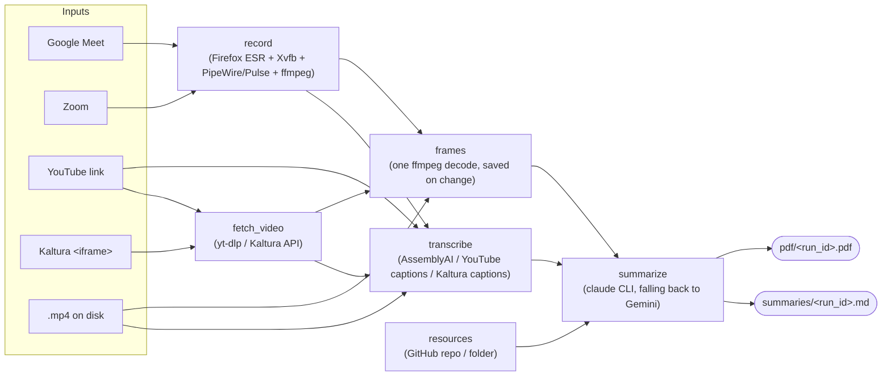

# meeting-transcriber

A meeting/lecture bot that runs on your own **Debian 13 (trixie) PC**, as your
own user. It joins a Google Meet or Zoom call — or creates a new Google Meet and
hosts it — in a signed-in **Firefox ESR** (Chrome is the fallback), on a hidden
display so it never takes over your screen, records the screen and audio to
MP4 **in the background**, transcribes it, and writes an AI summary — as
Markdown **and as a PDF** — combining the transcript with keyframes pulled from
the recording. It also works on YouTube links, on Kaltura lecture-capture
embeds (paste the `<iframe>` from your LMS), and on video files you already
have, and it can read the lecturer's own slides from a GitHub repo or a folder
and use them as reference material. A small web UI, run by pm2 and off until
you switch it on, does all of that from a browser.

The three stages are independent — each has its own entry script and runs
without the others — and `pipeline.sh` chains them.

- **Everything you run day to day is in [Commands](#commands).**
- Architectural decisions and the reasons behind them live in `CLAUDE.md`.

> **Other versions.** The same system as a root install on a Proxmox VM (with
> `/opt`, systemd units and Chrome) is on the `debian13-in-proxmox` branch; the
> one-container Docker build is on `docker`; the Alpine host + Debian container
> is on `alpinelinux`.

---

## Table of contents

- [How it works](#how-it-works)
- [Running on a PC](#running-on-a-pc)
- [Install](#install)
- [First-time login](#first-time-login)
- [Web UI](#web-ui)
- [Commands](#commands)
- [Hosting a new Google Meet](#hosting-a-new-google-meet)
- [Discord voice bot](#discord-voice-bot) (in progress)
- [Summarizing part of a video](#summarizing-part-of-a-video)
- [Slides and reference material](#slides-and-reference-material)
- [Resuming a failed run](#resuming-a-failed-run)
- [Parallelism](#parallelism)
- [Output format](#output-format)
- [Configuration](#configuration)
- [Tests](#tests)
- [Troubleshooting](#troubleshooting)

---

## How it works


```mermaid
flowchart LR
    subgraph Inputs
        GM[Google Meet]
        ZOOM[Zoom]
        YT[YouTube link]
        KAL["Kaltura &lt;iframe&gt;"]
        MP4[".mp4 on disk"]
    end

    REC["record<br/>(Firefox ESR + Xvfb + PipeWire/Pulse + ffmpeg)"]
    FETCH["fetch_video<br/>(yt-dlp / Kaltura API)"]
    TR["transcribe<br/>(AssemblyAI / YouTube captions / Kaltura captions)"]
    FR["frames<br/>(one ffmpeg decode, saved on change)"]
    RES["resources<br/>(GitHub repo / folder)"]
    SUM["summarize<br/>(claude CLI, falling back to Gemini)"]
    OUTMD([summaries/&lt;run_id&gt;.md])
    OUTPDF([pdf/&lt;run_id&gt;.pdf])

    GM --> REC
    ZOOM --> REC
    REC --> TR
    REC --> FR
    YT --> FETCH
    YT --> TR
    KAL --> FETCH
    FETCH --> TR
    FETCH --> FR
    MP4 --> TR
    MP4 --> FR
    TR --> SUM
    FR --> SUM
    RES --> SUM
    SUM --> OUTMD
    SUM --> OUTPDF
```

Each input becomes a **run**, with its own directory under
`$MEETING_BOT_ROOT/runs/<run_id>/` holding its state, logs, and sentinels.
Within a run, `transcribe` and `fetch_video → frames` are independent once a
video exists, so they execute concurrently and `summarize` joins them. Kaltura
is the exception: its entries rarely carry captions, so `transcribe` needs the
downloaded file and `fetch_video` runs first, ahead of both branches.

| Stage | Does | Needs |
|---|---|---|
| `record` | Joins (or creates) the call, records screen + audio to MP4, in the background | Firefox ESR (or Chrome), Xvfb, `pactl`, a profile signed in as `BOT_GOOGLE_ACCOUNT` |
| `fetch_video` | Downloads a YouTube video (for frames only) or a Kaltura entry (for frames *and* audio) | yt-dlp / nothing (Kaltura needs no key) |
| `transcribe` | Local file → AssemblyAI; YouTube → youtube-transcript.io captions, else YouTube's own (yt-dlp); Kaltura → its own captions if it has any, else AssemblyAI | `ASSEMBLYAI_API_KEY_1..3` / `YT_TRANSCRIPT_KEY_1..10` (optional for YouTube) |
| `frames` | A keyframe each time the slide changes → `manifest.json` | ffmpeg + Pillow |
| `summarize` | Transcript + frames (+ slides) → Markdown + PDF | the `claude` CLI signed into your Claude subscription / `GEMINI_API_KEY_1..3` |

Where the outputs go is **configured, not assumed** — the five directories are
independent variables, so summaries can sit in a synced library (SeaDrive, a
NAS) while frames stay on the local disk:

```
$RECORDINGS_DIR/<run_id>.mp4            screen + audio
$TRANSCRIPTS_DIR/<run_id>.{txt,srt}
$FRAMES_DIR/<run_id>/                   keyframes + manifest.json
$SUMMARIES_DIR/<run_id>.md              the deliverable
$PDF_DIR/<run_id>.pdf                   the readable deliverable

$MEETING_BOT_ROOT/                      the pipeline's own bookkeeping (~/.local/share/meeting-bot)
├── runs/<run_id>/                       state.json, logs/, kill, admitted, record.pid,
│                                        and the YouTube/Kaltura download while the run
│                                        is in progress (deleted once it is summarized)
├── logs/                                a background meeting's pipeline_*.log, web UI trigger_*.log
├── state/keycursor.json                 API-key rotation cursor
├── tmp/                                 claude CLI scratch cwd + cached system prompts
├── resources/                           cached slide repos + rendered slides
├── firefox-profile/                     persistent Google/Zoom login (MEETING_BROWSER=firefox-esr)
└── chrome-profile/                      the same, for MEETING_BROWSER=chrome
```

---

## Running on a PC

Settled 2026-09-29. The system used to live on a Proxmox VM, as root, with
everything under `/opt` (that version is on the `debian13-in-proxmox` branch).
On a desktop PC it runs as **you**:

| | Proxmox VM (`debian13-in-proxmox`) | This PC (`debian13`) |
|---|---|---|
| User | root | your own account; `sudo` only for `setup.sh --system` |
| Bot state | `/opt/meeting-bot` | `~/.local/share/meeting-bot` |
| Python | `/opt/meeting-bot-venv` | `.venv` in the repo, built by **uv** — `rm -rf .venv` removes it |
| Browser | google-chrome-stable via Playwright | **Firefox ESR** via Selenium + geckodriver; Chrome selectable |
| Sign-in | noVNC | a window on your desktop (noVNC still available) |
| Bot account | whatever the profile held | **`BOT_GOOGLE_ACCOUNT` only** — anything else is refused |
| A meeting | ran in your terminal | **runs in the background**; the command returns at once |
| Services | systemd trigger unit + resume timer | **pm2**: `./webui.sh on` / `off`, nothing at boot |
| Camera/mic | none on the VM | the PC's real ones are never given to the browser |

Per-run isolation is unchanged: `lib/xsession.sh` claims a free display number
for each recording and loads a PulseAudio null sink named after the run, and
the browser is pointed at that sink with `PULSE_SINK` — so a recording never
touches your desktop's screen or speakers, and two recordings never share a
sink. On the PC it also loads a second, silent sink whose monitor is the
browser's **microphone**, so a bot that failed to mute can't broadcast your
room, and the browser's camera is refused outright.

---

## Install

Target: Debian 13 (trixie) desktop, as a normal user with `sudo`.

```bash
sudo ./setup.sh --system
```

```bash
./setup.sh
```

The first installs the apt packages — ffmpeg, Xvfb, `pactl`
(`pulseaudio-utils`; not the PulseAudio daemon, since the desktop runs
PipeWire), x11vnc/noVNC, **firefox-esr**, poppler, Pango for the PDF renderer,
Thai fonts, nodejs/npm and the Thai locale. Add `--with-chrome` for
`google-chrome-stable` (only for `MEETING_BROWSER=chrome`) and
`--with-libreoffice` so `.pptx` slides can be rendered into the PDF (~700MB).

The second runs as you, with no sudo, and puts everything else in your home
directory or the repo:

- **uv** (from astral.sh, into `~/.local/bin`) and the project venv at
  **`.venv`**, built by uv from the hash-pinned lockfiles. Deleting `.venv`
  removes every Python dependency; `./setup.sh` rebuilds it in seconds.
- **geckodriver** (Mozilla's release) and **yt-dlp** (latest release) in
  `~/.local/bin`.
- The vendored Bai Jamjuree and Sarabun fonts in `~/.local/share/fonts`.
- **pm2** (npm, into `~/.local`) — nothing is registered to start at boot.
- A `.env` from `.env.example` with a fresh `MEETING_BOT_TOKEN`, if you don't
  have one yet.

`--no-browser` skips the recorder's Python drivers (Selenium, Playwright) for a
box that only transcribes and summarizes.

**Python dependencies are pinned.** `requirements.txt` (and
`requirements-browser.txt`) hold every package and transitive dependency at an
exact version with a SHA-256 hash, generated from the `requirements.in` files
beside them. To change a dependency, edit the `.in` file, then:

```bash
uv pip compile --generate-hashes --python-version 3.13 --python-platform x86_64-unknown-linux-gnu requirements.in -o requirements.txt
```

```bash
uv pip compile --generate-hashes --python-version 3.13 --python-platform x86_64-unknown-linux-gnu -c requirements.txt requirements-browser.in -o requirements-browser.txt
```

### Sign the summarizer in

The summarizer spends **your Claude subscription**, not a metered API key —
there is no `ANTHROPIC_API_KEY` anywhere in this project. It does that by
running the `claude` CLI, so the CLI has to be installed and signed in once:

```bash
curl -fsSL https://claude.ai/install.sh | bash
```

```bash
~/.local/bin/claude auth login
```

`.env.example` already points `CLAUDE_CLI_BIN` at `~/.local/bin/claude`, where
that installer puts it — set explicitly because pm2 and background runs don't
always inherit your shell's `PATH`. (The Claude desktop app's bundled CLI is
not the same install and is not signed in on its own.) Check it any time with:

```bash
~/.local/bin/claude auth status
```

If the CLI is missing or signed out, the summarize stage falls through to
Gemini (if you have Gemini keys) — the provenance header of every document says
which model wrote it. `./verify_e2e.sh --preflight` reports it too.

Then configure:

```bash
$EDITOR .env
```

Set **`BOT_GOOGLE_ACCOUNT`** (the Google address the bot signs in as), the API
keys (Gemini, AssemblyAI, youtube-transcript.io — Claude needs none) and the
five output directories. `~/` at the start of a value means your home
directory. Check them with:

```bash
.venv/bin/python3 lib/paths.py show
.venv/bin/python3 lib/keyring.py status    # counts keys, never prints them
./verify_e2e.sh --preflight                # everything, including a real 2s capture
```

---

## First-time login

Run this once, and again whenever the bot's Google or Zoom session expires:

```bash
./first_time_login.sh
```

It opens the bot's own browser — a separate Firefox ESR instance on the bot's
profile, not your everyday Firefox — as a window on your desktop, on Google's
sign-in page with **`BOT_GOOGLE_ACCOUNT` already filled in**. Sign in as that
account only (sign out of any other that appears), then open `zoom.us` in the
same window and sign in there too if you record Zoom calls. Close the window
when you're done.

When the window closes, the script checks which Google accounts the profile
holds and exits 1 unless `BOT_GOOGLE_ACCOUNT` is among them. The recorder makes
the same check before every Google Meet — a profile signed in as anyone else
(or signed out) is refused with a `wrong_account.png` in the run — and it
opens the meeting with `authuser=<BOT_GOOGLE_ACCOUNT>`, so Meet uses that
account even if the profile holds another. Check it any time with:

```bash
./first_time_login.sh --check
```

From another machine, or on a box with no desktop, the old noVNC path is still
there:

```bash
./first_time_login.sh --novnc          # headless Xvfb + noVNC on localhost:6080
./first_time_login.sh --tailscale      # noVNC on this host's tailnet IP
./first_time_login.sh --bind 0.0.0.0   # every interface (see the warning it prints)
./first_time_login.sh --screenshot     # (noVNC) also dump the display to a PNG every 10s
./first_time_login.sh --url https://zoom.us/signin
```

> The VNC session has no password and fronts a browser holding the bot's Google
> session. The default localhost binding is the safe one; only use `--bind` on a
> network you trust, and stop the script as soon as you're signed in.

The browser is launched **directly** here, never through Selenium or
Playwright: a driven browser sets `navigator.webdriver`, and Google's sign-in
flow rejects that with "This browser or app may not be secure". (The recorder
*is* driven, and Firefox ESR 140 still exposes `navigator.webdriver` there —
joining a Meet with an already-signed-in profile is a different check from
signing in, but it is the first suspect if Meet ever starts refusing the bot;
`MEETING_BROWSER=chrome` is the fallback.)

---

## Web UI

Off until you switch it on, and off again after a reboot — pm2 runs it, but
nothing registers it to start at boot:

```bash
./webui.sh on       # start the web UI and the 15-minute resume loop
```

```bash
./webui.sh off      # stop both
```

```bash
./webui.sh restart  # after editing .env — a plain `pm2 restart` does not re-read it
```

`./webui.sh on` prints the address(es) to open with the token already in them
(`http://localhost:8765/#token=…` — the part after `#` never reaches the
server or any log; the page keeps it in that browser). It listens on
`MEETING_BOT_BIND` = `127.0.0.1,tailscale` by default: this machine, plus this
PC's Tailscale address for your phone (skipped with a warning if Tailscale is
down). `./webui.sh status`, `./webui.sh url` and `./webui.sh logs` do what
they say.

The second pm2 process, `meeting-bot-resume`, runs `pipeline.sh --resume-all`
every 15 minutes — the backstop that finishes a summary paused on the Claude
usage window once it resets.

The page follows the look of the summary PDF (DESIGN.md: navy section
banners, green/amber/red boxes) in a light or dark theme, whichever your
system uses. Two-or-three-way choices are button groups with a ✓ on the chosen
one, on/off options are switches, and every field says ✓ / ⚠ / ✗ under itself
as you type.

- **New Google Meet** — one button: the bot creates a meeting, shows you the
  link to share (with **Join** and **Copy link**), admits everyone, records,
  and summarizes. **End & stop recording** ends it early, after a red
  confirmation bar. See [Hosting a new Google Meet](#hosting-a-new-google-meet).
- **Record / summarize** — the pipeline's options as a form: inputs one per
  line (with `#t=` windows), spoken language, clip, combine, reference
  material. About a second after you stop typing the page runs
  `pipeline.sh --dry-run` with exactly those options — the real parser, so a
  typo is caught before anything is downloaded or billed — and marks **every
  input line** ✓ (its kind, new run or which run it resumes, its window) or ✗
  with the reason. Warnings (a name that will be ignored, **Start over**
  re-running paid stages, playlists expanding) are listed above the button.
  **Start N runs** only unlocks once the current form has passed a check;
  when the runs end the page says how many finished, failed or paused.
- **Summary**, on both tabs: the style (`video`, `meeting`, `lecture`,
  `tutorial`, `reality`), the language it is written in (Thai or English), the PDF
  font (only the ones that language offers; defaults from `PDF_FONT_TH` /
  `PDF_FONT_EN`), and a free-text **Extra instructions** box for this run
  ("focus on the exam hints", "list every decision with its owner"). Also
  **Save recording** (video, or audio only — meetings) and **Summarize from**
  (frames and voice, or voice only); audio only forces voice only. See
  [Voice only and audio-only recordings](#voice-only-and-audio-only-recordings).
- **Runs** — every run with a status badge (recording, running, paused,
  failed, done, in a combined set), its stages as labelled pills (`✓ transcribe`,
  `✗ summarize` … — stages that never run for that kind of input are left
  out), live meeting audio, the created meeting's link and **Join**. Open one
  for its settings, the summary and PDF paths (with **Copy path**), the tail of
  each stage log, and **Resume** / **Stop** (confirmed in the page).

The same server takes scripted requests (a phone shortcut, say):

```bash
curl -X POST http://localhost:8765/trigger \
  -H "Authorization: Bearer <token>" -H "Content-Type: application/json" \
  -d '{"url": "https://meet.google.com/abc-defg-hij", "name": "Client Call",
       "resources": "https://github.com/me/course@week4"}'
```

```bash
curl -X POST http://localhost:8765/trigger \
  -H "Authorization: Bearer <token>" -H "Content-Type: application/json" \
  -d '{"new_meet": true, "name": "Project sync"}'
```

Both return `202` at once and run `pipeline.sh` in the background, logging to
`$MEETING_BOT_ROOT/logs/trigger_<timestamp>.log`. The endpoints are listed at
the top of `trigger_server.py`. A meeting started from the command line shows
up in **Runs** too, and its `pipeline_*.log` is readable there.

---

## Commands

### The whole pipeline

```bash
./pipeline.sh "https://meet.google.com/abc-defg-hij" --name "Weekly Standup"
./pipeline.sh "https://zoom.us/j/1234567890" --name "Client Call"
./pipeline.sh --new-meet --name "Project sync"      # the bot creates the meeting
./pipeline.sh "https://www.youtube.com/watch?v=5GAfjAjLKYk"
./pipeline.sh ~/Videos/existing.mp4
```

**A meeting runs in the background.** Anything that records (a Meet or Zoom
link, `--new-meet`) detaches into its own session and the command returns at
once:

```
==> Recording in the background (pid 41233). Closing this terminal won't stop it.
    Log:    tail -f '~/.local/share/meeting-bot/logs/pipeline_20260929_140501_41230.log'
    Run:    Weekly_Standup_20260929_140501
    Status: ./pipeline.sh --list    (or ./pipeline.sh --status <run id>)
    Stop:   ./kill_meeting.sh --run-id <run id>   (leaves the call cleanly)
```

The whole run — recording, then transcription and the summary — carries on in
the background; the browser is on a hidden display, so nothing appears on your
screen. `--foreground` (or `MEETING_BOT_FOREGROUND=1`) keeps the old attached
behaviour. YouTube, Kaltura and local files still run in the foreground.

A Kaltura lecture can be given either way — paste the whole `<iframe>` your LMS
shows you, or just its `src`. Quote it: the tag contains spaces.

```bash
./pipeline.sh '<iframe id="kaltura_player" src="https://cdnapisec.kaltura.com/p/2910381/embedPlaykitJs/uiconf_id/52668182?iframeembed=true&entry_id=1_y9jay9sw"></iframe>'
./pipeline.sh "https://cdnapisec.kaltura.com/p/2910381/embedPlaykitJs/uiconf_id/52668182?iframeembed=true&entry_id=1_y9jay9sw"
```

Both produce the same run (`kal_1_y9jay9sw_<timestamp>`), so pasting the tag
once and the URL later resumes rather than duplicates. No key and no login are
involved — the entry is reached with an anonymous Kaltura widget session, the
same one the embedded player uses. An entry that *does* need a logged-in LMS
session fails immediately and says so; recording one through the browser is not
implemented.

Each of those writes both `$SUMMARIES_DIR/<run_id>.md` and
`$PDF_DIR/<run_id>.pdf`.

### Several inputs at once

Any mix of types, processed concurrently:

```bash
./pipeline.sh "https://youtu.be/aaa" "https://youtu.be/bbb" "https://youtu.be/ccc" --jobs 3
```

From a file (blank lines and `#` comments are skipped):

```bash
./pipeline.sh --from-file links.txt --jobs 4
```

Expand a playlist — opt-in, because a normal watch URL often carries a stray
`&list=` and silently transcribing 200 videos would be rude:

```bash
./pipeline.sh "https://www.youtube.com/playlist?list=PL..." --playlist
```

Summarize several videos **as one lecture** — one document, one study guide,
the model reads every transcript:

```bash
./pipeline.sh --from-file chapter3_links.txt --prompt lecture \
  --combine ~/courses/2_Transcripts/chapter3.md
```

Each input is still transcribed and frame-sampled on its own (those stages
run in parallel, and resume individually), but **none of them gets its own
summary**: their `summarize` stage stays `pending` on purpose, and a separate
*combine run* — `combine_3x_<hash>_<time>` in `--list` — hands every
transcript and every frame manifest, in input order, to one summarize call.
That writes `chapter3.md` **and** `chapter3.pdf`, with a single keyframe
appendix across all the videos and every transcript in the hidden text layer.
Name the PDF somewhere else with `--combine-pdf`, or skip it with
`--no-combine-pdf`:

```bash
./pipeline.sh --from-file chapter3_links.txt \
  --combine ~/courses/2_Transcripts/chapter3.md \
  --combine-pdf ~/courses/pdf/chapter3.pdf
```

What the combined document looks like, and why:

- **One title** (the first video's), then **one link line per video**, tagged
  `(Video 1)`, `(Video 2)`, … — those numbers are how the model refers to the
  videos in the text.
- **Timestamps are relative to the video they cite**, never to a running
  total: the transcript the model reads is fenced per video (`=== video 2 of
  3: <title> ===`), every frame is announced as `frame 12 @ video 2 410.0s`,
  and the keyframe appendix captions read `Frame 12 — Video 2, 6:50`. The
  document says so under the links. A `#t=` window on one input shows up as
  `Clip (Video 2): …` on its line.
- **Frame numbers are unique across the whole set**, assigned once in video
  order, so "Frame 12" means the same picture to the model and to the PDF.
- Long sets go through the usual chunk-and-merge path, but each video is
  chunked on its own — a chunk never spans two videos, because its timestamps
  and frames belong to one.

The combined summary resumes like any run. Re-running the same command
resumes it (the members skip their finished stages, the combine run skips a
finished summarize); a member that failed blocks the combined summary until
it is fixed, and nothing is spent on the summary in the meantime.
`./pipeline.sh --run-id combine_…` resumes it directly, and `--force` there
re-summarizes — re-extracting any member frames that were swept first.
`--resume-all` leaves combine members alone and resumes their combine run
instead.

The combine run sweeps the members' frames and their downloads once the
combined PDF is written, under the same rules as a single run
(`KEEP_FRAMES=1` keeps them; a PDF that was asked for and did not render
keeps the frames too).

### Options

| Flag | Meaning |
|---|---|
| `--name N` | Meeting name (single input only; otherwise derived) |
| `--display-name D` | Name the bot shows in the meeting (default `Meeting Bot`) |
| `--language L` | `th` (default), `en`, `auto`, or any AssemblyAI code |
| `--prompt P` | The summary style: `video` (default), `meeting`, `lecture`, `tutorial` or `reality` — see [Summary styles](#summary-styles) |
| `--summary-language L` | The language the summary is **written** in: `th` or `en` (default `SUMMARY_LANGUAGE`) |
| `--pdf-font F` | The PDF's body font: `"Bai Jamjuree"` or `Sarabun` for Thai; `"CMU Serif"` (Computer Modern), `Sarabun` or `"Bai Jamjuree"` for English (default `PDF_FONT_TH` / `PDF_FONT_EN`) |
| `--instructions T` | Extra instructions for the summarizer, this run only — e.g. `"Focus on what will be on the midterm"` |
| `--summary-source S` | `both` (default: transcript + frames) or `voice` (transcript only: no frames stage). `--voice-only` is the short form. Default `SUMMARY_SOURCE` |
| `--record-media M` | Meetings: `video` (default, an MP4) or `audio` (an `.m4a`, summary from the voice). `--audio-only` is the short form. Default `RECORD_MEDIA` |
| `--source-url URL` | One local file only: the `https://` link of the call it was recorded from, cited by the summary in place of the file's path (the Discord bot passes its voice channel's link) |
| `--clip W` | Summarize only part of the video, e.g. `--clip 00:05:00-01:30:00` (see below) |
| `<input>#t=W` | Not a flag: a per-input window, overriding `--clip` for that input |
| `--resources SPEC` | Slides / notes for this session; repeatable (see below) |
| `--jobs N` | Inputs processed at once (default 2) |
| `--from-file F` | Read inputs from a file, one per line |
| `--playlist` | Expand YouTube playlist URLs |
| `--combine F` | Summarize all the inputs together, as one document (no per-input summaries) |
| `--combine-pdf F` | Where the combined PDF goes (default: `--combine`'s path with `.pdf`) |
| `--no-combine-pdf` | Write only the combined markdown |
| `--new-meet` | Create a new Google Meet, host it and record it (also: `meet.new` as an input) — see [Hosting a new Google Meet](#hosting-a-new-google-meet) |
| `--foreground` | Don't detach a meeting into the background (see above) |
| `--dry-run` | Check every input, window and reference file, print what would run, start nothing. Every unusable input is reported (not just the first), and the exit is 1 if there was one |
| `--force` | Ignore prior state, start clean |
| `--run-id ID` / `--resume-last` / `--resume-all` | Resume (see below) |
| `--list` / `--status ID` | Inspect runs |

The legacy positional form still works when unambiguous:
`./pipeline.sh <input> [name] [display_name] [language] [prompt]`.

An option that needs a value and doesn't get one (`... --combine` as the last
argument, or `--combine --jobs 1`) is an error naming the option. It used to
make `pipeline.sh` loop forever without printing anything.

### Individual stages

```bash
# 1 — record only
./screen/record_screen.sh "<meeting_url>" "Meeting Name" ["Display Name"] [out.mp4]

# 2 — transcribe only  (local file → AssemblyAI, YouTube URL → captions,
#     Kaltura embed → its captions, else AssemblyAI on the file behind --media)
./transcribe/transcribe.sh <file_or_url> "<name>" [language] [--out-base PATH] [--media PATH]

# Kaltura on its own: inspect an entry, or pull the MP4 down by hand
python3 lib/kaltura.py info "<iframe or src url>"
python3 lib/kaltura.py download "<iframe or src url>" /tmp/lecture.mp4

# 3 — summarize only
.venv/bin/python3 ./summarize/summarize.py \
    <video_or_youtube_url> <transcript.txt> [out.md] \
    [--prompt NAME] [--frames-manifest PATH] [--resources SPEC] \
    [--pdf-out PATH] [--no-pdf] [--no-markdown] [--source-url URL] [--title TEXT]

# frames only (normally called by the pipeline)
python3 screen/extract_frames.py <video> <out_dir> ["name"]

# PDF only, from a summary you already have
.venv/bin/python3 summarize/pdf.py summary.md out.pdf \
    --frames-manifest "$FRAMES_DIR/<run_id>/manifest.json"
```

### Stopping a recording

```bash
./kill_meeting.sh                  # every active run
./kill_meeting.sh --run-id <id>    # just that one
./kill_meeting.sh --list           # show what's running, kill nothing
```

`Ctrl+\` in the recording terminal does the same thing. Either way the bot
clicks **Leave** in the meeting UI so other participants see it go, rather than
having the browser killed under it. Only if a recorder is still alive after the
grace period (25s) does `kill_meeting.sh` escalate to signals, and even then
ffmpeg gets `SIGINT` first so the MP4 is finalised and playable.

## Hosting a new Google Meet

```bash
./pipeline.sh --new-meet --name "Project sync"
```

(or the **New Google Meet** button in the web UI). The bot opens `meet.new` in
its signed-in browser profile, so **the meeting belongs to
`BOT_GOOGLE_ACCOUNT`** (it opens `meet.google.com/new?authuser=…` when that is
set). Then:

1. **The link is announced the moment it exists** — printed as
   `New Google Meet: https://meet.google.com/xxx-xxxx-xxx`, written to
   `runs/<run_id>/meet_url`, stored in the run (`--status` shows it) and shown
   in the web UI with a copy button. Share it however you like.
2. **Everyone who asks to join is admitted**, checked every 3 seconds.
3. **Recording starts at once** — the bot is the host, so there is no waiting
   room for it.
4. **It waits `NEW_MEET_WAIT_MINUTES` (15) for the first participant.** An
   empty call it just created is not a meeting that ended, so the idle rules
   don't apply until someone has joined; if nobody comes, it ends the call.
5. **Once people have joined, it ends the call for everyone when they've all
   left** — about 30 seconds after the last one goes. A 1:1 (you and the bot)
   is a real meeting here, not an idle test call. `MAX_MEETING_MINUTES` and
   **End & stop recording** / `./kill_meeting.sh --run-id <id>` still work.
6. Transcription and the summary follow as for any meeting; the summary cites
   the real `meet.google.com` link.

Every `--new-meet` is a new call: it is never auto-resumed into an earlier run
(re-running the command creates another meeting). A run whose *recording*
finished but whose summary failed resumes with `--run-id` as usual.

If the profile isn't signed in as `BOT_GOOGLE_ACCOUNT`, the run fails in
seconds and says so — run `first_time_login.sh`.

> **Verify on a live call before relying on it.** The admit and "end the call
> for everyone" buttons are found by their labels, in English and Thai (the
> bot's browser runs in `th-TH`); the Thai admit labels in particular have not
> yet been checked against a real call. If knockers are left waiting, the
> labels in `HOST_ADMIT_LABELS` in `screen/capture.py` are the place to look.

---

## Discord voice bot

> **In progress — not usable yet.** What exists: the recording format and
> mixer (`lib/discord_spool.py`), the pipeline hand-off (`--source-url`), and
> two spike bots to decide which Discord library the real bot is built on.
> The bot itself comes after the spike.

What it will do: in a Discord server, anyone in a voice channel types
`/record-and-summarize` (optional style, language and instructions). The bot
joins that voice channel, posts "🔴 Recording started by @you" in its chat,
records until `/stop` (the requester or someone with Manage Server), 30 s
after the channel empties, or `MAX_MEETING_MINUTES`. Then it transcribes
and summarizes, and posts the **PDF into the voice channel's chat and into
the requester's DMs**. The recording (`.m4a`) stays on this PC in
`RECORDINGS_DIR`, with one speech-only track per speaker beside it
(`<name>.speakers/`) for a later upgrade to named speakers. The bot runs as a
third pm2 app, on and off with `./webui.sh on|off`, and its runs appear in
the web UI.

Why a spike first: since 2 March 2026 every Discord voice call is end-to-end
encrypted (DAVE), and a recording bot has to *decrypt* what it receives. Two
libraries do, differently:

| | Python: discord.py fork + `discord-ext-voice-recv` | Node: discord.js + `@discordjs/voice` 0.19 |
|---|---|---|
| Who maintains it | a fork of a fork (zacker150), pinned to a commit | the discord.js team |
| Timing | RTP timestamps, jitter buffer, lost-packet concealment | arrival time only |
| Needs | `libopus0` (installed here) | Node ≥ 22.12 (Debian 13 has 20) |

### Setting up the Discord application (once)

1. <https://discord.com/developers/applications> → **New Application**, name
   it (e.g. "Meeting Bot"). Note the **Application ID** on *General
   Information*.
2. **Bot** → **Reset Token** → copy it into `.env` as `DISCORD_BOT_TOKEN=`.
   Leave every *Privileged Gateway Intent* off — slash commands need none.
3. Invite it to your test server with this URL (put your Application ID in):
   `https://discord.com/oauth2/authorize?client_id=<APPLICATION_ID>&scope=bot+applications.commands&permissions=1084416`.
   It asks for View Channels, Send Messages, Attach Files and Connect.
4. In Discord: *User Settings → Advanced → Developer Mode* on, then
   right-click the server → **Copy Server ID** → `.env`:
   `DISCORD_SPIKE_GUILD_ID=`. (The spike registers its commands on that one
   server, where they appear at once.)
5. Allow DMs from that server's members (*Privacy Settings* on the server),
   or the DM half of the test fails. The bot says so in the channel when
   that happens.

### Running the spike

You need a second person (or a second Discord account on another device) in
the voice channel. Run each candidate in turn:

```bash
./spike/discord/py/run.sh
```

```bash
./spike/discord/node/run.sh --fetch-node
```

(`--fetch-node` downloads Node 22 into `spike/discord/node/node-v22` the
first time; nothing is installed system-wide.) In Discord, join a voice
channel, type `/spike_join`, talk for two minutes — take turns, talk over
each other once, and leave one long pause — then `/spike_stop`. The bot
posts `report.json` and `mixed.m4a` into the voice channel's chat and your
DMs; everything is also in `~/.local/share/meeting-bot/discord/spike/`.
Listen for: every voice clear (not static or robotic), nobody's words
shifted against the others', the pause still a pause. Ctrl+C stops the spike
bot.

Remove the spikes afterwards with `rm -rf spike/discord/py/.venv
spike/discord/node/node_modules spike/discord/node/node-v22`.

---

## Summarizing part of a video

`--clip` takes a time window and summarizes only that stretch — the second half
of a three-hour lecture, one talk out of a recorded conference day, the part
after the break.

```bash
./pipeline.sh "https://youtu.be/aaa" --clip 00:05:00-01:30:00
```

The window can be written as `HH:MM:SS`, `MM:SS`, or a plain number of seconds,
and either end may be left open:

| Spelling | Means |
|---|---|
| `--clip 00:05:00-01:30:00` | five minutes in, to ninety minutes in |
| `--clip 5:00-90:00` | the same window |
| `--clip 300-5400` | the same window, in seconds |
| `--clip 00:05:00-` | from five minutes in, to the end |
| `--clip -00:10:00` | the first ten minutes |

**The media is cut before it is transcribed.** That is the point: AssemblyAI
bills for the minutes you asked for and not for the whole lecture, and frame
extraction only walks the window. The cut is a stream copy, so it costs seconds
rather than a re-encode — the price is that it starts at the keyframe at or
before your start time, which on these recordings is within a few seconds. Set
`CLIP_REENCODE=1` if you need it exact.

**Timestamps in the output are relative to the clip, not to the source video.**
A clip starting at `00:05:00` has its first subtitle cue at `0:00:00` and its
first keyframe at `Frame 1 @ 0:00:00`. The summary says so, on its own line
under the title, because that is the one thing about a clipped summary that
will otherwise mislead a reader.

### One window per input

`--clip` applies to every input in the invocation. When only some of them need
trimming — and especially when they all belong in one `--combine` document —
append `#t=WINDOW` to the input itself instead:

```bash
./pipeline.sh \
  "<iframe … entry_id=1_aaa …></iframe>" \
  "<iframe … entry_id=1_bbb …></iframe>#t=00:00:00-01:16:04" \
  "<iframe … entry_id=1_ccc …></iframe>#t=00:00:00-00:23:00" \
  --resources "/srv/course/notes.md" \
  --combine "/srv/course/Requirements-guide.md" --jobs 1
```

The suffix works on any input type — a YouTube URL, a pasted Kaltura
`<iframe>` (put it after the closing tag), or a local path — and takes the same
spellings as `--clip`. It overrides `--clip` for that one input; inputs without
it fall back to `--clip`, or to no window at all.

It is stripped before the input is classified, so it never reaches the run id,
the stored input, the provenance comment or the link line. A `#t=` that doesn't
parse as a window is an error, not a silently truncated URL — and a `#t=` on
something that isn't an input is left alone.

In a `--from-file` list a `#` only starts a comment at the beginning of a line
or after whitespace, so `…?v=abc#t=5:00-90:00` survives while
`…?v=abc   # week 3` still gets its comment stripped.

**A clipped run is a separate run.** Its id carries the window
(`yt_abc123_c000500-013000_20260910_143000`), so clipping a lecture you have
already summarized in full leaves the full summary alone, and two different
windows of the same video keep their own transcript, summary and PDF. Asking
for the same window twice still resumes, however you spell it.

YouTube and Kaltura entries that have captions are the one case with no media
to cut — the captions come back whole and free — so there the window is applied
to the transcript instead, and shifted onto the same clip-relative clock. The
result is the same either way.

`--clip` is refused for a live Meet or Zoom URL: there is no recording yet to
take a window out of. Record it, then clip the MP4:

```bash
./pipeline.sh "$RECORDINGS_DIR/<run_id>.mp4" --clip 00:05:00-01:30:00
```

---

## Slides and reference material

A recording plus a transcript is what the class *said*. The slides are what it
*meant* — the correct spelling of every technical term, the notation actually
used, the section numbering. Feeding them in alongside the transcript is the
cheapest available fix for speech recognition mangling domain vocabulary.

```bash
# a GitHub repo (default branch)
./pipeline.sh "<url>" --resources https://github.com/me/course

# a branch
./pipeline.sh "<url>" --resources https://github.com/me/course@week4

# a branch and a subdirectory — paste a /tree/ URL straight from GitHub
./pipeline.sh "<url>" --resources https://github.com/me/course/tree/main/lectures/wk4

# a local folder or a single file
./pipeline.sh "<url>" --resources "/srv/course/Week 4" --resources ~/notes/handout.pdf
```

What happens to it:

- **Text** is extracted from `.md`, `.txt`, `.pdf` (via `pdftotext`), `.pptx`
  and `.docx` and appended to the prompt as reference material, capped at
  `RESOURCE_MAX_CHARS` (40,000) in total so a whole textbook can't push the
  transcript out of the model's context. It is framed as *data*, never as
  instructions — the same treatment the transcript gets.
- **Slide images** are rendered (PDF pages via `pdftoppm`; `.pptx` via
  LibreOffice when installed) and embedded in the PDF's Appendix B.
- GitHub sources are shallow-cloned into `$RESOURCE_CACHE_DIR` and refreshed on
  re-runs. Private repos work when `GITHUB_TOKEN` is set; the token is injected
  into the remote URL only for the clone, never written to disk or logged.
- The specs are stored in the run's `state.json`, so a **resume** summarizes
  against the same material the first attempt used.

A GitHub source that can't be fetched degrades the summary and is reported —
it doesn't fail the run. A *local* path that doesn't exist fails immediately —
in `pipeline.sh`, before anything is recorded or transcribed — because that is
always a typo, and finding out after paying for a summary is worse. So does a
**binary file with a text name** (a PDF saved as `notes.md`, a `.docx` renamed
`.txt`): *"this looks like a binary document; convert it to Markdown first."*
A real `.pdf` is fine; it is read with `pdftotext`. `--from-file` gets the same
check, since a PDF read as a list of links is a list of garbage inputs.

Every `--resources` applies to every run in the invocation, and the size of
the text actually sent is printed once per summarize (it goes with every
chunk, so a large reference is a large part of every request).

### A textbook excerpt with citations

For a course with a textbook, give the reference a small header and use the
`lecture` prompt. Nothing in the code is course-specific: the same two steps
work for any subject.

1. Turn the chapters you need into Markdown, e.g.:

   ```bash
   pdftotext -layout -f 25 -l 110 kurose.pdf kurose-ch1-3.md
   ```

   Trim it to what the lectures cover — `RESOURCE_MAX_CHARS` (40,000) is the
   cap, and a focused excerpt beats a truncated book.

2. Put frontmatter at the top:

   ```yaml
   ---
   course: Computer Networks I
   source: "Kurose & Ross, Computer Networking: A Top-Down Approach (7th ed.)"
   citation_label: Kurose      # the notes cite "(Kurose §2.4)"
   coverage: "Chapters 1-3 only"
   ---
   ```

   `course` and `source` are expected (a missing `course` falls back to the
   file name, with a warning); `citation_label` defaults to `course`;
   `coverage` is optional; unknown keys are ignored. Malformed lines are
   reported and skipped — never fatal.

3. Run with it:

   ```bash
   ./pipeline.sh ~/Videos/Week03.mp4 \
       --resources ~/notes/kurose-ch1-3.md --prompt lecture
   ```

The file's text reaches the model inside
`<course_reference course="…" source="…" citation_label="…" coverage="…" lecture_language="th">`,
and the `lecture` prompt's six course-reference rules (which it ignores when
there is no such block) tell it: the transcript decides what was taught; cite
only headings that are actually in the excerpt, and say *"not in the provided
Kurose excerpt"* rather than recall a section number; fix transcription garble
the book disambiguates; put book-only additions in a `> [!NOTE] From Kurose`
box; report
lecturer/book contradictions as contradictions; and give the lecturer's spoken
term in parentheses on first mention when the lecture language differs.

A Markdown file *without* frontmatter behaves exactly as before.

**Caching:** the rules are in the prompt's static half — one system-prompt file
for every course — and the reference sits at the top of the per-run half,
before anything that changes between chunks. So every chunk after the first,
and every lecture of the same course within the CLI's cache window, reads the
reference from cache. `cache_read_input_tokens` in `--status`'s usage line is
where that shows.

---

## Resuming a failed run

Every run records what it finished and where the output went, so nothing
successful is ever redone. **Just run the same command again** — it finds the
unfinished run for that input and restarts at the first stage that isn't done:

```bash
./pipeline.sh "https://youtu.be/abc"     # died at summarize (API was down)
./pipeline.sh "https://youtu.be/abc"     # resumes; reuses transcript + frames
```

Explicit forms:

```bash
./pipeline.sh --list                 # what runs exist and how far each got
./pipeline.sh --status <run_id>      # per-stage detail, artifacts, last error
./pipeline.sh --run-id <run_id>      # resume that one
./pipeline.sh --resume-last          # resume the most recent
./pipeline.sh --resume-all           # resume everything unfinished
./pipeline.sh <input> --force        # ignore prior state, start over
```

Two details worth knowing:

- **A stage counts as done only if its output is still on disk.** Delete a
  transcript and re-run, and it regenerates rather than being skipped.
- **A run is locked while it's being processed**, so two invocations can't work
  the same run. If the owning process died, the lock is taken over instead of
  blocking forever — a killed run has to stay resumable.
- **A run that ran out of Claude usage window is `PAUSED`, not failed.** The
  summarize stage first waits in-process for the window to reset (up to
  `CLAUDE_CLI_MAX_WAIT_SECONDS`, 6h by default); if it has to give up, the
  reset time goes into `state.json`, `pipeline.sh` exits 75 and reports the
  run as `PAUSED`, and `--status` says when it can go again. `--resume-all`
  skips a paused run until that time has passed, so it is safe to run from a
  timer — `setup.sh --with-resume-timer` installs one that fires every 15
  minutes and 5 minutes after every boot. Nothing is spent twice: the
  transcript and frames are kept, and only summarize re-runs. See
  [Watch your subscription's usage window](#the-usage-window) below.

### What is kept, and what is deleted after the summary

A YouTube or Kaltura video is downloaded into `runs/<run_id>/` only so that
frames can be extracted from it (and, for Kaltura, so AssemblyAI has a file
to transcribe). **Once the summary is written, that download — and the
`--clip` window cut from it — is deleted.** The frames are swept at the same
point. A meeting recording is different: it is the one thing that cannot be
regenerated, so `$RECORDINGS_DIR/<run_id>.mp4` is never touched, and a
local file you pass as input is never touched either.

- A run that failed or is `PAUSED` keeps its download, so the resume does
  not pay for it again.
- If a finished run ever needs its frames back (`--force`, or a `--combine`
  `--force` over members whose frames are gone), the video is downloaded
  again first — `--status` shows `fetch_video` as done with its artifacts
  "deleted after use" in the meantime, not as failed.
- `KEEP_FRAMES=1` keeps both the frames and the download.

Old run directories (which still hold the download of a run that never
finished, or one run with `KEEP_FRAMES=1`) can be swept:

```bash
python3 lib/runstate.py sweep --days 30
```

---

## Parallelism

Four independent levels, all tunable:

| Level | Control | Default |
|---|---|---|
| Inputs processed at once, **within one invocation** | `--jobs N` / `PIPELINE_JOBS` | 2 |
| Within a run: `transcribe` ∥ `fetch_video`→`frames` | always on | — |
| Chunks of a long transcript summarized at once | `SUMMARY_MAX_PARALLEL` | 3 |
| A component running at once, **across all invocations** | `QUEUE_SLOTS_<COMPONENT>` | unlimited |

On a 4-vCPU box, `--jobs 2` or `3` is sensible; frame extraction is the
CPU-hungry part. Chunk concurrency is kept low on purpose — every chunk carries
images, and firing a dozen multi-megabyte requests is a good way to earn the
429s you then have to sit out.

### What costs CPU, and measuring it (`benchmark.sh`)

`./benchmark.sh` runs synthetic media through every local stage with the
settings the pipeline really uses, and prints wall time, CPU time and peak
memory per stage, plus CPU-minutes per hour of media. It touches no run
state and calls no API. `--browser` adds Firefox ESR on a hidden display
playing a full-screen video, as a stand-in for the browser rendering a call.
`--watch-run <run_id>` samples a recording in progress instead: CPU and
memory of its browser, ffmpeg, Xvfb and helpers.

```bash
./benchmark.sh --browser
```

Measured on the reference PC (Core 7 150U, 12 threads), 2026-09-29:

| Stage | CPU per hour of media | Can it be turned off? |
|---|---|---|
| Recording: browser rendering the call | ≥ 60 CPU-min (≥ 1 core, the whole meeting) | Only by not recording. `MEETING_BROWSER` picks the browser |
| Recording: x264 encode | 20 (slides) to 56 (full-screen camera) CPU-min | No. `RECORD_FRAMERATE` scales it |
| `--clip` with `CLIP_REENCODE=1` | ~29 CPU-min | Yes, off by default (stream copy is ~0) |
| Frame extraction (one decode + change check) | ~5-8 CPU-min (three real Meet recordings, 2026-09-30; the old two-pass extractor took 12-19 on the same files) | No. `FRAME_CHECK_SECONDS` scales the check; `FRAME_DECODE_THREADS=0` trades ~50% more CPU for a faster decode |
| Frame prep for the model | 0.2-0.3 CPU-s per frame | `CLAUDE_CLI_FRAME_VISION=0` skips it |
| PDF render | ~10 CPU-s per document (half of it maths) | `--no-pdf` / `SUMMARY_WRITE_PDF=0`; `PDF_MATH=0` |
| Silence check before upload | ~0.5 CPU-min | No, it is what stops paying for silence |

The summary itself costs the Claude subscription, not local CPU: see
[The usage window](#summarization) and each run's `state.json`
`stages.summarize.usage`.

### Queueing across separate sessions

`--jobs` only limits concurrency *inside one* `./pipeline.sh` invocation. Run
the script in three terminals — or trigger it three times from your phone — and
you get three independent sets of stages competing for the same CPUs and the
same rate-limited APIs.

The queue is the machine-wide throttle those sessions coordinate through. Set a
slot count and they take turns, first-come-first-served:

```bash
# in .env
QUEUE_SLOTS_TRANSCRIBE=1     # one transcription at a time, box-wide
QUEUE_SLOTS_FRAMES=1         # one ffmpeg frame extraction at a time
QUEUE_SLOTS_SUMMARIZE=2      # two summaries in flight
QUEUE_SLOTS_DEFAULT=1        # fallback for anything not named above
```

A session that can't get a slot waits and says where it stands, so a blocked
run never looks hung:

```
  queue: waiting for a 'transcribe' slot (1 ahead, 1/1 in use)
```

**Everything is unlimited unless you set its variable** — with nothing
configured, no queue files are created and behaviour is exactly as before.

> **Think twice about `QUEUE_SLOTS_RECORD`.** Recording is the one
> time-sensitive stage. If two meetings overlap and there's a single record
> slot, the second meeting isn't delayed — it's *missed*, and you can't go back
> and record it. Leave it unset unless your meetings never overlap.

Inspect and unstick:

```bash
python3 lib/slotqueue.py status
python3 lib/slotqueue.py reset --component transcribe
```

A slot is held by the shell running the stage. If that process dies — a kill, a
reboot — the next caller notices the PID is gone and reclaims the slot, so the
queue can't wedge permanently and needs no cleanup daemon.

---

## Output format

### Summary styles

There are five prompts, one per kind of recording, shared by the Claude and
the Gemini backends (`summarize/prompts/`):

| `--prompt` | For | What it writes |
|---|---|---|
| `video` (default) | talks, news, interviews, documentaries | key points, then the video's topics in order, speakers attributed |
| `meeting` | calls | decisions, an action-item table (task, owner, due, priority), the discussion by topic, open questions |
| `lecture` | classes | a study sheet: what the instructor flagged, then numbered sections with key concepts, worked examples and common mistakes; cites a `--resources` textbook excerpt when it has frontmatter |
| `tutorial` | walkthroughs, coding videos | prerequisites and takeaways, then the steps with every command and code block verbatim, and a quick-reference table |
| `reality` | competition reality-show episodes (The Face, Drag Race, MasterChef, …) | an episode recap: the teams, then the episode's segments in order with `[mm:ss]` timestamps and quotes from the mentors, judges and contestants, a highlights table, and last the results — the winner, who was up for elimination, who was eliminated |

None of them but `reality` writes timestamps, and none cites frames: the
notes stand on their own. All five mark their key points with callout boxes that the PDF styles
(see [DESIGN.md](DESIGN.md)). The names from before the merge
(`lecture-claude`, `lecture-gemini`, `lecture-reference`, `meeting-claude`,
`tutorial-gemini`, `summarize`, …) still work and resolve to the new file, so
an older `.env` or a resumed run keeps working.

**Reality-show recaps** (`--prompt reality`). The one style that cites
times: the model reads the transcript with a `[mm:ss]` mark every ~10
seconds (built from the `.srt`, so it costs ~7% more input; the document's
own transcript stays plain), and copies the mark where each moment begins.
On a YouTube source the code then turns every mark into a link to that
second of the video — with `--clip`, the clip's start is added to the link,
while the text keeps the clip-relative time. Kaltura and recordings keep the
marks as plain text. The transcript names no one, so quotes are credited
from the on-screen name captions in the frames, then names said aloud; an
unidentified speaker is described by role and team, never guessed. The
results come last, in a red box: challenge winner, prize, nominees,
eliminated, saved. A long episode is chunked and merged with its own merge
prompt (`_merge-reality.md`), which keeps every timestamp and quote and puts
the results at the end. Without an `.srt` beside the transcript there are
no timestamps, with a warning in the log.

**Per-run settings.** `--summary-language`, `--pdf-font` and `--instructions`
(and the matching fields on both tabs of the web UI) are stored with the run,
so a resume summarizes the same way; given again on a resume, they replace
the stored ones. `--instructions` is free text for the summarizer: it goes in
after the prompt's cached half, and takes precedence over the default
structure.

### Voice only and audio-only recordings

When a call is only voices and cameras, the frames cost CPU and summary
tokens for faces. Two per-run choices, on the command line, in `.env`, and
on both tabs of the web UI:

- **Summarize from: voice only** (`--voice-only`, `SUMMARY_SOURCE=voice`) —
  no frames stage at all, nothing on screen offered to the model, no
  pictures in the PDF. The prompt is told there are no frames.
- **Save recording: audio only** (`--audio-only`, `RECORD_MEDIA=audio`) — a
  meeting is recorded as an `.m4a` (AAC 128k, the same audio the MP4
  carries, ~58 MB/hour) instead of a screen recording, and the bot's hidden
  browser renders at `RECORD_AUDIO_GEOMETRY` (960x540). No picture means no
  frames, so it is always voice only; `--audio-only --summary-source both`
  is refused for a meeting.

What each one does per source:

| Source | Voice only | Audio only |
|---|---|---|
| Meet / Zoom link, `--new-meet` | Video still recorded; no frames cut from it | `.m4a`, no x264 encode (measured 1.12 → 0.43 cores with the bot alone in a call), smaller browser; voice only |
| YouTube | Not even downloaded (the download only ever fed the frames) | — |
| Kaltura | Still downloaded when AssemblyAI needs the media (no captions); no frames | — |
| Local file | No frames | — |
| `--combine` | One transcript-only summary; the members cut no frames | — |

Both are stored with the run. `--summary-source` given again on a resume
replaces the stored choice (a voice-only run resumed with `--summary-source
both` extracts its frames then); the recording medium is fixed when the run
is created. An audio file given as an input needs neither: its empty frame
manifest is summarized from the transcript alone.

### Markdown

Summaries from the `lecture`, `tutorial`, `video` and `reality` prompts are wrapped in a
course-note document, shaped to drop straight into a chapter file:

```markdown
<!-- meeting-transcriber
     source: https://www.youtube.com/watch?v=5GAfjAjLKYk
     source_type: youtube
     model: claude-cli/opus
     prompt: lecture.md
     run_id: yt_5GAfjAjLKYk_20260904_120000
     language: th
     font: Bai Jamjuree
     generated: 2026-09-04
-->

# Computer Engineering Mathematics II — Signals and Transformations

Youtube Link: `https://www.youtube.com/watch?v=5GAfjAjLKYk`

<details>
    <summary> View Transcript </summary>

    ...the full transcript, indented four spaces...
</details>
<br>

...the model's structured summary...

<br><br>
```

- The provenance header is an HTML comment: invisible when rendered, greppable
  in the raw file, and harmless when pasted into a larger document. On a
  fallback chain it is the only record of which provider actually answered.
- The title is the model's own: the lecture prompts ask for a `# Title`, and
  when the summary opens with one it is lifted to the top of the file. Only a
  summary without one falls back to the video's title from yt-dlp. The link
  and transcript are inserted by the code — the model never writes them, so
  they can't be hallucinated or truncated.
- `--combine` produces one of these for the whole set: one title, one link
  line per video (tagged `(Video N)`), one transcript block holding every
  video's transcript in input order, and one model-written body. See the
  `--combine` section above for how timestamps and frame numbers work there.

The `meeting` prompt keeps the plain executive-summary format — no wrapper.
`_merge.md` is internal and not selectable.

### PDF

The same summary is rendered to `$PDF_DIR/<run_id>.pdf` by WeasyPrint. Its
look is specified in [DESIGN.md](DESIGN.md), after the operator's exercise
sheet: a title with a grey subtitle and source line, navy section banners,
colour-coded callout boxes (green key concepts, blue examples, amber
mistakes, red must-remember, grey notes), tinted table headers, and code in
a dark editor window.

- **Callout boxes.** The prompts write `> [!CONCEPT] Title` blockquotes
  (also `[!EXAMPLE]`, `[!WARNING]`, `[!IMPORTANT]`, `[!NOTE]`); the export
  turns them into the coloured boxes. In any other Markdown reader they are
  ordinary quotes, and GitHub and Obsidian show NOTE, WARNING and IMPORTANT
  as their own alerts.
- **Code is JetBrains Mono on a dark panel**, with a window bar naming the
  language and Pygments `one-dark` syntax colours. Inline `code` is a dark
  chip in the same face. `fonts-jetbrains-mono` is installed by `setup.sh
  --system`; a JetBrainsMono Nerd Font already in `~/.local/share/fonts` is
  used as well.
- **Maths is always Computer Modern**, including symbols the model typed
  straight into the prose (ω, ≤, ⇒, ∑, ²), which are picked out and set in
  CMU Serif.

- **LaTeX is typeset, in Computer Modern.** The model writes maths as `$L/R$`
  and `$$...$$`; markdown readers render that, and a PDF renderer with no
  JavaScript engine and no MathML would print the backslashes. So
  `summarize/mathrender.py` lifts every expression out before the HTML
  conversion and hands it to matplotlib's `mathtext` — a LaTeX-subset
  typesetter that ships Computer Modern and needs no TeX installation —
  inlining the result as SVG, baseline-aligned to the text around it.
  mathtext has no environments, so `\begin{cases}`, the matrices
  (`pmatrix`, `bmatrix`, `vmatrix`, …), `array`, `aligned` and `gather` are
  composed here: every cell is typeset on its own and laid out on a grid
  between delimiters stretched to fit, nested ones included. Display
  formulas get full-size fractions. Anything it still can't parse degrades
  to cleaned-up text rather than failing the render. `PDF_MATH=0` turns the
  whole pass off; `PDF_MATH_SCALE` sizes the maths against the body text.
- **Nested bullets nest.** The model indents sub-items by two spaces, which
  every markdown reader accepts and python-markdown flattens; the export
  re-indents them before conversion so a three-level outline stays one.
- **Frame citations, where a document has them, are faded.** None of the
  four prompts asks for `(Frame N @ …)` citations, timestamps or a visual
  index — the frames still inform the notes, they are just not indexed. A
  document that does cite (an older run, a custom prompt) keeps the
  citations at 30% opacity so the notes read as notes.
- **The sheet is the summary alone.** No keyframe appendix, no reference
  slides, no transcript layer by default; the `.md` beside it still carries
  the transcript in its `<details>` block. Each comes back on request:
  `PDF_FRAMES=contact` collects the cited frames into a thumbnail contact
  sheet at the back (Appendix A — each frame once, blank ones dropped, only
  the cited ones cropped), `inline` replaces the first citation of each frame
  with the picture; `PDF_RESOURCES=appendix` prints the `--resources` slides
  as Appendix B.
- **Frames are cropped to the slide.** A raw 1920×1080 Meet frame is mostly
  dark UI chrome and participant tiles. `summarize/framecrop.py` finds the
  largest bright rectangle — slides are overwhelmingly light on dark UI — and
  crops to it, but only when the candidate passes size, area, aspect-ratio and
  brightness checks. Otherwise it falls back to a plain border trim, and then
  to the untouched frame: a confidently wrong crop (half a slide, one
  participant's face) is worse than no crop. Tune with `PDF_FRAME_CROP`
  (`slide` | `border` | `none`).
- **The transcript can travel with the PDF.** `PDF_TRANSCRIPT=hidden` puts
  it in as white 1pt text between `BEGIN_TRANSCRIPT` and `END_TRANSCRIPT`
  markers: nobody reading the PDF sees it, and `pdftotext` — or any other
  extractor — hands an agent the summary followed by the labelled
  transcript. It is written in ~40,000-character pieces because poppler
  silently stops extracting text after about 50,000 characters on one page,
  so a single block would come back truncated with no warning; the cost is a
  couple of blank-looking pages at the back of a long lecture.
  `PDF_TRANSCRIPT=appendix` prints it as Appendix C instead.
- **The body font is chosen per run, and every choice looks the same
  size.** A Thai summary offers **Bai Jamjuree** (default, `PDF_FONT_TH`) or
  **Sarabun**; an English one **CMU Serif** — Computer Modern, the face the
  maths is set in (default, `PDF_FONT_EN`) — Sarabun or Bai Jamjuree.
  Computer Modern has no Thai glyphs, so it is not offered for Thai. Pick one
  with `--pdf-font` or in the web UI. `PDF_FONT_SIZE` (9.5) is the size *as
  Computer Modern*; Sarabun and Bai Jamjuree are scaled to the same
  x-height, so they come out at about 8.2pt and look just as big. The
  language and font are read from the document's own provenance comment
  first, so a sheet re-rendered later keeps its face. `PDF_FONT_FAMILY`
  replaces the whole stack for both languages when no font was chosen for
  the run (no size matching then); keep a Thai face in it or Thai renders as
  tofu boxes. Every other size is relative to the body, so changing
  `PDF_FONT_SIZE` rescales headings, tables and captions together. Bai
  Jamjuree and Sarabun are not in Debian's archive; they are OFL Google
  Fonts vendored under `fonts/` and installed by `setup.sh` (`fonts-cmu` and
  Noto come from apt).

A PDF that fails to render logs a warning and leaves the run successful — the
Markdown is the artifact everything downstream depends on. Turn either output
off with `--no-pdf` / `--no-markdown` (or `SUMMARY_WRITE_PDF=0` /
`SUMMARY_WRITE_MARKDOWN=0`); turning off both is an error rather than a run
that writes nothing.

---

## Configuration

All settings live in `.env` at the repo root (`cp .env.example .env`,
`chmod 600 .env`). `.env.example` is a bare list of names and defaults — the
explanations are here. Already-exported variables always win, so one-off
overrides work: `SUMMARY_EFFORT=max ./pipeline.sh ...`.

### Output directories — all five are required

| Variable | Holds |
|---|---|
| `RECORDINGS_DIR` | `<run_id>.mp4` and its ffmpeg log |
| `TRANSCRIPTS_DIR` | `<run_id>.txt` and `<run_id>.srt` |
| `FRAMES_DIR` | `<run_id>/` — keyframes and `manifest.json` |
| `SUMMARIES_DIR` | `<run_id>.md` |
| `PDF_DIR` | `<run_id>.pdf` |
| `MEETING_BOT_ROOT` | The pipeline's own bookkeeping only (default `~/.local/share/meeting-bot`): `runs/`, `state/`, `tmp/`, `logs/`, `resources/`, the browser profiles |

They are independent of each other and of `MEETING_BOT_ROOT` — point any of
them anywhere, including a mount with spaces in the path. An unset one is a
hard error naming the variable, rather than a silent default: with independent
paths, a wrong default doesn't fail, it just puts your lecture summaries
somewhere you'll never look.

`FIREFOX_PROFILE_DIR` / `CHROME_PROFILE_DIR` (default `$MEETING_BOT_ROOT/firefox-profile`,
`.../chrome-profile`) and `RESOURCE_CACHE_DIR` (default
`$MEETING_BOT_ROOT/resources`) can also be moved.

**On a synced library (SeaDrive here), check the mount, not just the path.** If
the drive is not mounted when a run starts, the path is an ordinary empty
directory, the run writes into it, and the files vanish from view when the
mount comes back. `./verify_e2e.sh --preflight` shows where each directory
points.

### API keys — numbered slots, rotated round-robin

Every provider that allows several accounts reads numbered variables, and the
unnumbered name is accepted as slot 1:

| Variable | Slots | Used by |
|---|---|---|
| *(none — the `claude` CLI's own login)* | — | The default summarizer |
| `GEMINI_API_KEY_1..3` (or `GOOGLE_API_KEY`) | 3 | The fallback summarizer |
| `ASSEMBLYAI_API_KEY_1..3` | 3 | Transcribing local recordings |
| `YT_TRANSCRIPT_KEY_1..10` | 10 | YouTube captions |

`lib/keyring.py` rotates them. The cursor is **persisted** to
`$MEETING_BOT_ROOT/state/keycursor.json` and advances past the key that just
worked, so consecutive runs start on different accounts — a per-process cursor
would send every run at key #1 and exhaust that account first. Blank slots and
duplicates are skipped; a gap (`_1` and `_3` set, `_2` commented out) doesn't
end the scan.

```bash
.venv/bin/python3 lib/keyring.py status   # counts and the next slot
```

> **Moved from the Alpine version:** youtube-transcript.io tokens used to live
> in `/opt/meeting-bot/secrets/youtube_transcript_keys.json`. That file is gone;
> the tokens are `YT_TRANSCRIPT_KEY_1..10` in `.env` now.

### Summarization

| Variable | Default | Meaning |
|---|---|---|
| `SUMMARY_BACKEND` | `fallback` | `fallback`, `claude-cli`, `gemini` |
| `SUMMARY_FALLBACK_CHAIN` | `claude-cli,gemini` | Tried in order; first success wins. `disabled` short-circuits a slot |
| `CLAUDE_CLI_BIN` | found on `PATH`, then `~/.local/bin/claude` | Where the `claude` binary is |
| `CLAUDE_CLI_MODEL` | `opus` | A CLI model alias (`opus`, `sonnet`) or a full id |
| `CLAUDE_CLI_TIMEOUT_SECONDS` | 1800 | How long one summary may take before it counts as hung |
| `CLAUDE_CLI_FRAME_VISION` | 1 | `0` sends the frame list as text and never shows the images |
| `CLAUDE_CLI_FRAME_INLINE` | 1 | Frames go to the model as image blocks in one turn. `0` reverts to the `Read`-tool path (for a `claude` too old to accept `--input-format stream-json`), where every frame the model opens is another turn |
| `CLAUDE_CLI_FRAME_DEDUPE` | 1 | Drop consecutive frames of an unchanged slide (and blank frames) before offering them. `0` offers every frame |
| `CLAUDE_CLI_MERGE_MODEL` | same as `CLAUDE_CLI_MODEL` | Model for the merge call of a chunked run — mechanical work, and the most expensive call; `sonnet` is fine here |
| `SUMMARY_MERGE_EFFORT` | same as `SUMMARY_EFFORT` | Effort for that merge call |
| `CLAUDE_CLI_STATIC_PROMPT` | 1 | Pass the prompt's unchanging half as a system prompt file, so the prefix is cache-eligible. `0` sends it inline (for a `claude` too old to know the flags) |
| `SUMMARY_EFFORT` | `high` | `low`, `medium`, `high`, `xhigh`, `max` |
| `CLAUDE_CLI_MAX_FRAMES` | 0 | Most frames the model is *offered* per call (`0` = all of the chunk's), counted after the blank/duplicate pass. Scene changes kept first, periodic frames thinned evenly. The PDF still has every frame |
| `CLAUDE_CLI_MAX_WAIT_SECONDS` | 21600 | How long one call may sleep for the usage window to reset before the stage pauses (exit 75) |
| `CLAUDE_CLI_RATE_LIMIT_POLL_SECONDS` | 600 | Retry interval when the CLI reports a hit window without a reset time |
| `GEMINI_API_KEY_1..3` | — | For the `gemini` fallback |
| `GEMINI_MODEL` | `gemini-3.6-flash` | A comma-separated list is a fallback chain: every key is tried on the first model, then the next model (`gemini-3.8-flash,gemini-3.7-flash,gemini-3.6-flash` in `.env.example`). A rate-limited key moves on at once; an unknown model is skipped. Pin real versions, not `-latest` aliases |
| `SUMMARY_PROMPT` | `video` | `video`, `meeting`, `lecture`, `tutorial` or `reality` (`lecture` in `.env.example`); `--prompt` overrides. Older names still resolve |
| `SUMMARY_INSTRUCTIONS` | — | Extra instructions for every summary; `--instructions` (or the web UI's field) overrides it per run |
| `SUMMARY_MAX_TOKENS` | 16000 | **Gemini only.** The Claude CLI has no output cap, and output is not what spends a subscription window anyway — see below |
| `SUMMARY_DOC_FORMAT` | `auto` | `auto` wraps `lecture`/`tutorial`/`video`/`reality` output; `always`/`never` override |
| `SUMMARY_LANGUAGE` | `th` | The language the summary is *written* in: `th` or `en`; `--summary-language` overrides it per run. Independent of `ASSEMBLYAI_LANGUAGE`, which is the language the audio is in — see below |

**Output language.** `SUMMARY_LANGUAGE` decides what every prompt tells the
model to write in — `th` (the default) or `en`. Every shipped template
(`video`, `meeting`, `lecture`, `tutorial`, `reality` and the merge prompts) carries a
`{language_rule}` placeholder that is filled from this setting before the
prompt is sent, on both the Claude and the Gemini backends. In Thai the
model is asked for ordinary Thai academic prose with each technical term's
English name in parentheses on first use — การแปลงฟูเรียร์ (Fourier
transform) — and to leave code, LaTeX, commands and on-screen identifiers
untranslated. The wrapper the code builds around the body (`Youtube Link:`,
`View Transcript`, the PDF's appendix headings) stays in English either
way, so the `.md` still drops into the existing course files. The setting
is recorded in the document's provenance comment as `language:`, and the
PDF picks its body face from it (see PDF export). A value other than `th`
or `en` fails the summarize stage at startup, before anything is billed. A
custom prompt file without the placeholder is sent exactly as written.

**How the Claude backend runs.** `summarize/llm_client.py` shells out to:

```
claude -p --output-format stream-json --verbose --model opus --effort high \
       --safe-mode --no-session-persistence \
       --append-system-prompt-file "$MEETING_BOT_ROOT/tmp/claude-cli-prompts/<sha>.md" \
       --exclude-dynamic-system-prompt-sections \
       --input-format stream-json --tools ""
```

The prompt (transcript, frame list, slides) and the frame images go in on
stdin as one stream-json user message — an 80KB transcript would not fit in
a command-line argument, and a dozen images certainly would not. `--safe-mode` and a
scratch working directory keep this repo's own `CLAUDE.md`, hooks and plugins
out of the summarizer's context, and `--no-session-persistence` stops every
lecture leaving a full transcript in `~/.claude`.

**The instructions are sent as a system prompt so they can be cached.** Claude
caches an exact prefix, and the CLI exposes no caching flag of its own —
caching is automatic, so the only thing you control is whether the prefix stays
still. A prompt file may fence the half that never changes between runs:

```markdown
<!-- static-prompt: begin -->
...role, instructions, output format, worked example...
<!-- static-prompt: end -->

# Input
<transcript>{transcript}</transcript>
<frames>{frame_manifest}</frames>
```

That block is written once to a content-addressed file and passed with
`--append-system-prompt-file`; `--exclude-dynamic-system-prompt-sections`
moves the CLI's own per-machine sections (cwd, date, git status) out of the
system prompt too. Everything that varies — the chunk label, your slides, the
transcript, the frame paths — stays on stdin. On a long lecture split into
several chunks, every chunk after the first reuses the same cached prefix.

All four shipped prompts carry the fences, so the instructions (role, output
format, callout vocabulary, rules) are cached and only the transcript, the
frames, your slides and any `--instructions` are sent per call. A prompt file
of your own without markers is sent exactly as written and gets no caching
benefit; copy the fences into it if you want it. `CLAUDE_CLI_STATIC_PROMPT=0`
turns it off entirely.

**Frames are sent inline, in one turn.** `--input-format stream-json` lets
the user message carry base64 image blocks, the same shape the Messages API
takes, so every frame the model is offered arrives beside the text — labelled
with its frame number — and the model needs no tool at all. The older delivery
(`CLAUDE_CLI_FRAME_INLINE=0`) put absolute paths in the prompt and gave the CLI
a `Read` tool scoped by `--add-dir` to the run's frame directory; it still
works, but every frame the model opened was a separate turn that re-sent the
whole context as cache reads, which on a 12-frame chunk cost more than the
frames themselves. Set `CLAUDE_CLI_FRAME_VISION=0` to send no images at all:
lighter still, but the model then cites frames it has never seen, so the
pictures in the PDF may not match what the text says about them.

**Before they are sent, frames are filtered, cropped and shrunk.** Blank
frames (a screen share stopping, a slide mid-fade — extraction already skips
these, but older runs have them) and consecutive frames of an unchanged slide are dropped
(`CLAUDE_CLI_FRAME_DEDUPE`; a texture hash of the slide region, so a moved
cursor or a changed participant tile still counts as the same slide, while a
changed title does not). What remains is capped by `CLAUDE_CLI_MAX_FRAMES`,
then each copy is cropped to the slide — the same `PDF_FRAME_CROP` detector
the PDF uses — and fitted to `FRAME_MAX_DIMENSION` px on its long edge. The
saved frames are never touched. The per-call log line says how many frames
went each way:

```
claude-cli/opus (effort=medium): 9 frame(s) of 41, vision=inline, 3 blank + 22 repeated frame(s) dropped, 7 more left out (CLAUDE_CLI_MAX_FRAMES), 9 cropped/downscaled to 768px, cacheable system prompt
```

**Any `ANTHROPIC_API_KEY` in your environment is stripped before the CLI runs.**
If it survived, the CLI would quietly bill a metered console account instead of
your subscription, and nothing about the output would tell you.

**About `SUMMARY_EFFORT`.** It maps onto the CLI's `--effort`, the same scale
the API spells `output_config.effort`: how hard the model is told to think.
Thinking itself is adaptive, so the model decides when to use it, and there is
no "thinking budget" setting. `high` is the sweet spot for lecture notes; `max`
costs meaningfully more for a marginal gain on this kind of task, and `low` is
fine for short standups.

<a id="the-usage-window"></a>
**Watch your subscription's usage window — and it is metered now.** A Claude
Pro/Max subscription has a rolling 5-hour window (and a 7-day one). The CLI
reports both meters on every call, and the pipeline keeps them: each call
logs a line like

```
claude-cli/opus (effort=high): 61.2k in (48.0k cached), 4.1k out, 2.3k thinking, ~$0.71; 5h window 34%, resets 15:20 +07
```

and the stage's total lands in the run's `state.json` under
`stages.summarize.usage` — token counts, list-price cost as a proxy, and the
5-hour meter before and after the stage. `./pipeline.sh --status <run_id>`
prints it. **That number is how you size a lecture to your plan**: run one,
read `+N% this stage`, and you know how many fit in a window.

`.env.example` ships Pro-sized values — `CLAUDE_CLI_MAX_FRAMES=20`,
`SUMMARY_EFFORT=medium`, `SUMMARY_MAX_PARALLEL=1`,
`SUMMARY_CHUNK_CHARS=60000`, `CLAUDE_CLI_MERGE_MODEL=sonnet`,
`SUMMARY_MERGE_EFFORT=low` — which differ from the code's own defaults (0,
`high`, 3, 24000, and the chunk model/effort) on purpose: an unset
variable behaves as it always did, a fresh `.env` fits a lecture into a
window. Loosen them once the meter says you have room.

`SUMMARY_MAX_TOKENS` does nothing here — the CLI has no output cap, and output
is not where the window goes. What spends it, in order:

1. **The merge call, on a chunked run.** It reads every partial summary and
   writes them all out again, so its output is about the size of everything
   the chunks produced — and output tokens are the expensive kind. Two
   levers: `SUMMARY_CHUNK_CHARS` decides whether there is a merge at all (at
   60,000 a 90-minute Thai lecture is one call, no merge), and
   `CLAUDE_CLI_MERGE_MODEL` / `SUMMARY_MERGE_EFFORT` put the merge on a
   cheaper model when there is one. The chunk summaries — where the reading
   of noisy ASR happens — stay on `CLAUDE_CLI_MODEL`.
2. **Frames.** A whole 1920x1080 frame is ~1,844 tokens; cropped to the
   slide and fitted to 768px (`FRAME_MAX_DIMENSION`) it is ~200-450. The
   extractor saves a frame only when the slide changes, and the
   blank/duplicate pass removes what still repeats; `CLAUDE_CLI_MAX_FRAMES`
   caps what is left (slide changes first, the rest spread evenly), and
   `FRAME_MOTION_SECONDS` sets how often a moving picture (a played video)
   is sampled at the source. `CLAUDE_CLI_FRAME_VISION=0` drops them
   entirely, at the cost of citations to pictures the model never saw.
3. **Effort.** `SUMMARY_EFFORT=high` buys thinking tokens on every chunk;
   `medium` is noticeably cheaper on the window and still fine for notes.
4. **The model.** `CLAUDE_CLI_MODEL=sonnet` spends the window several times
   slower than `opus`.
5. **Parallelism.** `SUMMARY_MAX_PARALLEL` (default 3) fires that many
   `claude` processes at once for a long transcript, and `--jobs` multiplies
   it across inputs. That doesn't change the total, but it decides whether
   you find out the window is gone with one chunk left or with all of them.

**When the window is exhausted the pipeline waits for it, on Claude.** The
CLI reports the reset time; the call sleeps until then (plus a minute) and
tries again — `--status` shows `waiting for the Claude usage window until
…` meanwhile. Chunks that already finished are kept. The chain does **not**
fall through to Gemini for this: a hit window is not a broken backend, and
you chose to pay for a subscription. If the reset is further away than
`CLAUDE_CLI_MAX_WAIT_SECONDS` (6h — i.e. the weekly limit, or a window that
keeps refusing), the stage pauses instead: exit 75, `PAUSED` in the report,
reset time in `state.json`, and `./pipeline.sh --resume-all` — by hand or
from the `--with-resume-timer` unit — finishes it once the window is back.

Missing credentials for one backend are still not fatal — the chain skips
it and moves on. A `claude` CLI that is missing or signed out is treated
exactly that way. Which backend answered is recorded in the document's
provenance header (`model: claude-cli/opus`).

### PDF export

| Variable | Default | Meaning |
|---|---|---|
| `SUMMARY_WRITE_PDF` | 1 | `0` = markdown only (same as `--no-pdf`) |
| `SUMMARY_WRITE_MARKDOWN` | 1 | `0` = PDF only (same as `--no-markdown`) |
| `PDF_FRAMES` | `none` | `none`, `contact` (thumbnail appendix), or `inline` (figures in the body) |
| `PDF_FRAME_CROP` | `slide` | `slide`, `border`, or `none` |
| `PDF_FRAME_MAX_WIDTH` | 1280 | Inline figures are downscaled to this |
| `PDF_CONTACT_MAX_WIDTH` | 640 | Contact-sheet thumbnails are downscaled to this |
| `PDF_TRANSCRIPT` | `none` | `none`, `hidden` (white 1pt layer), or `appendix` |
| `PDF_RESOURCES` | `none` | `none` or `appendix` (the `--resources` slides as Appendix B) |
| `PDF_HIDDEN_CHUNK_CHARS` | 40000 | Characters of hidden transcript per page; above ~50k poppler stops extracting |
| `PDF_PAGE_SIZE` | `A4` | Any WeasyPrint page size |
| `PDF_FONT_TH` | `Bai Jamjuree` | Default body font for Thai summaries: `Bai Jamjuree` or `Sarabun` |
| `PDF_FONT_EN` | `CMU Serif` | Default body font for English summaries: `CMU Serif`, `Sarabun` or `Bai Jamjuree` |
| `PDF_FONT_FAMILY` | — | A whole CSS font stack for both languages, used only when no font was chosen for the run; no size matching. Keep a Thai face in it |
| `PDF_FONT_SIZE` | 9.5 | Body size in points, as Computer Modern — the other faces are scaled to look the same size. Everything else scales with it |
| `PDF_MATH` | 1 | 0 leaves LaTeX as text instead of typesetting it |
| `PDF_MATH_SCALE` | 1.0 | Maths size relative to `PDF_FONT_SIZE`; the body faces are already matched to Computer Modern, so 1.0 |
| `PDF_MATH_FONTSET` | `cm` | matplotlib mathtext font set (`cm` is Computer Modern) |

### Reference material

| Variable | Default | Meaning |
|---|---|---|
| `RESOURCES` | — | Default `--resources` specs for every run, comma- or newline-separated |
| `RESOURCE_MAX_CHARS` | 40000 | Total extracted text given to the model |
| `RESOURCE_MAX_FILE_MB` | 25 | Per-file size cap |
| `RESOURCE_SLIDE_IMAGES` | 1 | `0` skips rendering slide images |
| `RESOURCE_CACHE_DIR` | `$MEETING_BOT_ROOT/resources` | Clones and rendered slides |
| `GITHUB_TOKEN` | — | For private repositories |

### Transient failures (503 "server is busy", 429, 5xx)

| Variable | Default |
|---|---|
| `SUMMARY_MAX_RETRIES` | 5 |
| `SUMMARY_RETRY_BASE_SECONDS` | 2.0 |
| `SUMMARY_RETRY_MAX_SECONDS` | 60.0 |

Retries use exponential backoff with full jitter and honor `Retry-After`. A
backend is only abandoned once its own retries are exhausted; then the chain
advances. `400/401/403/404/422` never retry — a bad key fails the same way
forever, and retrying just delays the fallback. Gemini key rotation happens
*outside* the retry loop: an exhausted key hands over to the next one
immediately rather than burning the full retry schedule first.

### Long transcripts

| Variable | Default | Meaning |
|---|---|---|
| `SUMMARY_CHUNK_CHARS` | 24000 | Above this, chunk + merge. `0` disables. `.env.example` ships 60000: fewer seams, and no merge call at all for most lectures |
| `SUMMARY_CHUNK_OVERLAP` | 800 | Context repeated across a boundary |
| `SUMMARY_SEGMENT_MAX_SECONDS` | 120 | Transcript segments longer than this are split before chunking. `0` disables |
| `SUMMARY_SEGMENT_MAX_CHARS` | 2000 | Same, by length |
| `SUMMARY_MAX_PARALLEL` | 3 | Concurrent chunk requests |

### Transcription

| Variable | Default | Meaning |
|---|---|---|
| `ASSEMBLYAI_API_KEY_1..3` | — | Required for local files |
| `ASSEMBLYAI_LANGUAGE` | `th` | `en`, `auto`, or any AssemblyAI code |
| `ASSEMBLYAI_MODEL` | SDK chain `universal-3-5-pro`, `universal-2` | Overrides the leading entry |
| `YT_TRANSCRIPT_KEY_1..10` | — | YouTube captions, first choice |
| `YT_AUTOCAPTIONS` | 1 | `0` turns off the yt-dlp caption fallback below |
| `TRANSCRIBE_BACKEND` | `assemblyai` | YouTube URLs always use captions regardless |

**YouTube captions come from two places.** youtube-transcript.io first; it
only sees *uploaded* caption tracks. When none of them is in the requested
language — or the API fails, or no keys are configured — yt-dlp asks YouTube
itself: an uploaded track in that language if there is one, otherwise
YouTube's **automatic captions of the language actually spoken**. Never one of
YouTube's machine translations. A track in some other language is only the
last resort, and is announced as such (the 2026-09 verify run summarized
English lectures from their only uploaded track — an Arabic translation).

Kaltura entries need no key at all. When the entry carries a caption track in
the requested language it is used and AssemblyAI is skipped; most
lecture-capture entries have none, and then the downloaded MP4 goes to
AssemblyAI like any other file.

### Kaltura

| Variable | Default | Meaning |
|---|---|---|
| `KALTURA_REFERER` | `https://cdnapisec.kaltura.com/` | The `Referer` sent with every Kaltura request |

Kaltura entries usually sit behind an access-control profile that checks the
referring domain, and a request without an allowed `Referer` is answered with a
bare `404` and no explanation. The default — Kaltura's own CDN domain — is
accepted by every tenant tested so far and needs no configuration. Set this to
your LMS's origin (e.g. `https://www.mycourseville.com/`) if your institution
whitelists only that; a `404` during the download is the symptom, and the error
message names this variable.

A key rejected for auth or quota reasons hands over to the next key; a failure
that is about the *audio* (silent file, unsupported language) does not, because
another key would fail identically.

### Frames

| Variable | Default | Meaning |
|---|---|---|
| `FRAME_CHECK_SECONDS` | 2 | How often the picture is looked at; a slide shown for less can be missed |
| `FRAME_CHANGE_DISTANCE` | 16 | Texture-hash bits (of 4096, over the slide region) that make a new picture; the model-side duplicate pass uses the same number |
| `FRAME_MOTION_SECONDS` | 30 | A picture that never settles (a played video, a full-screen camera) gets one frame per this |
| `FRAME_SAFETY_SECONDS` | 300 | A frame anyway after this long without one; `0` disables |
| `FRAME_DECODE_THREADS` | 1 | ffmpeg decoder threads; `0` = automatic (faster, ~50% more CPU) |
| `FRAME_MAX_DIMENSION` | 768 | Long edge, in pixels, of the frame *copies* sent to the LLM, after the crop to the slide; `0` skips the downscale |
| `CLIP_REENCODE` | 0 | `--clip` cuts by stream copy; `1` re-encodes for a frame-accurate start |

**A frame is saved when the picture changes, never on a clock.** One ffmpeg
decode hands a sample every `FRAME_CHECK_SECONDS` to Python, which compares
it with the last saved frame by a texture hash of the slide region — a moved
cursor or the participant strip is not a change, a new title or new text is.
A changed picture is saved once the next sample shows the same thing, so a
slide mid-fade is never the one kept; a blank (one-colour) sample is never
saved. A static slide is therefore one frame however long it stays up.
`SCENE_THRESHOLD` and `FRAME_PERIOD_SECONDS` belonged to the previous
two-pass extractor and are ignored (the log says so if they are set).

More frames: `FRAME_CHECK_SECONDS=1 FRAME_MOTION_SECONDS=15`.
Fewer: `FRAME_MOTION_SECONDS=120 FRAME_SAFETY_SECONDS=0`.

**`CLIP_REENCODE` buys exactness with a full transcode.** The default stream
copy takes seconds and starts at the keyframe at or before the requested time —
a few seconds early on these recordings. Re-encoding is frame-accurate and
costs a full encode: this box runs at 2.3x realtime, so an 85-minute window is
over half an hour of CPU. Worth it only when the clip boundary has to land on
an exact word.

**`FRAME_MAX_DIMENSION` never touches the frames you keep.** A 1920x1080
keyframe costs the model roughly 1,844 tokens every time it sees one, about
790 at 1024px and about 440 at 768px. So a *copy* is written to
`<frame dir>/llm-768-slide/` (the dimension and the `PDF_FRAME_CROP` mode are
in the name) and that is what the model gets; the full-resolution original
stays where it is, because the PDF crops and embeds it. The copy is cropped to
the slide **before** it is shrunk — the same detector the PDF uses, and one
that declines rather than guesses — which is what keeps slide text legible at
768px: on a Meet recording the slide is perhaps two thirds of the frame, and
the dark chrome around it was paying for pixels that said nothing. The copies
are reused on a resume and are as disposable as the rest of `FRAMES_DIR`.
Needs Pillow — without it the originals are sent, with a warning. This
changes how much each frame costs; the duplicate pass and
`CLAUDE_CLI_MAX_FRAMES` change how many there are.

### The bot's browser and account

| Variable | Default | Meaning |
|---|---|---|
| `BOT_GOOGLE_ACCOUNT` | — | The only Google account the bot joins Meet as. Prefilled by `first_time_login.sh`, checked before every Meet, passed as `authuser=`. Unset: nothing is checked (a warning says so) |
| `MEETING_BROWSER` | `firefox-esr` | `firefox-esr` (Selenium + geckodriver) or `chrome` (Playwright, `google-chrome-stable`) |
| `FIREFOX_PROFILE_DIR` | `$MEETING_BOT_ROOT/firefox-profile` | Firefox's persistent login |
| `CHROME_PROFILE_DIR` | `$MEETING_BOT_ROOT/chrome-profile` | Chrome's |
| `FIREFOX_BIN` / `GECKODRIVER_BIN` / `CHROME_BIN` | from `PATH` | Override the binaries |

Each browser has its own profile: switching `MEETING_BROWSER` means signing in
again with `first_time_login.sh`.

### Web UI

| Variable | Default | Meaning |
|---|---|---|
| `MEETING_BOT_TOKEN` | generated by `setup.sh` | Shared secret for every `/api` call and `/trigger` |
| `MEETING_BOT_BIND` | `127.0.0.1,tailscale` | Comma-separated listen addresses; `tailscale` = this PC's Tailscale IPv4 |
| `MEETING_BOT_PORT` | 8765 | |
| `MEETING_BOT_FOREGROUND` | 0 | `1` = never detach a meeting into the background (same as `--foreground`) |

### Discord voice bot (in progress)

| Variable | Default | Meaning |
|---|---|---|
| `DISCORD_BOT_TOKEN` | — | The bot's token from the Developer Portal (*Bot → Reset Token*). A secret, like the API keys |
| `DISCORD_SPIKE_GUILD_ID` | — | The spike only: the test server's ID, where `/spike_join` and `/spike_stop` are registered |

### Meeting behaviour

| Variable | Default | Meaning |
|---|---|---|
| `MAX_MEETING_MINUTES` | 240 | Hard wall-clock cap |
| `IDLE_LEAVE_MINUTES` | 5 | Leave after this long alone (or with one other); `0` disables |
| `NEW_MEET_WAIT_MINUTES` | 15 | A meeting the bot created: how long to wait for the first participant before ending it |
| `AUTO_LEAVE_SILENCE_SECONDS` | 120 | The idle and "most people left" rules only fire after the meeting audio has also been silent this long |
| `AUDIO_SILENCE_WARN_SECONDS` | 120 | Warn in the log / web UI after this long without meeting audio |
| `TRANSCRIBE_MIN_SOUND_SECONDS` | 30 | Less sound than this in a recording → not sent to AssemblyAI |
| `KILL_FINALISE_SECONDS` | 120 | `kill_meeting.sh`: how long to wait for the MP4 to be finalised when forcing a stop |
| `RECORD_GEOMETRY` | `1920x1080` | Xvfb head, browser window and ffmpeg capture size — they must agree or the recording gets black edges |
| `RECORD_MEDIA` | `video` | `audio` records meetings as an `.m4a`; same as `--record-media` |
| `RECORD_AUDIO_GEOMETRY` | `960x540` | The browser's display size for an audio-only recording |
| `SUMMARY_SOURCE` | `both` | `voice` summarizes from the transcript alone; same as `--summary-source` |
| `RECORD_FRAMERATE` | 15 | |
| `MEETING_BOT_DISPLAY_NAME` | `Meeting Bot` | Same as `--display-name` |
| `PIPELINE_JOBS` | 2 | Same as `--jobs` |

When the bot leaves on its own (checked every 15 seconds):

- **Everyone left** — only the bot remains on two polls (~30s): it leaves, or
  ends the call for everyone if it created it.
- **Nobody came** — a meeting it created with no one joining within
  `NEW_MEET_WAIT_MINUTES`.
- **It dropped out** — the call's controls are gone on two polls (Meet sent it
  back to the lobby): the recording ends; `runs/<id>/left_call.png` shows why.
- **Idle** — joining someone else's call, only the bot and one other person for
  `IDLE_LEAVE_MINUTES` — **and** no meeting audio for
  `AUTO_LEAVE_SILENCE_SECONDS`. A 1:1 where people talk is not idle.
- **Most people left** — the count falls to 30% of its peak on two polls —
  **and** the meeting has gone quiet. A lecturer still talking to the few who
  stayed keeps the recording going.
- The stop button / `./kill_meeting.sh`, and the `MAX_MEETING_MINUTES` cap.

---

## Tests

Run them with the project venv (`.venv/bin/python3`, or
`MEETING_BOT_VENV=$PWD/.venv bash lib/...` for the shell suites).
Everything except `verify_e2e.sh` runs with no API keys and no network access
— against temporary directories, including one with a space in its
path so quoting mistakes surface.

```bash
python3 lib/test_runstate.py                 # run state, resume, concurrency, the pause (19)
python3 lib/test_slotqueue.py                # cross-session component queue (23)
python3 lib/test_keyring.py                  # numbered keys + rotation cursor (22)
python3 lib/test_resources.py                # resource specs, extraction, GitHub, frontmatter, binary files (36)
python3 lib/test_kaltura.py                  # iframe/URL parsing, Referer, captions, retries (51)
python3 lib/test_clip.py                     # --clip parsing, the cut, caption windowing (33)
python3 lib/test_discord_spool.py            # Discord recordings: placing each speaker on one timeline, the mix, real ffmpeg (22)
python3 summarize/test_summarize_units.py    # retry, chunking, map-reduce, frame numbering, document, claude-cli, the usage window, the Gemini model chain, the course reference, the output language, the four prompts, --instructions, no frames (200)
python3 summarize/test_pdf_units.py          # frame cropping, citations, LaTeX, the design (callouts, code, maths symbols), font choice and size matching, PDF render (107)
python3 transcribe/test_yt_transcript_client.py   # key rotation, retry, tracks[] (16)
python3 transcribe/test_yt_autocaptions.py   # the yt-dlp caption fallback: track choice, json3 (11)
python3 screen/test_extract_frames.py        # frames on change: settle, motion cap, safety net, blanks, real ffmpeg (19)
python3 screen/test_capture_host.py          # hosting a created Meet: when it ends, and when it must not (7)
python3 screen/test_browser.py               # browser choice, fake devices, the bot-account check (16)
python3 test_trigger_server.py               # the web UI API: argument mapping, auth, dry-run check, paths, summary settings, record/summary source, per-line check results (12)
bash lib/test_pipeline_e2e.sh                # full orchestration, stages stubbed, background meetings, summary settings, voice only / audio only, dry-run reports, --source-url (460)
bash lib/test_media_e2e.sh                   # real media, APIs stubbed at the socket (131)
```

Two of those are worth understanding:

- **`test_pipeline_e2e.sh`** runs `pipeline.sh` and `run_one.sh` for real —
  routing, the DAG, parallel branches, state transitions, resume, `--force`,
  `--combine`, locking, the output-directory requirements, `--resources`
  threading — with the four expensive stages replaced by stubs honoring the
  same contract.
- **`test_media_e2e.sh`** does the opposite: it builds a real MP4 with ffmpeg
  and runs the *actual* stages against local stub servers
  (`lib/fake_api_server.py`) that speak the providers' HTTP protocols, and —
  for the summarizer — against a stub `claude` binary (`lib/fake_claude_cli.py`)
  that records exactly how it was invoked. The real AssemblyAI SDK and the real
  `llm_client` do the work, so it verifies things a mock never could: that
  `--effort` carries `SUMMARY_EFFORT`, that the frames arrive as image blocks
  on stdin (cropped, downscaled, the originals untouched) with no tool and no
  filesystem path in the prompt, that the transcript reaches the prompt, that
  an `ANTHROPIC_API_KEY` the test deliberately exports does
  *not* reach the CLI, that a signed-out CLI falls through to the next backend
  instead of being retried, that the key cursor advances, and that the PDF comes
  out with cropped frames in it.

Neither proves the browser can join a live Meet call, that your real keys work, or
that your Claude subscription still has quota.
That is what `verify_e2e.sh` is for:

```bash
./verify_e2e.sh --preflight                    # tools, packages, keys, profile,
                                               # and a real 2-second Xvfb+Pulse+ffmpeg capture
./verify_e2e.sh --browser-smoke                # the real browser on Xvfb, recorded — no meeting, no spend
./verify_e2e.sh --mp4 /path/to/recording.mp4   # real AssemblyAI + real summarizer
./verify_e2e.sh --youtube "<url>"              # real captions + real summarizer
./verify_e2e.sh --kaltura "<iframe or url>"    # real Kaltura download + summarizer
./verify_e2e.sh --meet "<url>" --minutes 3     # the real browser joins, records, leaves
./verify_e2e.sh --zoom "<url>" --minutes 3
```

`--browser-smoke` is worth running after any change to the recording path: it
launches the configured browser through `browser.open_page()` — the
recorder's own launch — records fourteen seconds of it, and then **measures a
late recorded frame for black bands** (late, because Firefox through
geckodriver takes a few seconds to map its window). That
check is what caught Chrome placing its kiosk window at (10,10) — a 10-pixel
black band down the left and top of every recording that comparing window sizes
would have missed.

The meeting checks record for `--minutes`, then stop through the normal
`kill_meeting.sh` path, so they exercise the kill switch too. They check the
recording actually has an audio stream — a missing sink produces perfect video,
a silent MP4 and an empty transcript, which is otherwise only noticed at the
summary.

---

## Troubleshooting

**`missing required program(s): ...`**
`sudo ./setup.sh --system`, then `./setup.sh`. Xvfb, `pactl` and the browser
all have to be present on the PC itself.

**`no free X display between :90 and :119`**
Stale claims from a crashed run: `ls -l /tmp/.meeting-bot-X*.claim /tmp/.X*-lock`.
A claim or lock whose pid is gone is taken over automatically; remove any that
aren't.

**`PulseAudio did not start (pactl info fails)`**
On the desktop PipeWire's pulse socket answers `pactl`; `pactl info` in your own
terminal shows whether it is up. A background run started from a login shell
with no `XDG_RUNTIME_DIR` can't find it — start it from your desktop session.

**Firefox: `Error: cannot open display`, or its window appears on your screen**
The browser picked Wayland over the hidden X display. `record_screen.sh` unsets
`WAYLAND_DISPLAY` and exports `GDK_BACKEND=x11` for exactly this; if you launch
`screen/capture.py` by hand, do the same.

**`Cannot join: the browser profile is signed in as …, not …`**
The profile holds a different Google account from `BOT_GOOGLE_ACCOUNT` (or none:
"not signed into Google"). Run `./first_time_login.sh`, sign out of the other
account, sign in as the bot. `runs/<run_id>/wrong_account.png` shows what the
bot saw.

**Google says "This browser or app may not be secure"**
The login must go through `first_time_login.sh`, which launches the browser
directly. Selenium and Playwright both set automation flags Google detects.

**Google Meet says "You can't join this video call"**
Meet refuses guests while the organizer isn't in the call, and refuses accounts
that weren't invited to a restricted meeting. Sign the bot in (`BOT_GOOGLE_ACCOUNT`)
and invite that account, or be in the call to let it in.

**The bot never gets admitted**
Check `runs/<run_id>/join_failed.png` or `not_admitted.png`, and
`runs/<run_id>/logs/record.log`.

**The MP4 has video but no sound**
The sink wasn't wired to the browser. Check that `PULSE_SINK` reached the browser
(`runs/<run_id>/record.pid` records the sink name) and that
`pactl list short sinks` shows it. `./verify_e2e.sh --preflight` reproduces the
whole chain in two seconds.

**The meeting had sound, but the recording is silent**
Check where the bot's browser is playing: `pactl list sink-inputs` should
show `application.name = "Meeting Bot"` on the `meeting_<run id>` sink. The
recorder pins it there every 10 seconds (`lib/pinaudio.py`). If your *own*
browser's sound has gone somewhere odd after a recording, that is PipeWire
restoring a routing it remembered for "Firefox": set it back in
`pavucontrol` → Playback.

**The recording has black bands down one edge**
The browser window isn't filling the Xvfb head. `./verify_e2e.sh --browser-smoke`
measures it. A band of 1px at the right and bottom is normal (the kiosk
viewport is a pixel under the window); anything thicker means `RECORD_GEOMETRY`,
`--window-size` and `--window-position` disagree.

**The MP4 is empty**
See `<recording>_ffmpeg.log` next to the MP4. Usually the display or the sink
didn't come up.

**No PDF, but the markdown is there**
The renderer is optional at runtime by design. The warning names what's
missing — usually `weasyprint` or its Pango libraries. Install the system half
with `sudo apt-get install libpango-1.0-0 libpangoft2-1.0-0`, then re-run
`./setup.sh` to restore the Python half from the lockfile (or `rm -rf .venv`
first for a clean rebuild). Installing individual packages by hand with
`.venv/bin/pip install weasyprint` works too, but leaves the venv out of step
with `requirements.txt`.

**The PDF prints raw LaTeX instead of formulas**
matplotlib isn't installed in the venv, so `summarize/mathrender.py` fell back
to plain text. Re-run `./setup.sh` to restore the venv from the
lockfile. If a *particular* expression is the only one showing as text, it is
one mathtext can't parse (environments other than `aligned`-style ones,
`\substack`, and similar) — the fallback is deliberate, and the formula is
intact in the `.md`.

**A Kaltura entry fails with a 404, or "exposes no playable source"**
Two different problems with the same look.

A `404` on the *download* is access-control refusing the `Referer`. The default
is Kaltura's own CDN domain, which most tenants allow; if yours whitelists only
your LMS, set `KALTURA_REFERER` to that origin in `.env` (e.g.
`https://www.mycourseville.com/`). Check it in one second without running the
pipeline:

```bash
python3 lib/kaltura.py info "<iframe or src url>"
```

"exposes no playable source" is the other case: the entry is not playable
without a logged-in LMS session. There is no fallback for that — the browser
profile is not involved on this path, so signing it in would not help, and
browser-recording a private entry is not implemented. Download the file from
the LMS yourself and feed the pipeline the local `.mp4`.

**Frames in the PDF are uncropped**
Pillow isn't installed, or the slide detector declined on every frame (a
full-screen camera shot has no slide to find). `PDF_FRAME_CROP=border` gives
you the plain border trim instead.

**Every summary is coming out of Gemini**
The Claude backend is being skipped, and there are two independent reasons for
it. Check both — the first is easy to miss because an interactive shell can
find `claude` when the pipeline cannot.

*The binary isn't on the pipeline's PATH.* `claude` installs to
`~/.local/bin`, which pm2, cron and a background run don't necessarily have on
`PATH`. `_claude_cli_bin()`
then returns `None`, the backend raises `BackendUnavailable`, and the chain
falls through to Gemini without anything looking broken. **Set
`CLAUDE_CLI_BIN` to the absolute path in `.env`** rather than relying on
`PATH`; that is what the variable is for. Seen on the deployment box, where
every summary in a 51-file library had quietly been billed to Gemini keys
while the operator believed they were spending a Claude subscription.

*Or the CLI isn't logged in.* `claude auth status` — if it says
`"loggedIn": false`, run `claude auth login` (or `claude setup-token` on a
headless box) *as the user the pipeline runs as*; the login lives in that
user's `~/.claude`. `./verify_e2e.sh --preflight` checks this. The summarize log names the
reason on the `!! claude-cli unavailable:` line, and the finished document's
provenance header records which backend actually answered.

**`claude CLI is not logged in` in the middle of a batch**
The OAuth token expired. The chain falls through to Gemini, so the run still
completes; `claude auth login` fixes the next one. (An exhausted usage window
is *not* reported this way any more — it waits, or pauses the run; see the
next entry.)

**A run says `PAUSED`, or `--status` says `waiting for the Claude usage window`**
The subscription's 5-hour (or 7-day) window is spent. Waiting is the intended
behaviour: the call sleeps until the reset the CLI reported, and a run that
had to give up (`PAUSED`, exit 75) is picked up by `./pipeline.sh --resume-all`
once its recorded reset time has passed — automatically, if you installed
`setup.sh --with-resume-timer`. To make the next lecture fit, read
`stages.summarize.usage` in `--status` and turn down `CLAUDE_CLI_MAX_FRAMES`,
`FRAME_MOTION_SECONDS` or `SUMMARY_EFFORT` — see
[the usage window](#the-usage-window). If you would rather have Gemini answer
than wait, set `SUMMARY_FALLBACK_CHAIN=gemini`.

**A YouTube transcript comes back as `[เสียงพากย์ไทย]`**
That's a re-voiced video whose only captions are a placeholder. Every API key
hits the same upstream captions, so retrying won't help — the placeholder is
written through deliberately so you can see it in the `.txt`.

**A run half-finished**
`./pipeline.sh --status <run_id>` shows which stage failed and the error;
`./pipeline.sh --run-id <run_id>` picks up from there.

**Everything is slow on a long video**
Frame extraction is CPU-bound. `FRAME_DECODE_THREADS=0` finishes it sooner
for more CPU; raise `FRAME_CHECK_SECONDS`, or lower `--jobs` so runs aren't
competing for the same cores.
